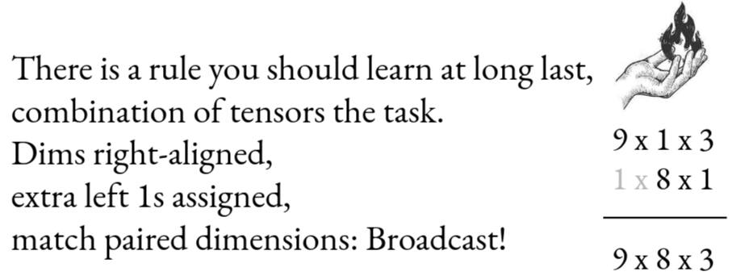

[Tensor Puzzles](https://github.com/srush/Tensor-Puzzles) is a masterclass in using tensor broadcasting and matrix products to perform complex operations, condensed into twenty-one short and deceptively difficult puzzles.

While these techniques are powerful, they can also be quite challenging to grasp without
further explanation, even with the help of the [amazing visualizations](https://github.com/srush/Tensor-Puzzles/) provided by Sasha. Hence I'll offer my solutions to each of the puzzles, along with the reasoning behind them.

## Tips \& Rules
Like Sasha mentions in [the repo](https://github.com/srush/Tensor-Puzzles):
- The puzzles are about [broadcasting](#stop-stop-stop-what-is-broadcasting).
- Each puzzle is given as a function to be implemented, and a valid solution **must** consist of a single return statement not longer than 80 characters.
- You are allowed to use **ONLY**:
    - arithmetic operations (incl. `@` (matrix multiplication))
    - comparison operations
    - `shape`
    - indexing operations (slicing, indexing (with `None`, numbers, arrays), boolean masking)
    - any solutions from **preceding** puzzles.
    - Pre-defined operations

### Pre-defined Operations
The predefined operations `arange` and `where` are defined as follows:
```python
import numpy as np 

def arange(i: int):
    "Use this function to replace a for-loop."
    return torch.tensor(range(i))

def where(q, a, b):
    "Use this function to replace an if-statement."
    return (q * a) + (~q) * b
```

Without further ado, lets g-

## Stop stop stop stop what is broadcasting?

Oh, right.

In a vacuum, operations on multidimensional arrays have very restrictive shape requirements (i.e. dimensions).
For example, adding two arrays requires them to have the exact same shape:
```python
import numpy as np
a = np.random.rand(3, d)
b = np.random.rand(3, f)
c = a + b  # works fine iff d == f

a1 = np.random.rand(3, 4)
a2 = np.random.rand(5, 6)
c = a1 + a2  # No way this is working in a million years...
```

However, there are many reasons why this could be inconvenient:
- [(Auxiliary) memory is wasted in coercing arrays to the same shape](https://numpy.org/doc/stable/user/basics.broadcasting.html)
- Code becomes less general and reusable, as it can only handle specific shapes.
    - Have you ever seen C code try to accommodate different dimensional arrays...

Hence, `numpy` (and inspired libraries like `PyTorch`/`TensorFlow`/`JAX` etc.) "softens" the requirements on array shapes via **broadcasting**, so that arrays need not match exactly in shape, but need only be **conformable**.
This possibly takes inspiration from [the Yorick language's array indexing rules](https://mail.python.org/pipermail/matrix-sig/1995-November/000143.html), or [other array-based programming languages](https://www.cs.mcgill.ca/~hv/articles/Numerical/numpy.pdf).

In the repository, Sasha does a great job summarizing **broadcasting** by using the following limerick:


Any **two** multi-dimensional arrays are **conformable** if **for each dimension from right to left, either**:
- the size in that dimension is the same for both arrays, or
- one of the arrays has size 1 in that dimension, or
- one of the arrays does not have that dimension (i.e. it has fewer dimensions).

In the limerick, Sasha shows two **conformable** arrays:
- The first having shape `(9, 1, 3)`
- The second having shape `(8, 1)`

These two arrays are **conformable** because:
- The first dimension from the right: `3` and `1` -> one of them is `1`
- The second dimension from the right: `1` and `8` -> one of them is `1`
- The third dimension from the right: `9` and (no dimension) -> one of them does not have that dimension

**Broadcasting** then refers to the process by which **conformable** arrays are 
iterated through **as though they had the same shape**. In **most** cases, this **same shape** is determined as follows,
counting again from the rightmost dimension:
- In dimensions where both arrays have the same size, that size is used.
- In dimensions where one array has size 1, it is "**expanded**" to match the other array's size.
- In dimensions where one array does not have that dimension, it is treated as if it had size 1 in that dimension and is "**expanded**" accordingly.

Thus, any operation on the two arrays in Sasha's limerick would be performed as if both arrays had shape `(9, 8, 3)`,
and (in the case of elementwise addition) result in an array of shape `(9, 8, 3)`.

This virtual looping and expansion is done without actually copying data in memory,
and has the cool side-effect of allowing for fascinating ways to write our usual, primitive array operations.

## Puzzle Solutions
Here are my solutions to each of the puzzles, along with explanations.

### Puzzle 1 (ones)
We're asked to take in an integer `i` and return a tensor of shape `(i, )` filled with ones.

By using the fact that scalars are 0-dimensional arrays, we use `arange` to create an array of shape `(i, )`,
then multiply it by `0` (which broadcasts the scalar `0` to each element), and finally add `1` to each element
(ditto the previous step).

#### Solution
```python
def ones(i: int) -> TT["i"]:
    return arange(i) * 0 + 1
```

### Puzzle 2 (sum)

We're asked to take in a 1-dimensional tensor `a` of shape `(i, )` and return the sum of its elements as a tensor of shape `(1, )`.

This can quite easily be rewritten as the matrix product of a row vector of ones (of shape `(1, i)`) and the input tensor `a` (of shape `(i, 1)`):
$$
\text{sum}(a) = \left(\begin{array}{c} 1 & 1 & \cdots & 1 \end{array}\right) \cdot \left(\begin{array} a_1 \\ a_2 \\ \vdots \\ a_i \end{array}\right)
$$

Unfortunately we cannot create a column vector `a` via transpose (the usual way). But we **CAN** add a new axis to `a` using `None` indexing >:).

#### Solution
```python
def sum(a: TT["i"]) -> TT[1]:
    return ones(len(a)) @ a[:, None]
```

### Puzzle 3 (outer)

This puzzle is somewhat interesting.
Though it is quite literally just asking for the outer product of two vectors `a` and `b`,
thinking **instead** in terms of broadcasting yields a shorter solution than appealing to the mathematical definition of the outer product.

Classically, the outer product $\otimes$ of 2 column vectors is defined as $\mathbf{a} \otimes \mathbf{b} = \mathbf{a} \mathbf{b}^T$.
Directly transcribing this definition into code would yield:
```python
def outer(a: TT["i"], b: TT["j"]) -> TT["i", "j"]:
    return a[:, None] @ b[None, :]
```

Unfortunately, this needs 2 `None` indexings. Matrix multiplication imposes requirements on the shapes of the operands that prevent us from using only one `None` indexing. (*After all, how would it know whether you are trying to multiply a column vector, or a to-be-broadcasted array?*)

However, we can rewrite $(\mathbf{a} \otimes \mathbf{b})_{ij} = (\mathbf{a} \mathbf{b}^T)_{ij} = a_i b_j$.
This means we just need to multiply each element `a_i` of `a` with each element `b_j` of `b`,
a task that is very easy for broadcasting.

Since we desire the output shape `(i, j)`, we add a new trailing dimension to `a` using `None` indexing,
and simply multiply `a` and `b`:

#### Solution
```python
def outer(a: TT["i"], b: TT["j"]) -> TT["i", "j"]:
    return a[:, None] * b
```

The interpretation here is that we convert `a` from a row vector of shape `(i, )` to a column vector of shape `(i, 1)`,
and let broadcasting take over the elementwise multiplication with `b` of shape `(j, )` to form the output of shape `(i, j)`.

### Puzzle 4 (diag)
This puzzle asks us to take a square matrix `a` of shape `(i, i)` and return the elements along its principal diagonal as a 1-dimensional tensor of shape `(i, )`.

So it wants $\left(\begin{array}{ccc} a_{11} & ... & a_{1i} \\ \vdots & \ddots & \vdots \\ a_{i1} & ... & a_{ii} \end{array}\right) \mapsto \left(\begin{array}{c} a_{11} \\ a_{22} \\ ... \\ a_{ii} \end{array}\right)$.

We can use `arange` to generate the indices, and (optionally) include ellipses (`...`) to select all leading dimensions of `a` (if any). 

#### Solution
```python
def diag(a: TT["i", "i"]) -> TT["i"]:
    return a[..., arange(a.shape[-2]), arange(a.shape[-1])]
```

### Puzzle 5 (eye)
This puzzle gives us an integer `j` and asks us to return the identity matrix of shape `(j, j)`.

Based on what we have so far, we are only capable of generating 1D arrays using `arange` and `ones`. So how do we create a 2D identity matrix?

Unsurprisingly, broadcasting:

#### Solution
```python
def eye(j: int) -> TT["j", "j"]:
    return (arange(j)[:, None] == arange(j)) + 0
```
Here, we create a row vector of **distinct elements** using `arange` and apply the same trick as in [`outer`](#puzzle-3-outer) to convert it to a column vector.
This column vector and the original row vector are then broadcast under the equality operator (`==`),
resulting in a boolean matrix where `True` values only exist along the principal diagonal.

Lastly, `0` is added to coerce the boolean values to integers (`True` to `1` and `False` to `0`).
(Technically, you can also use `where(..., 1, 0)`. But this is shorter ;))

### Puzzle 6 (triu)

Similarly to the previous puzzle, this one asks us to return the upper triangular matrix of shape `(j, j)`.

But we can just tweak the check a little bit to invoke the definition of [upper triangular matrices](https://en.wikipedia.org/wiki/Triangular_matrix#Description):

#### Solution
```python
def triu(j: int) -> TT["j", "j"]:
    return (arange(j)[:, None] <= arange(j)) + 0
```
and everything follows as in [`eye`](#puzzle-5-eye).

### Puzzle 7 (cumsum)
This puzzle wants us to compute the running sum of a 1-dimensional tensor `a` of shape `(i, )`.

There are many ways to define the running sum, but the most interesting one is the matrix product with a lower-triangular matrix of ones:
$$
\text{cumsum}(a) = \left(\begin{array}{ccccc} 1 & 0 & 0 & \cdots & 0 \\ 1 & 1 & 0 & \cdots & 0 \\ 1 & 1 & 1 & \cdots & 0 \\ \vdots & \vdots & \vdots & \ddots & \vdots \\ 1 & 1 & 1 & \cdots & 1 \end{array}\right)\left(\begin{array}{c} a_1 \\ a_2 \\ a_3 \\ \vdots \\ a_i \end{array}\right)
$$

because it allows us to... **broadcast.**

This gives two solutions:
#### Solution 1
```python
def cumsum(a: TT["i"]) -> TT["i"]:
    return (1 - triu(len(a)) + eye(len(a))) @ a
```

#### Solution 2
```python
def cumsum(a: TT["i"]) -> TT["i"]:
    return (arange(len(a))[:, None] >= arange(len(a))) @ a
```
of which Solution 1 is technically shorter :)))

### Puzzle 8 (diff)

This puzzle wants us to compute the discrete difference between consecutive elements of a 1-dimensional tensor `a` of shape `(i, )`.

Like before, there is a special matrix product that represents this operation:
$$
\text{cumsum}(a) = \left(\begin{array}{ccccc} 1 & -1 & 0 & \cdots & 0 \\ 0 & 1 & -1 & \cdots & 0 \\ 0 & 0 & 1 & \cdots & 0 \\ \vdots & \vdots & \vdots & \ddots & \vdots \\ 0 & 0 & 0 & \cdots & 1 \end{array}\right)\left(\begin{array}{c} a_1 \\ a_2 \\ a_3 \\ \vdots \\ a_i \end{array}\right)
$$
which yields an alternative representation:

$$
\text{cumsum}(a) = \left(\mathbf{I}^{i \times i} + \left(\begin{array}{ccccc} 0 & -1 & 0 & \cdots & 0 \\ 0 & 0 & -1 & \cdots & 0 \\ 0 & 0 & 0 & \cdots & 0 \\ \vdots & \vdots & \vdots & \ddots & \vdots \\ 0 & 0 & 0 & \cdots & 0 \end{array}\right)\right)\left(\begin{array}{c} a_1 \\ a_2 \\ a_3 \\ \vdots \\ a_i \end{array}\right)
$$

that is easier to write down via a similar logic to [`eye`](#puzzle-5-eye).

#### Solution
```python
def diff(a: TT["i"], i: int) -> TT["i"]:
    return (eye(i) + -1 * (arange(i)[:, None] == (arange(i) + 1))) @ a
```

That is to say, the second matrix is constructed by checking where the row indices equal the column indices plus one, 
and then negating the resulting boolean matrix. (Unfortunately subtracting a boolean matrix is not supported, so we multiply by `-1` instead.)

### Puzzle 9 (vstack)
This puzzle wants us to vertically stack two 1-dimensional tensors `a` and `b` of shapes `(i, )` and `(j, )` respectively.

This can be done by broadcasting a `where` operation over a 1D arange of length `2` (adding a trailing dimension at the back).

#### Solution
```python
def vstack(a: TT["i"], b: TT["i"]) -> TT[2, "i"]:
    return where(arange(2)[:, None] == 0, a, b)
```

### Puzzle 10 (roll)
This puzzle wants us to take a 1D tensor `a` of shape `(i, )` and roll it by 1 position to the left.
In math notation:
$$
\text{roll}(a) =\left(\begin{array}{cccc} a_2 & a_3 & ... & a_i & a_1 \end{array}\right)
$$

Thankfully, indexing and arithmetic are legit, so...
#### Solution
```python
def roll(a: TT["i"], i: int) -> TT["i"]:
    return a[(arange(i) + 1) % i]
```

### Puzzle 11 (flip)
This puzzle wants us to take a 1D tensor `a` of shape `(i, )` and reverse its elements.

While a matrix product could very easily achieve this, indexing is allowed... so...
#### Solution
```python
def flip(a: TT["i"], i: int) -> TT["i"]:
    return a[-arange(i) - 1]
```

### Puzzle 12 (compress)
**This is easily the most challenging puzzle of the entire set, and is the WHOLE reason I even decided to write this explainer.**
It asks us to take a masking array `g` and a 1D array `v` (both of shape `(i, )`), 
and return a 1D array of shape `(v, )` containing only the elements of `v` where the corresponding element in `g` is `True`.

**MOREOVER**, the entries for which `g` is `True` must all be left-aligned (i.e. no gaps).

Despite that, it is quite easy to imagine how to do this with a matrix multiplication:
$$
\text{compress}(g, v) = \left(\begin{array}{c|c|c|c|c|c|c} \mathbf{I}^i_{\cdot, t_1} & \mathbf{I}^i_{\cdot, t_2} & ... & \mathbf{I}^i_{\cdot, t_k} & \mathbf{0} & ... & \mathbf{0} \end{array}\right)\left(\begin{array}{c} v_1 \\ v_2 \\ v_3 \\ \vdots \\ v_i \end{array}\right)
$$
where $t_1, t_2, ..., t_k$ are the indices where `g` is `True` with $i < j \implies t_i < t_j$.

We can ALSO conceptualize this multiplication in row-major order as follows, which is what I used in the final implementation:
$$
\text{compress}(g, v) = \left(\begin{array}{ccccc} v_1 & v_2 & v_3 & ... & v_i \end{array}\right)\left(\begin{array}{c} \mathbf{I}^i_{t_1} \\ \mathbf{I}^i_{t_2} \\ \vdots \\ \mathbf{I}^i_{t_k} \\ \mathbf{0} \\ \vdots \\ \mathbf{0} \end{array}\right)
$$

It was, of course, MUCH harder to actually **construct** this matrix, because we cannot exactly `concatenate` columns or anything like that.
After a few days of playing around, I finally arrived at the following solution which **actually** follows the rules:

1. First create a mapping of each position in `g` to the latest index where `g` was `True` (incl. the position itself):
```python
    last_true = cumsum(g + 0) - 1
```
2. Whenever `g[:, None]` is `True` at row `k`, we know that `last_true[k]` will be new position of `v[k]` in the output array.
```python
    true_entries = last_true[g[:, None]] # Boolean indexing
```
Note that we use `g[:, None]` to broadcast `g`, so it can undergo elementwise multiplication as per definition of [`where`](#pre-defined-operations).

However, there are 2 problems with the above approach.

1. What if `g` is `False`? What value do we put in `true_entries` then?
2. We need to return an array of the same shape as `v`.

Thankfully, `where` is just the right tool to settle both problems at once:
```python
    matrix = where(g[:, None], eye(i)[cumsum(g + 0) - 1], 0)
```
For `a` and `b`, we motivated the construction as follows:
- (`a`) When `g` is `True` at row $k$, we will want row `last_true[k]` of the identity matrix.
- (`b`) When `g` is `False` at row $k$, we want a row of zeros. Broadcasting `0` will give us the matrix of zeroes from which we can select the appropriate columns.

This is in fact exactly what our matrix representation was, and we can better explain the real Python code with this following pseudo-code:
```python
    let G_jk be the (j,k)-th entry of the broadcasted g matrix (i.e. G_jk = g_j)
    let I be the identity matrix of shape (i, i)
    let last_true be the array mapping each position in g to the latest index where g was
    matrix_jk = where G_jk is True,
        then I_{last_true[j], k}
        else 0
```

Finally, we can perform the matrix multiplication (again, in row-major order) to get the desired output:
```python
# It took me FOREVER to get this one
def compress(g: TT["i", bool], v: TT["i"], i:int) -> TT["i"]:
    return v @ where(g[:, None], eye(i)[(cumsum(g + 0) - 1)], 0)
```

### Puzzle 13 (pad_to)
Strangely enough, this puzzle wants us to **PAD** / (or truncate) a tensor `a` of shape `(i, )` to a target length `j`.

I didn't think you could (or would want to) do this with broadcasting, but apparently you can (with ANOTHER special matrix product).

Notice that by augmenting a diagonal matrix with extra zero columns OR rows, we can achieve padding OR truncation respectively (in row-major order).

Namely,
$$
\left(\begin{array}{ccc} a_1 & ... & a_i \end{array}\right)\left(\begin{array}{cccc|ccc} 1 & 0 & ... & 0 & 0 & ... & 0 \\ 0 & 1 & ... & 0 & 0 & ... & 0 \\ \vdots & \vdots & \ddots & \vdots & \vdots & \ddots & \vdots \\ 0 & 0 & ... & 1 & 0 & ... & 0 \end{array}\right) = \left(\begin{array}{ccc} a_1 & ... & a_i & 0 & ... & 0 \end{array}\right)
$$
for padding when $j > i$, and
$$
\left(\begin{array}{ccccc} a_1 & ... & a_j & ... & a_i \end{array}\right)\left(\begin{array}{cccc} 1 & 0 & ... & 0 \\ 0 & 1 & ... & 0 \\ \vdots & \vdots & \ddots & \vdots \\ 0 & 0 & ... & 1 \\ \hline
0 & 0 & ... & 0 \\ \vdots & \vdots & \ddots & \vdots \\ 0 & 0 & ... & 0 \end{array}\right) = \left(\begin{array}{ccc} a_1 & ... & a_j \end{array}\right)
$$
for truncation when $j < i$.

This matrix, in fact, has a pretty easy construction inspired by [`eye`](#puzzle-5-eye):
```python
def pad_to(a: TT["i"], i: int, j: int) -> TT["j"]:
    return a @ where(arange(i)[:, None] == arange(j), 1, 0)
```

### Puzzle 14 (sequence_mask)
This puzzle gives us a 2D tensor `values` of shape `(i, j)`, as well as a 1D tensor `lengths` of shape `(i, )`.
It wants us to apply the length mask across each row of `values`, such that only the first `lengths[k]` elements of row `k` are retained, and the rest are zeroed out.

This is another weird operation but... it's straightforward I guess...???
#### Solution
```python
def sequence_mask(values: TT["i", "j"], length: TT["i", int]) -> TT["i", "j"]:
    return where(length[:, None] > arange(values.shape[1]), values, 0)
```

There is no real need to explain since it is kind of like [`eye`](#puzzle-5-eye) and [`triu`](#puzzle-6-triu).

### Puzzle 15 (bincount)
This puzzle wants us to basically count the occurrences of each integer in a 1D tensor `a` of shape `(i, )`,
where all integers in `a` are guaranteed to be in the range `[0, j)`.

I took a good minute before realizing that actually, you can one-hot encode each integer in `a` with `eye(j)`,
and then sum in row-major order to get the counts.
#### Solution
```python
def bincount(a: TT["i", int], j: int) -> TT["j"]:
    return ones(len(a)) @ eye(j)[a]
```

### Puzzle 16 (scatter_add)
I have literally never seen an operation like this before.

We are given 2 1D arrays: `values` and `link` (both of shape `(i, )`), and we are to return a 1D array of shape `(j, )`
where the `k`-th element is the sum of all `values[m]` such that `link[m] == k`.

W-what....
I mean, it is easy enough to do... it's similar to [`bincount`](#puzzle-15-bincount) in that we can perform one-hot encoding of `link` with `eye(j)`...
#### Solution
```python
def scatter_add(values: TT["i"], link: TT["i", int], j: int) -> TT["j"]:
    return values @ eye(j)[link]
```

### Puzzle 17 (flatten)
Finally, something sane.
This puzzle wants us to flatten a 2D tensor `a` of shape `(i, j)` into a 1D tensor of shape `(i * j, )`.

We can just use indexing for this...
#### Solution
```python
def flatten(a: TT["i", "j"], i: int, j: int) -> TT["i*j"]:
    return a[arange(i * j) // j, arange(i * j) % j]
```

### Puzzle 18 (linspace)
This puzzle wants us to generate `i` evenly spaced numbers between `start` and `end` (inclusive).
I mean... it **IS** called `linspace` after all...

We can do this with a classic linear interpolation formula:

#### Solution
```python
def linspace(start: float, end: float, i: int) -> TT["i"]:
    return i + ((j - i) / max(1, n - 1)) * arange(n) 
```

### Puzzle 19 (heaviside)

Look, Sasha was so nice to provide us with the mathematical definition of the [Heaviside step function](https://numpy.org/doc/stable/reference/generated/numpy.heaviside.html):
$$
H(a) = \begin{cases} 0 & a < 0 \\ b & a = 0 \\ 1 & a > 0 \end{cases}
$$

Just implement it with `where`...
#### Solution
```python
def heaviside(a: TT["i"], b: float) -> TT["i"]:
    return where(a == 0, b, (a > 0) + 0)
```

### Puzzle 20 (repeat_1d)
This puzzle wants us to repeat each element in a 1D tensor `a` of shape `(i, )` exactly `d` times to form a matrix of shape `(d, i)`.

We can use broadcasting shenanigans to bail us out again.
Specifically, we can create a matrix of shape `(d, 1)` with `arange` and `None` indexing, and then add `a` (1D array) to get the desired output shape `(d, i)`.
#### Solution
```python
def repeat_1d(a: TT["i"], d: int) -> TT["d", "i"]:
    return arange(d)[:, None] * 0 + a
```

### Puzzle 21 (bucketize)
Last one!

Finally, we are made to **discretize** a 1D tensor `v` of shape `(i, )` such that each element can be approximated by finitely many buckets defined by the 1D tensor `boundaries` of shape `(j, )`, and then count the number of elements in `v` that fall into each bucket.

Sasha notes in the specification that this should be right-aligned such that each bucket `b_k` contains all values in the interval `(boundaries[k-1], boundaries[k]]`.

Thankfully, very straightforward indeed.
#### Solution
```python
def bucketize(v: TT["i"], boundaries: TT["j"], i: int, j: int) -> TT["i"]:
    return ((v[:, None] >= boundaries) + 0) @ ones(len(boundaries))
```

## Conclusion
As one can see, we can get away with obscenely many operations using just broadcasting and matrix products.

Though they're not always easy to implement or sensible in practice, but the puzzles are still fun and creative in their own ways. Thanks Sasha for making them!