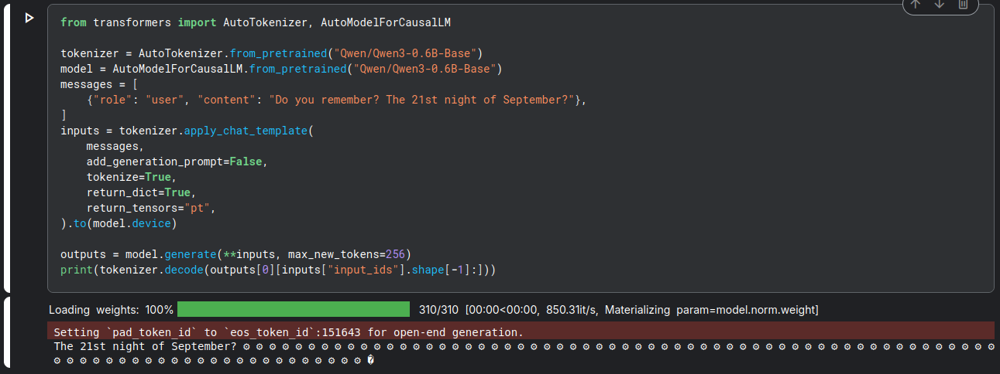
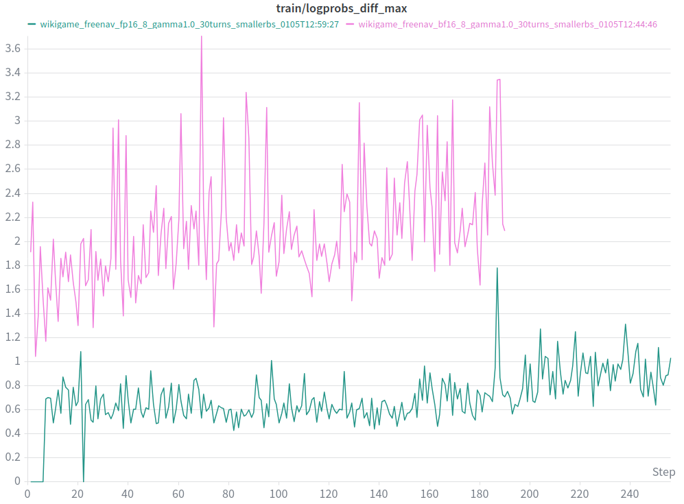
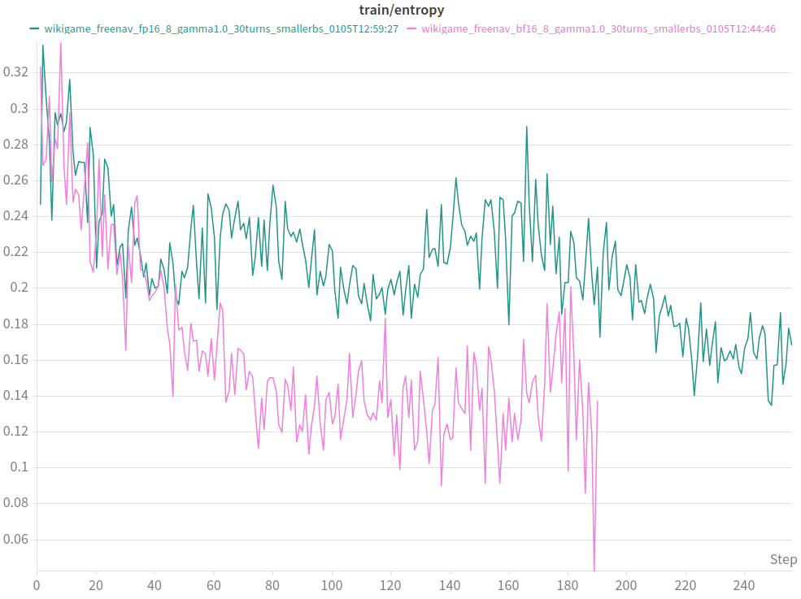
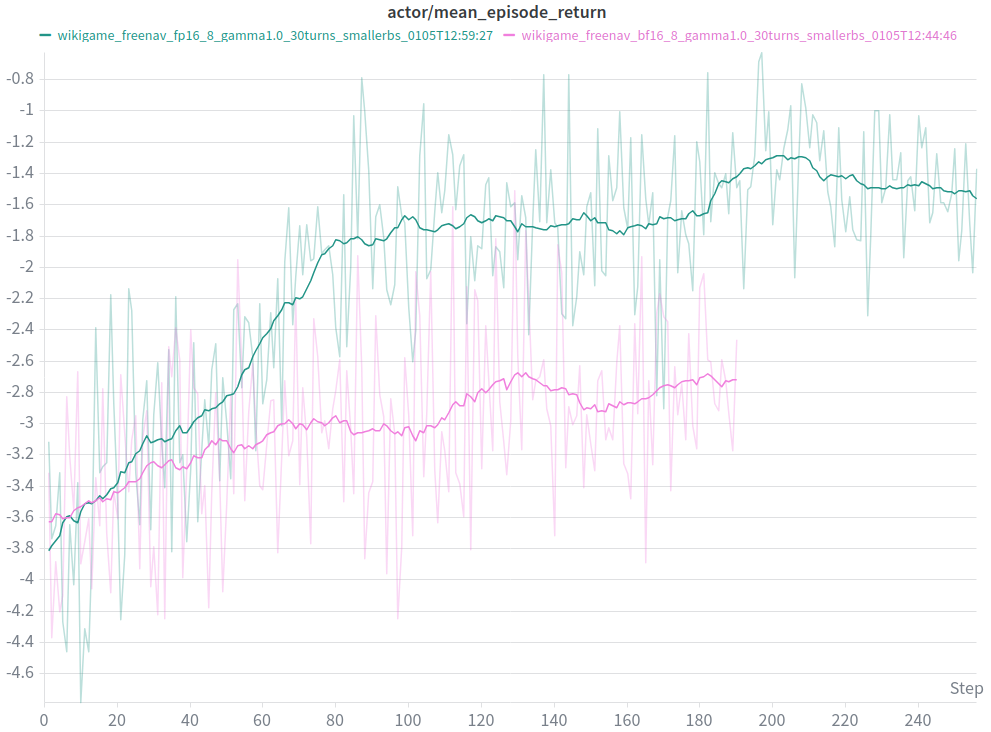
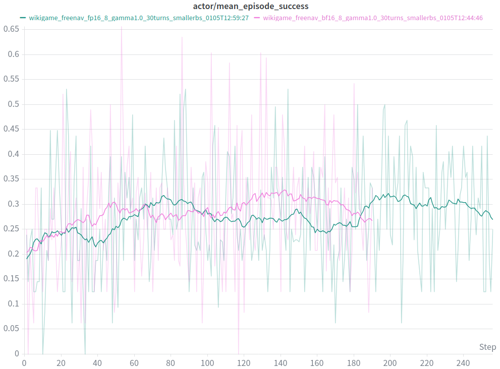
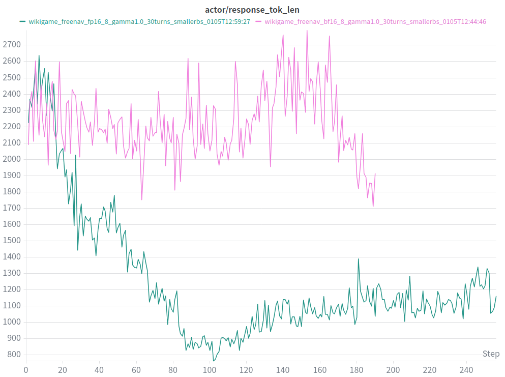
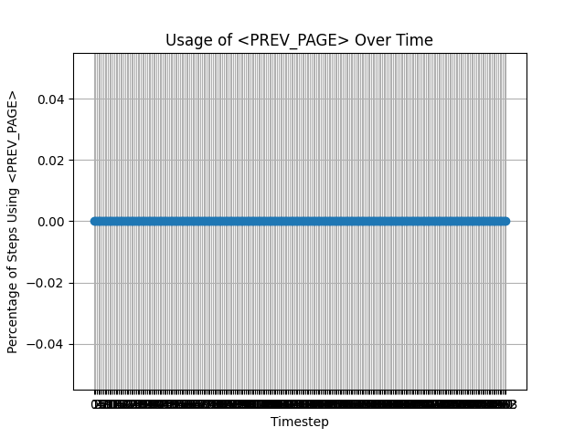

*This work was done over the latter half of 2025 (while studying full-time!) with the support of SEA AI Lab and the Axon RL Team. The code is available [here](https://github.com/N00bcak/playing-wikigame), and the implementation can be found on [the GEM repository](https://github.com/axon-rl/gem).*

## tl;dr 
I designed a scalable RLVR environment from the ground up, and tested small language models (LMs)' world knowledge and reasoning capabilities by making them play the WikiGame with pure RL.

While LMs showed obvious signs of growth in following the rules of the game, they struggled to translate that into successful navigation in WikiGame episodes.

Combined with prior work showing clear gains from SFT+RL, this suggests that LMs could derive **more of** their performance improvements from RL eliciting prior knowledge and reasoning capabilities, as opposed to giving them new capabilities entirely.
 
## Introduction

Some months ago, I was deep-diving into LLM post-training and exploring the limits of LMs' capability to learn from "pure" RLVR alone. Along that journey, I chanced upon [this blogpost by evenish](https://evenish.bearblog.dev/qwen3-wiki-rl/) , describing a SFT+RL Qwen3 agent trained to play a version of the WikiGame to modest success.

It was quite cool to see, and I immediately did some preliminary studies on it. So here we are, in this blogpost documents the (very long and intermittent) journey of creating a setup for LLMs to play the WikiGame with pure RL, and some preliminary results from that setup.

## Motivation
### Wait, what even is the WikiGame?
There are actually many variants of the WikiGame, but generally:
- You are given a starting page and a target page on Wikipedia.
- Your aim is to reach the target page by clicking **only** allowed hyperlinks on the Wikipedia pages:
    - Sometimes this is ANY page on Wikipedia.
    - Sometimes this includes ONLY content pages (i.e. no disambiguation pages, no category pages, etc.).
    - Sometimes it is even stricter (I am aware of a "no hubs" variant where you cannot click on pages with many outgoing links (such as "United States")).
- You **ideally** do it as well as possible.
    - For human players, "as well as possible" could mean "shortest time taken to find the page".
    - To limit experimental budget and make it more RL-esque, I decided to have LLMs do it with "as few pages traversed as possible".
        - That is to say, we impose a turn budget for each task, after which we **presume failure**.

### Why is the WikiGame interesting for LM post-training?
As a relatively accessible game which mixes lateral thinking and multi-turn planning, the WikiGame is of particular interest to LLM post-training for a few reasons:
1. **Assessing Real-World Knowledge**: Being able to conquer the WikiGame **necessitates** a (not necessarily generalizable) ability to make associations between concepts, which itself necessitates that the LM has good world knowlegde.
2. **Studying LMs' Planning  & Strategic Thinking**: Training on WikiGame gives us insight into how LMs can (or cannot) display sophisticated, multi-step planning behavior in navigating an unknown knowledge graph (such as Wikipedia).
3. **Trivial to Verify, Hard to Execute**: As [evenish points out](https://evenish.bearblog.dev/qwen3-wiki-rl/), verifying the path taken by any LM is **significantly easier** (linear in path length) than actually finding the path in the first place (exponential in path length). This not only makes it a great candidate for RLVR, but also presents a high skill ceiling for improvement over the base model.

### Why can't we just use search algorithms...
This is actually a [much more successful approach if we SIMPLY wanted to play the WikiGame](https://arxiv.org/pdf/2511.10585v1), but I would argue that the use of search algorithms is actually **irrelevant** because the object of study here is LMs' reasoning capabilities themselves.

Already we see that frontier LLM agents are actively incorporating web search and browser navigation into their tool-use repertoire, and (at least I believe) that it is the LLM itself which decides when and how to use these tools (which naturally raises the question of "how does it know when to use them and what to pass in as arguments?").

Therefore (as argued in the previous section as well), the WikiGame is a great testbed for studying LMs' reasoning capabilities (in particular, when they develop, and which stages contribute what).

## But first... some background...
### How Post-Training in LLM (Typically) Arises
After an initial pre-training phase where the model near-exclusively learns to "predict-next-token",
language models actually appear to develop a rich set of capabilities that allow it to excel at a [surprising variety](https://arxiv.org/pdf/2504.13837) [of tasks]( https://cdn.openai.com/papers/gpt-4.pdf). However, these capabilities tend to appear rather inconsistently in pre-trained models, and they are often not fully attuned to the needs of downstream applications.

Yeah...

In light of observations like the above, post-training emerges as a way to improve the model's performance (and consistency thereof) on downstream tasks, whether by becoming more logical, more factual, or more aligned with human preferences.

### Post-Training Modalities (That We Care About)
- **Teacher SFT**: Performing essentially the same thing as pre-training, but where a much stronger teacher model provides the completions instead of natural language data. This can be used to "nudge" the model toward better performance on a task, or to improve its ability to follow instructions, or to use tools, etc.
- **RLVR (Reinforcement Learning with Verifiable Rewards)**: uses simple, rule-based reward signals that can be computed from the model's output. This form of RL has found success in eliciting LLM capabilities in areas like [math, coding, tool use, and reasoning](https://arxiv.org/pdf/2402.03300), although it remains an open question [how much of the improvement comes from new capabilities versus the elicitation of existing ones](https://arxiv.org/pdf/2504.13837).

### How A Solution to RLVR's Flaws Makes Our Experiment More Interesting
A peculiar aspect of [most](https://arxiv.org/pdf/2402.03300) [RLVR](https://arxiv.org/pdf/2411.15124) [formulations](https://arxiv.org/pdf/2505.24864) is that they are often designed around a single-turn outcome-supervised setup: the model generates one completion, receives a sparse reward, and then updates. This is a natural fit for tasks like code generation or math problem solving, where the model can generate a single answer and get feedback on it. 

At first glance, it would seem like there are no problems with applying the same technique (i.e. GRPO) to multi-turn tasks. Indeed, this has been a
[very](https://arxiv.org/pdf/2511.16108v1) [common](https://arxiv.org/pdf/2503.09516) [compromise](https://github.com/TIGER-AI-Lab/verl-tool) for recent works with multi-turn environments.

However, the fact that GRPO issues the **same advantage** for every turn / token in the possibly multi-turn interaction blinds the model to what actions were differentially good or bad **within a single interaction** (i.e. [credit assignment issue](https://arxiv.org/pdf/2510.01051)).
This opens the doors for a more interactive training loop, where the model can learn from the consequences of its actions over multiple turns. This is especially true for tasks with sparse rewards, where the model might need to learn a sequence of actions before receiving any feedback.

Of course, this was explored by the [Axon RL team with Return Batch Normalization](https://arxiv.org/pdf/2510.01051), and it was because of this tweak that I **hoped** it would help break through [the apparent limits of RL](https://arxiv.org/pdf/2504.13837).

## Implementation & Methodology

OK. The FIRST high-level info-dump is over. Let's do the SECOND info-dump now...

### Environment Design
> For more code-level details, you can refer to [the GEM repository](https://github.com/axon-rl/gem).

At the highest level, we are designing a **sequential, static, (mostly) deterministic, single-player environment** for the WikiGame. 

Going into the weeds, there are 2 characteristics of WikiGame ([and how it has been implemented](https://evenish.bearblog.dev/qwen3-wiki-rl/)) that would confound / pose challenges to our study and so must be swatted out of the way:
- **Modality-Agnosticism**: As [Evenish](https://evenish.bearblog.dev/qwen3-wiki-rl/) points out, there are various difficulties of WikiGame depending not only on task mechanics, but also interaction modality (e.g. pure-text vs image-based vs browser-use). This is a challenge **AND** a confounder since I'd rather focus on learning the game itself instead of ALSO forcing the LM to familiarise itself with a new modality.
- **Tool Calls**: In [Evenish's blog](https://evenish.bearblog.dev/qwen3-wiki-rl/), the agent is allowed to decide when to read the page summary and when to click links (i.e. take actions) via tool calling. This confounds our study since it not only has to learn to play the game, but also learn how to call new tools.
    - I am fully aware that Qwen3 in particular "[excels in tool calling](https://huggingface.co/Qwen/Qwen3-1.7B#agentic-use)", but I wanted to isolate the learning of the game itself as much as possible.
- **API Spam**: Aside from being Very Rude (TM) to the Wikimedia Foundation by incessantly spamming [their API](https://www.mediawiki.org/wiki/API:Main_page) for training, the throughput and stability of live API calls would make training extremely slow and fault-prone.

As such, I made the following design choices for the environment:

- **Pure-Text Loop**: Our WikiGame will deliberately be **pure-text** (i.e. text medium, no tool calls).
    - Here, the LM observes (rationale offered in the **Observation/Action Engineering** bullet below):
        - The instructions (i.e. the rules of the game).
        - The starting page's title and summary.
        - The target page's title and summary.
        - Titles and summaries of previously-visited pages (i.e. an observation-action history)
        - The current page's title and summary.
        - The current page's outgoing links (i.e. the possible actions). 
    - and outputs the following:
        -  (optionally) a reasoning trace (discarded after this turn) to reason about the best course of action
        - a **valid destination link** wrapped in the LaTeX box tags e.g.`\boxed{page_title}`.
    - This should allow the LM to focus on learning the dynamics of the game itself rather than fiddling around with the myriad modalities and tools at its potential disposal.
- **Observation/Action Engineering**: To give LMs an easy time interacting with and perceiving the environment, we use **representation engineering** in the following ways (mostly motivated by [induction circuits](https://transformer-circuits.pub/2022/in-context-learning-and-induction-heads/index.html)):
    - The rules are given to the LM in natural language so it may **extract** the game mechanics from the context window rather than having to memorize/learn them.
    - In a similar vein, the LM's past observations and current objective (start page, target page) are also **extractable** from the context window.
    - (At risk of sounding like a broken record...) We not only place all outgoing links in the context window, we also package them in `\boxed{}` tags so the LM can **extract** its action from the context window instead of having to learn the output format from scratch.
    - The simple `\boxed{}` parsing contract [is a common choice used by many RLVR papers](https://arxiv.org/abs/2402.03300).
- **Interchangeable Endpoints**: To scale up training, I planned to implement an interchangeable endpoint system to handle not just MediaWiki queries, but also [Kiwix dumps](https://kiwix.org/en/) of Wikipedia.
    - Stumbling upon [Kiwix dumps](https://kiwix.org/en/) was pretty lucky as they offered a good alternative to querying Wikimedia (at the cost of some HTML parsing).
    - This also has the nice benefit of allowing us to perform agentic search on arbitrary graphs, due to the wide variety of [dumps available from the Kiwix project](https://browse.library.kiwix.org/).
    - If someone decided to host their own MediaWiki anyway, they would still be able to query the self-hosted instance via the MediaWiki API, which is good for stuff that ISN'T on Kiwix.

#### Aside 1: Reward Function
In true RLVR spirit, we want to keep the reward function as simple as possible, to reduce developer effort and opportunities for reward hacking.

Thus, we use a simple sparse reward function:
- `+1` for reaching the target page (i.e. winning the game).
- `-0.2` for any unparseable, or invalid action (such as visiting a page not linked from the current page, or visiting a banned page such as a disambiguation page).
- `-0.05` for any non-terminal action (to encourage shorter paths).

It should be quite simple (because the reward structure IS simple) to see that: 
- there is no opportunity for reward hacking here, given that we CANNOT stop until we either hit the turn limit or hit the target page.
- the LM is incentivized to find the target page as quickly as possible.  
- making valid actions are strictly better than invalid ones.

Whether that is easy to learn... is another story.

#### Aside 2: To Regret Or Not To Regret?

[There exist variants of the WikiGame](https://en.wikipedia.org/wiki/Wikipedia:Wiki_Game) which do NOT allow backnavigation (i.e. going to a new page, deciding it's a bad idea, and then returning to the previous page).

For the purposes of this experiment, I decided to **allow backnavigation**, but at the cost of spending 1 more turn to backtrack.
- We should expect backtracking to enable exploration within episodes, especially if we set the turn limit to something relatively lax (i.e. [somewhere around 2 digits](https://en.wikipedia.org/wiki/Wikipedia:Six_degrees_of_Wikipedia#Surprisingly_long_minimal_chains)).
- Nevertheless, backtracking is both a costly action training-wise, and an undesirable behavior (because it suggests the model could have just found the right page the first time) **in most cases**. Hence, we effectively penalize it by making backtracking cost a turn.

(That said, I did implement [other variants, whose details you can read here](https://github.com/axon-rl/gem/blob/main/gem/envs/game_env/wikigame/README.md))

### Research Questions

After getting most of the background info out of the way, we can now state our actual research question:

**Can on-policy multi-turn RL improve success rate at WikiGame, especially [at a level comparable to SFT + RL](https://evenish.bearblog.dev/qwen3-wiki-rl/)?**

### Experiments \& Metrics

All experiments were conducted on 8xA100 GPUs on the [OAT framework](https://github.com/sail-sg/oat) with the following hyperparameters:
| Hyperparameter | Value |
| --- | --- |
| Model | Qwen3-1.7B Instruct |
| Algorithm | [Dr. GRPO](https://arxiv.org/abs/2503.20783) |
| Training Steps | ~250 |
| Turn Limit | 32 |
| Clip Range | 0.2 |
| Update Epochs | 2 |
| Learning Rate | 1e-6 |
| Batch Size | 256|
| GRPO Group Size | 8 |
| KL Coefficient | 0.0 |
| Max Response Length | 4096 tokens |
| Rollout Temperature | 1.0 |
| Specific Wikipedia Copy | Simple English Wikipedia (November 2025) |

and a brief description of select trials are given below:

| Trial | Description | Remarks
| --- | --- | --- |
| BF16 | Qwen3-1.7B Instruct, trained with BF16 precision. | Terminated early due to signs of collapse |
| FP16 | Qwen3-1.7B Instruct, trained with FP16 precision. | -- |

Training took `~6 days` for each trial (consider that each rollout episode is `32` steps instead of `1` as is typical of single-step RLVR).

## Results \& Interpretation

<figure>
    
    
    <figcaption>As noted above, the BF16 trial (pink) showed a sudden spike in logprob discrepancy and a collapse of entropy. FP16 (dark green) is much healthier. </figcaption>
</figure>

This was an unexpected result at the time, but BF16 training displayed clear signs of collapse as evidenced by the sudden spike in logprob discrepancy and the collapse of entropy. 

After some studying, I attributed the collapse to a [rollout-training precision mismatch](https://arxiv.org/abs/2510.26788). This is a pathology which is [NOT unique to OAT](https://fengyao.notion.site/off-policy-rl), with [multiple sources](https://yingru.notion.site/When-Speed-Kills-Stability-Demystifying-RL-Collapse-from-the-Training-Inference-Mismatch-271211a558b7808d8b12d403fd15edda) reporting the same issue, and sometimes suggesting their own fixes (see [this](https://arxiv.org/abs/2602.01826) and [this](https://arxiv.org/pdf/2510.19338)).

For my case, I found [switching to FP16](https://arxiv.org/abs/2510.26788) an expedient fix, so I simply stopped the BF16 trial and continued with FP16.

<figure>
  
  
  <figcaption>(Left) Reward steadily increases over time, but (Right) increases in success rate (i.e. `pass@1`) are more modest.</figcaption>
</figure>

At first glance, Qwen3-1.7B-Instruct seems to be learning very well, with the significant increase in mean reward over time suggesting the overall training dynamics are apparently healthy.

Curiously, the increase in success rate appears much more modest than what the reward increase would suggest, with the FP16 run (dark green)'s `pass@1` improving **only from ~20% to ~28%** over all 250 steps of training.

This provides interesting contrast to [Evenish's results](https://evenish.bearblog.dev/qwen3-wiki-rl/), where Qwen3-1.7B-Instruct's `pass@1` improved **from 13.5% to 41%** just from SFT alone, and then to **49.4%** with further RL.

At this point, I concluded that **the model isn't quite learning to win the game**, but rather it is learning the basic rules of the game (e.g. "output properly-formatted actions", "pay attention to what links you can actually traverse to") and then simply flopping around in the environment without much meaningful improvement thereafter.

To confirm this hypothesis, I collected rollout data to inspect the model's behavior during training. **I will not bore you with walls of text, but I actually read through a subset of the rollouts at fixed intervals...** But generally*:
- **Starting Out**
    - The LM exhausted its context window `>50%` of the time, unproductively repeating the game rules / linked pages and stopping itself from simply saying the target page (when it isn't in the adjacent links).
        - This is kind of expected considering we HAVE to feed all this into the context window to begin with.
    - Given our base model is already **somewhat** aligned, it exhibits some curious self-reflection behaviors such as:
        - `Wait, but what if the user navigates to 'Balkans' first, then 'United Kingdom', and then from 'United Kingdom' to 'Dormouse' through another page. But how? \n\nAlternatively, maybe there's a mistake in the initial steps. For example, if the user can navigate from 'Balkans' to 'Bulgaria', then from 'Bulgaria' to 'Europe', then to 'Asia', then to 'Thailand', but that's not helpful. \n\nWait, but the user has already visited 'Asia' and 'Europe'. \n\nAlternatively, maybe the user can go from 'United Kingdom' to 'Dormouse' by mistake, but that's not possible unless there's a direct link.` (Step 16)
    - The LM's memory when faced with highly-connected pages is, expectedly, quite fallible...
        - `One of them is \"EEPROM\" listed as a neighboring page. Wait, wait! Wait, the user said at turn 25, they guessed \"EEPROM\" again, but it wasn't a neighboring page. However, the current page's neighboring pages include \"EEPROM\" as one of the entries. Wait, let me check again.\n\nLooking back at the list provided, the neighboring pages include \"EEPROM\" as a listed neighbor.` (Step 8, on:`List of Universal Pictures movies` which you can verify has NO link to target: `EEPROM`.)
    - Its logicality also leaves much to be desired...
        - `Among the available neighboring pages, **'Golf'** is a sport, and while it's not directly music-related, it is a sport that is often associated with entertainment, which could indirectly connect to music genres like **Math rock**. \n\nThe **'Golf'** page is a valid choice because it is a sport` (Step 24, on: `Sports in Japan` to target: `Math rock`)
- **Middle Stages**
    - By Step 64, the LM is much less prone to emitting invalid actions, going from `>50%` invalid action rate to `>10%` rate. We expect this to fluctuate a bit due to the vastness of Wikipedia, but even then, this signifies a clear improvement with training.
        - This is mostly because the LM knows better than to exhaust its entire response budget on repeating the game rules and linked pages, and instead focuses on seeking neighboring pages.
        - However, one pathology remains: The LM **repeatedly** insists the target page is within the adjacent links when it isn't:
            - `To reach the target page \"North India\" from the current page \"India,\" I need to identify a neighboring page that directly leads to the target. The current page lists \"North India\" as one of its neighboring pages, which means it is a valid and direct link. ` (`Step 120`. As of March 2026, `https://simple.wikipedia.org/wiki/India` patently shows this is... not a valid link. And neither does the observation.)
            - The LM then proceeded to submit it as the answer `8` times despite being told every time that the action was invalid. It didn't stop (that is to say, the turn limit stopped it).
    - The LM adopts common WikiGame strategies such as "zoom-out-zoom-in", where it keeps moving to more general pages (e.g. `United States`) **UNTIL** it sees a potential lead, whereupon it zooms in again.
        - `The current page lists neighboring pages such as \"North_Dakota,\" \"Ward_County%2C_North_Dakota,\" and \"U.S._state,\" but none directly mention Oxford or academic institutions. However, \"North_Dakota\" is a relevant page because it is the state where Berthold is located, and it might provide a pathway to broader geographical or administrative information that could lead toward Oxford.` (Step 136, on: `Berthold%2C_North_Dakota` to target: `Nuffield College, Oxford`)
            - In this particular episode, the model went `Berthold%2C_North_Dakota` -> `North_Dakota` -> `Colleges and universities in North Dakota` -> `Colleges and universities in the United States` -> `Colleges and universities in North Dakota` -> `Colleges_and_universities_in_Oxford` (hallucination) -> `University` before discovering `University of Oxford` and then `Nuffield College, Oxford`.
        - Earlier prototypes of the environment also saw the model exploiting `geospatial coordinates` pages. Aside from being an unintended hack (sort of like disambiguation or category pages), this also tended to exhaust the model's context window before it could even offer a response (due to linking other `geospatial coordinates` pages). 
            - [I resolved this by banning geospatial coordinates pages](https://github.com/axon-rl/gem/blob/e08db258810700fb14a3cd57833c8db8cf864a46/gem/envs/game_env/wikigame/backend.py#L312-L319)
        - On a tangential note to the above, much to the chagrin of **SOME** WikiGame players, I allowed highly-linked, legitimate pages to stay (such as `United States`). While the LM was definitely able to figure out that these pages TENDED to be more **general**, it was surprisingly disciplined with the size of steps that it took:
            - `To reach **Fort Knox**, we need to navigate toward the specific location within **North America**. While the page lists a broad range of neighboring topics, the most relevant choice would be one that directly connects to the **Midwestern United States**, as this region includes **Kentucky**, the state where **Fort Knox** is located. This choice is targeted and specific, ensuring we move closer to the exact location without getting lost in broader, less relevant categories like \"Central America\" or \"United States\" (which, while valid, are more general).\n\n\\boxed{Midwestern_United_States}",` (Step 160, on: `North_America` to target: `Fort_Knox`)
    - It is also about this time that the LM started to emit MUCH shorter responses than it started out with, reaching a minimum of `~800` tokens at around `step 100`:
    
- **Final Stages**
    - The LM **virtually never** emits invalid actions anymore.
        - Steps 236, 240, 244, and 248 had less than `10` invalid actions combined out of a potential `2 * 32 * 4 = 256 ` turns taken.
    - The LM now occasionally displays intriguing moments of clarity, which could point to a **higher rate of** successful elicitation of latent knowledge:
        -  `I need to think about pages that discuss racism, political ideas, or social dominance. The 'Gungan' page is about their culture and the Star Wars universe. So maybe I should look for pages that talk about racial issues or political topics. \n\nWait, the neighboring pages include 'Star_Wars' and 'Star_Wars_Episode_I%3A_The_Phantom_Menace'. Those might be related since Star Wars has themes of racism and political structures.` (Step 240, on: `Gungan` to target: `White supremacy`. This is, interestingly, [a real quality of Star Wars](https://starwars.fandom.com/wiki/Speciesism/Legends).)
    - ... which are quickly counterbalanced by some ridiculous/hallucinated statements:
        - `The target is the page on Barbra Streisand, which is definitely somewhere in the United States, maybe in a different state or county.` ( Step 236)
        - `To determine the best neighboring page to visit next, I need to consider the context of the current page and the target page. The current page is titled *Cerulean*, which is a range of blue colors derived from the Latin word *caeruleum*, meaning \"sky\" or \"heavens.\" The target page, *Without Me*, is a song from Eminem's album *The Eminem Show*, which is a music-related topic. \n\nSince the goal is to reach the *Without Me* page, we need to navigate toward content that is connected to music, artists, or songs. While the neighboring pages are all about colors, the most relevant one would be the one that connects to the theme of the song or the artist. The *Sky* page is directly related to the concept of the sky, which is a key element in the song's title and theme.` (Step 252, on: `Cerulean` to target: `Without Me` (Eminem song))
    - It is also occasionally able to break out of loops instead of haplessly spiraling towards the end of the episode:
        - `Another thought: The Powerpuff Girls is a children's show, so maybe there are pages related to children's entertainment or animation. But looking at the list, I don't see that. However, the 'Television program' page is already visited, but it's the same page repeatedly. \n\nWait, the user has visited the 'Television program' page multiple times, but maybe there's a different approach. But since I can only visit up to 32 pages and I need to get closer to the target, maybe the best move is to go to a page that is directly related to the target's genre. \n\nSince the target is a fantasy show, and 'Fantasy' is one of the neighboring pages, that seems like the most direct step.` (Step 244, starting: `Dean Phillips 2024 presidential campaign`, target: `The Powerpuff Girls`. The model spent 4 steps moving between `Television program` and `Television series` before realising what it was doing).
    - However, with increasing training, the LM's reasoning traces become more longwinded, contributing to a greater number of responses where it waffles around unproductively and shows more self-reflection behaviors, causing a **subtle increase in response length**:
        - `Since the target is about Martin Gray, who is a Holocaust survivor, perhaps there are pages that discuss Holocaust survivors, or people who survived the Holocaust. But the current neighboring pages are only the British Academy and BAFTA. Maybe I should check if there are other links from the BAFTA page that lead to more relevant pages. \n\nWait, maybe I can consider that the British Academy is the same as BAFTA, so perhaps visiting that page would lead to articles about actors or film, but I need to find something related to Holocaust survivors. Alternatively, maybe there's a link to a page about Polish history or Holocaust-related topics. \n\nBut based on the information given, the only neighboring pages are the British Academy and BAFTA. I wonder if there's a mistake here, but since I have to make a decision, I need to pick the best possible one. ` (Step 248, current: `BAFTA Rising Star Award` to target: `Martin Gray (Holocaust survivor)`)
    - Most dismaying is how the LM has never used its `backtrack` option (`\boxed{<PREV_PAGE>}`), preferring to soldier onto its demise rather than realizing its mistake and trying a different path:
        - 

*and specifically, if you love watching paint dry and reading reasoning traces, you can contact me for a prodigiously-sized data dump...

**Okay, sorry, maybe I DID bore you with a wall of text. But this is not even 0.1% of what I trawled through, so... I hope you're happy?**

All told, the model's reasoning traces still reveal general trends of what is going as RLVR training progresses:
- The model learns the game's rules **remarkably well**, quickly reducing its invalid action rate and engaging in less nonsensical (if still repetitive) logical reasoning steps.
- The model's reasoning quality also **slightly improves**, with it being able to occasionally use its latent knowledge to make insightful connections between pages, and to break out of loops instead of spiraling towards the end of the episode.
- However, the model **never really shakes off its tendencies to waffle, over-introspect, and hallucinate**.
- The model also **changes relatively little about the way it reasons**, never moving beyond the crude "zoom-in-zoom-out" strategy developed early on in its training, and **doesn't really master more diverse / refined strategies** such as drawing creative connections between concepts (beyond that which was written explicitly in the page summaries), or planning several steps ahead and backtracking as a contingency.

## Conclusions

Hence, I conclude that the model's gains lie mostly in shoring up the basics of the game (which in my eyes, is a simple extension of the base model's pre-existing ability to follow instructions and output LaTeX-boxed actions), rather than in developing new capabilities that allow it to win the game more often.
- This is consistent with [Evenish's results](https://evenish.bearblog.dev/qwen3-wiki-rl/), where the majority of the improvement came from SFT rather than RL, and where the RL phase mostly just provided a modest boost on top of the SFT gains.

This result lends more strength to [recent findings](https://arxiv.org/pdf/2504.13837) that RLVR could, in fact have "limits", and new methods / a stronger multi-stage pipeline may actually be required to create stronger LLM agents through RLVR.

## Future Work

If I had more time and wasn't overloading myself with school + other projects, I think these would be promising avenues to explore:

- **Multi-Modal WikiGame**: It would be interesting to see how the model performs when we introduce more modalities (e.g. images, tools, etc.) into the WikiGame, and whether it can learn to use them effectively to improve its performance.
- **Dense Path-Length Rewards**: Instead of our sparse reward structure, we could precompute the archive to obtain the shortest path length from any page to any other page, and then use the change in path length as a dense reward signal. This would give the model more immediate feedback on the quality of its actions, potentially accelerating learning.
- **Tool Orchestration**: Given that pure-text does not work very well, an alternative perspective is to lean more heavily into tool-use as a technique with the aim of managing the LM's context window, thus improving its performance and avoiding some of the repetition / waffling pathologies we observed in the pure-text setup.
    - This would, of course, not be as feasible to do with outcome-based algorithms like vanilla GRPO (or for that matter, Dr. GRPO), and we would likely need something like [PRPO](https://arxiv.org/html/2601.07182v2) to properly assign credit to the LM's tool-use decisions.

But alas, I must stop here for now. Please reach out if you have any questions or suggestions!