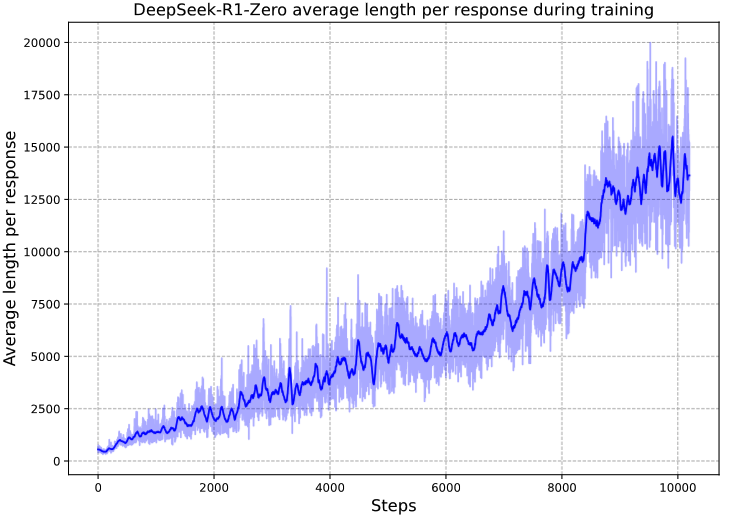
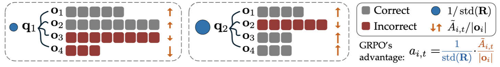

_This is an ongoing post on token-efficient LLM RL. Any suggestions for experiments or feedback are more than welcome!_

## TL;DR

I studied using Lagrangian relaxation in-depth in order to manage response length and format compliance in LLM RL without manual penalty tuning. 
Preliminary results show that, at least in the RLVR context, **most RL methods are not as effective as a traditional implementation of Lagrange relaxation** for controlling these ancillary objectives while preserving task performance.

## Introduction

Recently I found out about Constrained Markov Decision Processes (CMDPs) (represented by [CPO](https://arxiv.org/abs/1705.10528), [RCPO](https://arxiv.org/abs/1805.11074), and interestingly, [TRPO](https://arxiv.org/abs/1502.05477) itself), which are a variant of the standard MDP framework where the agent must optimize some primary reward **while respecting constraints on secondary cost channels**. 
 
This problem formulation appears quite interesting to LLM RLVR, wherein we usually only care about some primary reward (e.g. task performance), but also have separate behaviors that we want to control (e.g. response length, format compliance), either because they improve training throughput, or they make training significantly easier (among many, MANY other potential reasons).

Of all these secondary qualities, perhaps the one which has captivated **industrial** research interest most recently is **response length**. We already know vanilla GRPO not only [tends to](https://arxiv.org/pdf/2501.12948), but is indeed [biased towards generating longer and longer outputs](https://arxiv.org/abs/2503.20783), and this is undesirable for a few reasons:
- **Higher Inference Cost**: More forward passes are needed to generate responses, increasing the cost of RLVR training
- **Lower Training Throughput**: Longer responses can lead to slower rollouts, which can bottleneck training speed and increase wall-clock time.
- **Blabbering**: At inference time, the model may produce unnecessarily long outputs when it is uncertain, which can degrade user experience and downstream parsing reliability.

<figure>
    
    <figcaption>
    When training <a href="https://arxiv.org/abs/2402.03300">DeepSeek-R1-Zero</a>, DeepSeek noticed an appreciable increase in response length as GRPO training progresses
    </figcaption>
</figure>

## Background

### Group Relative Policy Optimization (GRPO)
In LLM RL, policy-gradient methods tend to be favored for their relative simplicity and ease of implementation (although [recent works](https://arxiv.org/abs/2602.19362) appear [to be revisiting this decision](https://openreview.net/forum?id=RduOiisl1S)). The most well known of these methods, [(Outcome Supervision) GRPO](https://arxiv.org/abs/2402.03300), attempts to optimize a contextual bandit objective of the form:
$$\max_{\theta} J(\theta) = \max_{\theta} \mathbb{E}_{q \sim Q, \{\tau_i\}_{i = 1}^G \sim \pi_\theta(\cdot|q)}\left[\frac{1}{G}\sum_{i=1}^G \frac{1}{|\tau_i|}\sum_{t=1}^{|\tau_i|} \frac{\pi_\theta(a_t^i|s_t^i)}{\pi_{\theta_{old}}(a_t^i|s_t^i) }\hat{A}(\tau_i, t)\right]$$
where $Q$ is some prompt distribution, $\tau_i$ represent individual responses to the prompt, and $\hat{A}(\tau_i, t) = \frac{r(\tau_i) - \mu_{\tau}}{\sigma_{\tau}}$ is the group-relative advantage. (Note: I omit KL here because it is not relevant to the formal discussion)

### Managing Auxiliary Rewards

Another feature of LLM RL (though hardly unique to it) is the use of auxiliary rewards to coax desirable behavior beyond the primary task objective (e.g. "Get Answer Correct").

This is most obvious through the use of **format rewards** in mathematics or coding domains, where responses are cheaply verifiable (via empirical or formal checks) if they come in a easily-parsed format. Therefore, in these regimes LLMs are usually made to output their answers in code blocks and/or LaTeX for parser convenience, and are penalized for format violations.

A frequent question that arises from these schemes is how one should set the scale of these auxiliary rewards:
- Set them too low, and the task of disbursing primary rewards becomes difficult to impossible (since we cannot parse the model's output to check correctness).
- Set them too high, and the model may learn to prioritize format compliance over task quality, leading to suboptimal performance on the primary objective.

Notice while we ask ourselves that question, we actually have **NO GOOD IDEA** of what "too low" or "too high" even means. It is doubtless that we know we can't set the format penalty to 0; that is a no-op. We also know the format penalty can't outscale the primary reward, otherwise the model will just learn to be format-compliant and ignore task quality. In between those two very obvious extremes, however, it becomes very hard to ascribe numeric thresholds and interpretations to the coefficients without just running a sweep and seeing what happens.

This is especially true when model behavior shifts during training, which can change the effective scale of the primary reward and thus the relative importance of the auxiliary reward.

This results in our second research question:
- Are we able to manage auxiliary rewards like format compliance and length control **without having to manually tune coefficients whose effects are hard to interpret**?
    - Further, can we do so without taking massive hits to primary objective performance?

## Constrained RL and Lagrange Relaxation

It turns out, if we reframe both of the above questions a little, we can view them as instances of constrained optimization problems:
**How can we maximize task reward while staying below some thresholds for response length and format violation rate?**

This mindset change has some nice benefits:
1. Conceptually, 
    - We can change our line of questioning from "how do we tune arbitrary coefficients to achieve our desired behavior" to "what is our desired behavior, and how can our coefficients adapt to achieve it?"
    - We can start off with a good framework for thinking about our tradeoffs problem (even though the math doesn't actually hold up in practice)
2. Pragmatically,
    - We can tap into a large body of existing work on Constrained RL for ideas to try out in our setting.

A constrained formulation is often more faithful to deployment goals:
\[
\max_{\theta} J(\theta)
\quad\text{s.t.}\quad
\mathbb{E}[c_k(\tau)] \le b_k,\;\; k=1,\dots,K,
\]
where each \(c_k\) is a cost (for example, format violation rate or excess length usage) and \(b_k\) is its budget/setpoint.[^cpo][^rcpo]

Lagrange relaxation converts this into an unconstrained saddle objective:
\[
\mathcal{L}(\theta,\lambda)
=
J(\theta)-\sum_{k=1}^{K}\lambda_k\big(\mathbb{E}[c_k]-b_k\big),
\qquad
\lambda_k \ge 0.
\]
The policy parameters \(\theta\) are optimized to increase reward under current penalties, while multipliers \(\lambda\) are updated by dual ascent and projected to the nonnegative orthant.[^cpo][^rcpo]

In practice, dual variables can become unstable or saturate; one pragmatic variant is to add coefficient damping (equivalently, a quadratic/L2-style regularization pressure on multipliers), which discourages runaway growth:
\[
\lambda_k \leftarrow
\Pi_{\lambda_k \ge 0}
\left(
\lambda_k + \eta_k\big(\widehat{c}_k-b_k\big) - \eta_k\rho_k\lambda_k
\right).
\]
This preserves the constrained-optimization intuition while improving training stability in finite-sample, nonstationary RL regimes.[^rcpo]

For LLM RL, this lens is directly useful: response quality remains the primary objective, while ancillary attributes (format compliance and token-budget discipline) become explicit cost channels instead of brittle one-off heuristic penalties.[^deepseekmath][^deepseekr1][^l1][^laconic]

### Response Length

We mentioned earlier that response length is undesirable for post-trained RL models. [It turns out, there is a structural reason for this bias](https://arxiv.org/abs/2503.20783), and that is that **the GRPO objective systematically encourages wrong yet verbose** responses. 

Although I couldn't identify **WHY** the specific design choice was made [in the original GRPO paper](https://arxiv.org/abs/2402.03300), this phenomenon can be visualized with a very nice picture from [this paper]((https://arxiv.org/abs/2503.20783)):

### Wait, but I thought longer responses could mean the model is being more deliberative?

Good catch, and that changes the "response length" issue from a simple "shorter is better" problem into a **problem of tradeoffs**.

We know from [earlier](https://arxiv.org/abs/2201.11903) [research](https://arxiv.org/abs/2210.03629) can actually arise from contemplative **behaviors**, which in turn help task performance.

## Research Question
This gives rise to an interesting research question, that sounds a bit like having our cake and eating it too: Can we simultaneously
1. Reduce average response length, and
2. Roughly preserve task performance?

## Significance
For readers comfortable with math but new to this niche: the key issue is objective mismatch. If we optimize only correctness reward, models can discover policies that are accurate but operationally expensive (long outputs) or integration-hostile (format failures).[^efficient]

In deployment-like settings, format reliability and compute budget are not optional niceties. They are hard constraints tied to latency, serving cost, parser robustness, and user experience. Constrained RL offers a principled way to encode those requirements as budgets rather than manually retuned scalar penalties every time data or policy behavior shifts.[^cpo][^rcpo][^laconic]

Recent efficient-reasoning work also shows this tension clearly: length-control mechanisms can preserve or improve task quality while substantially reducing generated tokens, but method details matter (fixed penalties, adaptive penalties, and constrained updates behave differently).[^l1][^laconic][^o1pruner][^laser][^efficient]

## Implementation
This study is implemented in a math-RL setup centered on `train_math.py`, with actor implementations under `~/programming/lagrange-all-the-things/latte/actors`. For this post, `~/programming/latte` is treated as that codebase path.

### Primary Comparators
- `vanilla` (Lagrange-style adaptive constraints)
- `laconic` (length-focused adaptive variant)
- `l1_exact` and `l1_max` (LCPO family)

These map to actor-learner pairs declared in `train_math.py` and corresponding actor classes (`latte/actors/vanilla.py`, `latte/actors/laconic.py`, `latte/actors/l1.py`).

### Reward and Cost Construction (Vanilla Lagrange)
At rollout level, the implemented augmented reward is:
\[
r_i^{\text{aug}}
=
r_i^{\text{task}}
-\lambda_{\text{fmt}}\,c_i^{\text{fmt}}
-\lambda_{\text{len}}\,c_i^{\text{len}}.
\]
with
\[
c_i^{\text{fmt}}=\mathbb{1}\{\text{malformed output}\},
\quad
\ell_i=\frac{p_i-s_{\text{len}}}{s_{\text{len}}},
\quad
p_i=\frac{\text{response tokens}_i}{L_{\max}},
\]
\[
c_i^{\text{len}} = (1-c_i^{\text{fmt}})\,\ell_i
\]
and optional one-sided length decay using \(\max(0,\ell_i)\) depending on config flags.

Multiplier updates are projected and optionally damped:
\[
\lambda_{\text{fmt}}
\leftarrow
\Pi_{[0,\lambda_{\text{fmt}}^{\max}]}
\left(
\lambda_{\text{fmt}}
\,+\,
\eta_{\text{fmt}}
\left(\bar{c}_{\text{fmt}}-s_{\text{fmt}}-d_{\text{fmt}}\frac{\lambda_{\text{fmt}}}{\lambda_{\text{fmt}}^{\max}}\right)
\right),
\]
\[
\lambda_{\text{len}}
\leftarrow
\Pi_{[0,\lambda_{\text{len}}^{\max}]}
\left(
\lambda_{\text{len}}
\,+\,
\eta_{\text{len}}
\left(\bar{c}_{\text{len}}-d_{\text{len}}\frac{\lambda_{\text{len}}}{\lambda_{\text{len}}^{\max}}\right)
\right),
\]
where \(d_{\cdot}\in\{0,1\}\) encodes whether decay is active.

### Comparator-Specific Mechanics
- `laconic`: keeps the same broad objective style but only updates length-side control and uses clamped positive length overage for shaping in its actor implementation.
- `l1_exact`: uses LCPO-style reward \( \mathbf{1}_{\text{correct}} - \alpha|T-L| \) (plus format-side penalty in this code path).
- `l1_max`: uses clipped bonus form \( \mathbf{1}_{\text{correct}}\cdot\text{clip}(\alpha(T-L)+\delta,0,1) \) (again with format-side penalty in this implementation).[^l1]

### Compact Run Definitions

| Run name | `learner_type` | Constraint mechanism | Key control knobs |
|---|---|---|---|
| `math-qwenbase-1.5b-drgrpo-lagrange-both-with-decay` | `vanilla` | Adaptive format + length (both floating), with decay | `fmt_init=0.0`, `len_init=0.0`, `fmt_setpoint=0.05`, `len_setpoint=0.25`, `use_fmt_decay`, `use_len_decay` |
| `math-qwenbase-1.5b-drgrpo-lagrange-both` | `vanilla` | Adaptive format + length, no decay | Same setpoints/caps, decay flags off |
| `math-qwenbase-1.5b-drgrpo-laconic` | `laconic` | Length-focused adaptive control | `floating_len_coef`, `len_setpoint=0.25`, fixed format coefficient |
| `math-qwenbase-1.5b-drgrpo-l1-exact` | `l1_exact` | LCPO-Exact style length control | `l1_alpha=0.0003`, target-length sampling in actor |
| `math-qwenbase-1.5b-drgrpo-l1-max` | `l1_max` | LCPO-Max style length control | `l1_alpha=0.0003`, `l1_delta=0.5`, sampled target-length range |

All runs above are currently configured with the same model family and core training skeleton in the script set, but this write-up treats comparisons as preliminary pending stricter matched-seed and matched-config sweeps.

## Preliminary Results
The content in this section is intentionally scaffolded for insertion of your measured metrics, ablation summaries, and qualitative examples.

<!-- TODO_MAIN_RESULTS_TABLE_START -->
Insert your main comparison table here (recommended columns):

| Method | Primary run name | Main quality metric(s) | Avg response length / pct max | Format success rate | Notes |
|---|---|---:|---:|---:|---|
| Lagrange (`vanilla`) | `...` | `...` | `...` | `...` | `...` |
| LACONIC | `...` | `...` | `...` | `...` | `...` |
| L1-Exact | `...` | `...` | `...` | `...` | `...` |
| L1-Max | `...` | `...` | `...` | `...` | `...` |
<!-- TODO_MAIN_RESULTS_TABLE_END -->

<!-- TODO_MAIN_RESULTS_NARRATIVE_START -->
Insert narrative for the main comparison here.

Suggested prompts:
- Which methods best satisfied length/format targets without damaging task quality?
- Were there distinct training-dynamics signatures (fast compression, oscillatory multipliers, delayed quality recovery)?
- Which trade-off frontier looked most favorable in this exploratory pass?
<!-- TODO_MAIN_RESULTS_NARRATIVE_END -->

<!-- TODO_ABLATION_TABLE_START -->
Insert your ablation table here (removing ancillary objectives from the Lagrange setup).

Recommended structure:
| Ablation variant | Removed objective/component | Quality delta vs full | Length delta vs full | Format-rate delta vs full | Interpretation note |
|---|---|---:|---:|---:|---|
| Full Lagrange | None | `baseline` | `baseline` | `baseline` | `...` |
| No format objective | Format channel removed | `...` | `...` | `...` | `...` |
| No length objective | Length channel removed | `...` | `...` | `...` | `...` |
| No decay (if applicable) | Dual damping removed | `...` | `...` | `...` | `...` |
<!-- TODO_ABLATION_TABLE_END -->

<!-- TODO_ABLATION_NARRATIVE_START -->
Insert your ablation narrative here.

Suggested prompts:
- Which ancillary objective contributed most to stability vs final metric quality?
- Did objective removal expose coupling effects (e.g., worse format then indirectly worse quality)?
- Which ablation most clearly supports the constrained-optimization framing?
<!-- TODO_ABLATION_NARRATIVE_END -->

<!-- TODO_QUALITATIVE_CASES_START -->
Insert qualitative case studies from representative runs.

Suggested structure (2-4 examples):
1. A high-quality concise solution showing desired behavior.
2. A verbose-but-correct trajectory and how constraint pressure changed it.
3. A malformed-output or truncation failure case.
4. (Optional) A case illustrating different behavior between Lagrange, L1, and LACONIC.
<!-- TODO_QUALITATIVE_CASES_END -->

<!-- TODO_LIMITATIONS_NON_CETERIS_PARIBUS_START -->
Insert explicit caveats here about non-ceteris-paribus factors in this preliminary study.

Suggested checklist:
- Seeds not fully matched across every variant.
- Some script flags evolved during exploration.
- Hyperparameter budgets tuned unevenly across methods.
- Potential implementation-level differences beyond the intended method change.
<!-- TODO_LIMITATIONS_NON_CETERIS_PARIBUS_END -->

## Interpretation
### Descriptive observations
At this stage, the main outcome is methodological: the Lagrange-relaxation framing cleanly maps to practical RL controls in code and yields measurable levers over ancillary behavior (length/format) while preserving a shared reward-learning backbone.

### Working hypotheses (not causal claims)
1. Adaptive dual updates are likely to reduce manual penalty tuning burden compared to fixed scalar penalties, particularly when model behavior shifts during training.[^rcpo][^laconic]
2. Coupling format and length channels may be important because malformed generations can confound length statistics and downstream reward signal quality.
3. Damping/decay terms probably help avoid coefficient blow-up and limit oscillatory dual dynamics in finite-batch RL.

### Threats to validity
1. Not fully ceteris paribus: this is an exploratory study converted into a preliminary report.
2. Stochastic RL variance and evaluation noise can be large without strict multi-seed matching.
3. Method-level and implementation-level effects are partially entangled in early-stage experimental code.
4. Math-domain results may not transfer uniformly to coding or multi-turn environments without retuning setpoints and cost definitions.

## Conclusion
This write-up establishes a constrained-RL interpretation of efficient LLM RL in a practical math-training stack: optimize task reward while controlling ancillary objectives through adaptive Lagrange multipliers. The current evidence is intentionally preliminary, but the scaffolding is now in place for rigorous next-round comparisons, especially matched-seed ceteris-paribus tests and transfer to coding and game-style multi-turn domains.

## Bibliography
[^ppo]: John Schulman, Filip Wolski, Prafulla Dhariwal, Alec Radford, and Oleg Klimov. *Proximal Policy Optimization Algorithms*. arXiv:1707.06347, 2017. https://arxiv.org/abs/1707.06347

[^cpo]: Joshua Achiam, David Held, Aviv Tamar, and Pieter Abbeel. *Constrained Policy Optimization*. arXiv:1705.10528, 2017. https://arxiv.org/abs/1705.10528

[^rcpo]: Chen Tessler, Daniel J. Mankowitz, and Shie Mannor. *Reward Constrained Policy Optimization*. arXiv:1805.11074, 2018. https://arxiv.org/abs/1805.11074

[^deepseekmath]: Zhihong Shao et al. *DeepSeekMath: Pushing the Limits of Mathematical Reasoning in Open Language Models*. arXiv:2402.03300, 2024. https://arxiv.org/abs/2402.03300

[^deepseekr1]: DeepSeek-AI et al. *DeepSeek-R1: Incentivizing Reasoning Capability in LLMs via Reinforcement Learning*. arXiv:2501.12948, 2025. https://arxiv.org/abs/2501.12948

[^l1]: Pranjal Aggarwal and Sean Welleck. *L1: Controlling How Long A Reasoning Model Thinks With Reinforcement Learning*. arXiv:2503.04697, 2025. https://arxiv.org/abs/2503.04697

[^laconic]: Chang Liu, Yiran Zhao, Lawrence Liu, Yaoqi Ye, Csaba Szepesvari, and Lin F. Yang. *LACONIC: Length-Aware Constrained Reinforcement Learning for LLM*. arXiv:2602.14468, 2026. https://arxiv.org/abs/2602.14468

[^o1pruner]: Haotian Luo et al. *O1-Pruner: Length-Harmonizing Fine-Tuning for O1-Like Reasoning Pruning*. arXiv:2501.12570, 2025. https://arxiv.org/abs/2501.12570

[^laser]: Wei Liu et al. *Learn to Reason Efficiently with Adaptive Length-based Reward Shaping*. arXiv:2505.15612, 2025. https://arxiv.org/abs/2505.15612

[^efficient]: Daman Arora and Andrea Zanette. *Training Language Models to Reason Efficiently*. arXiv:2502.04463, 2025. https://arxiv.org/abs/2502.04463
