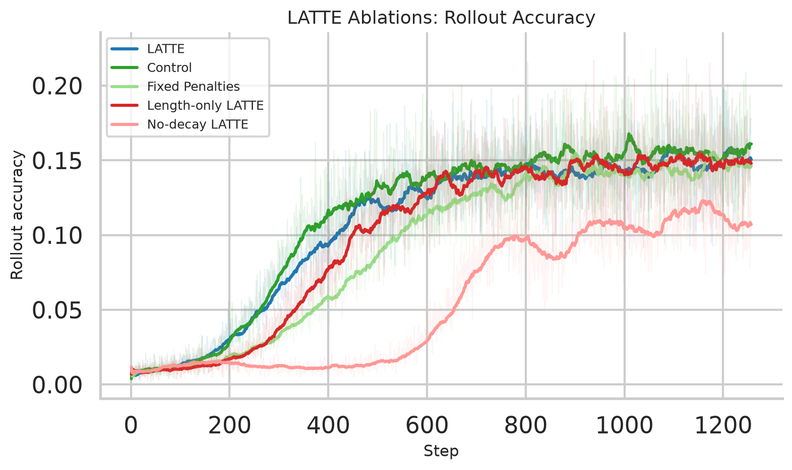
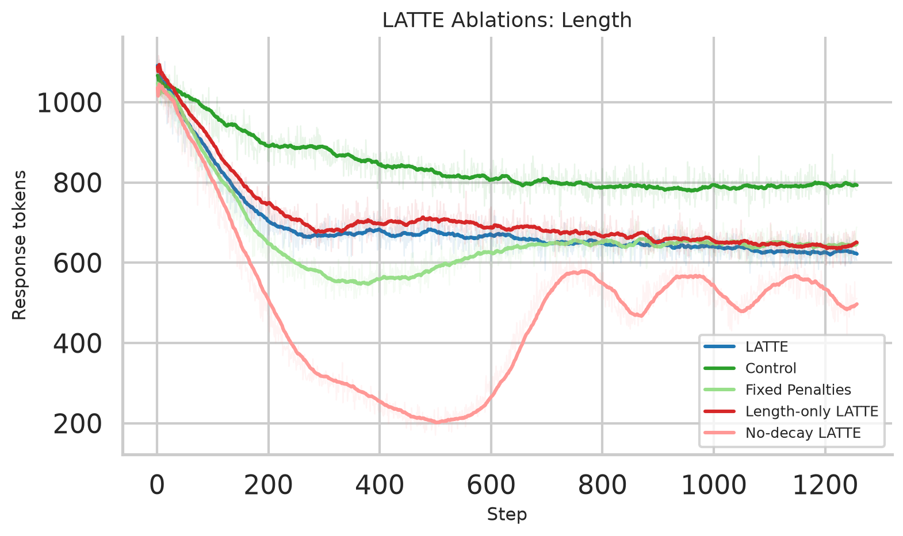
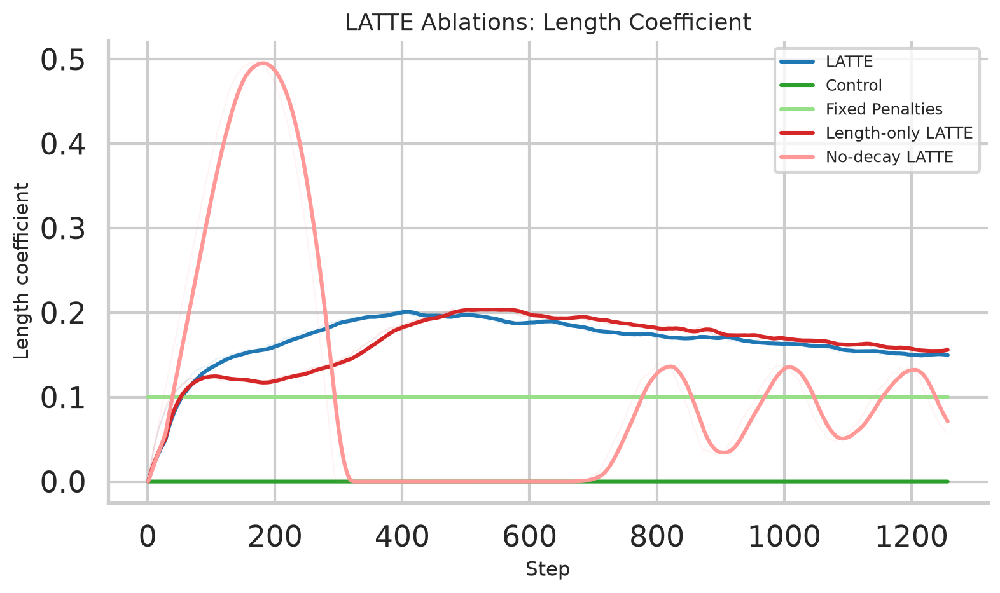
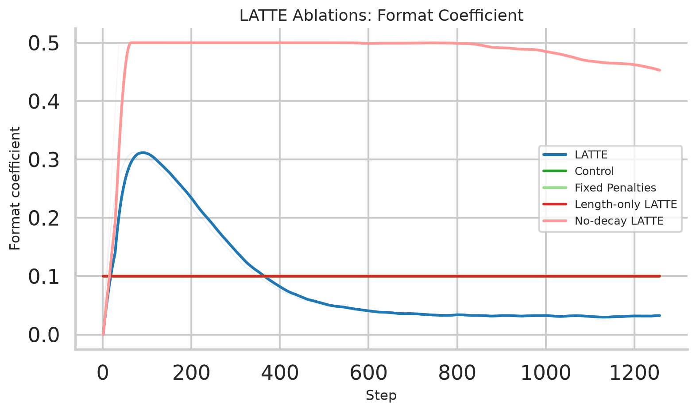
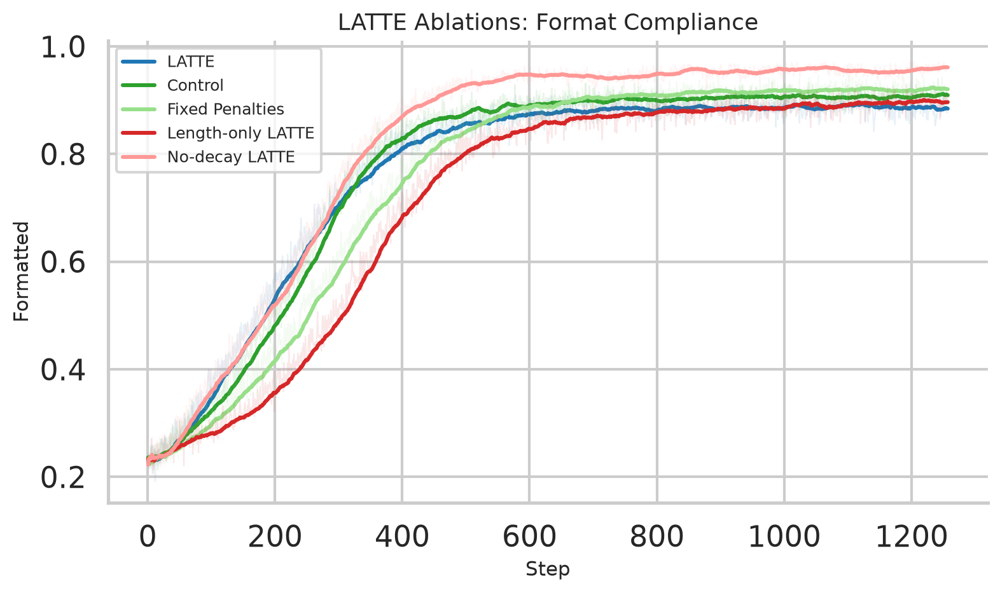
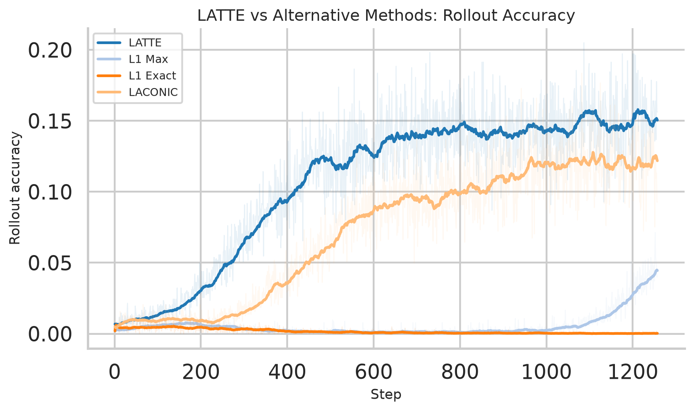
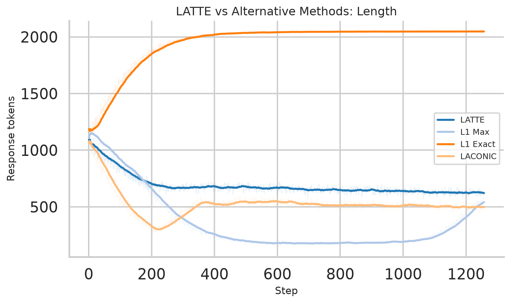
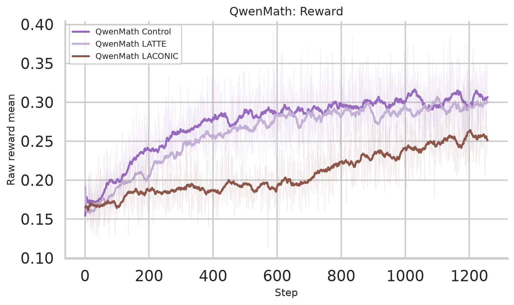
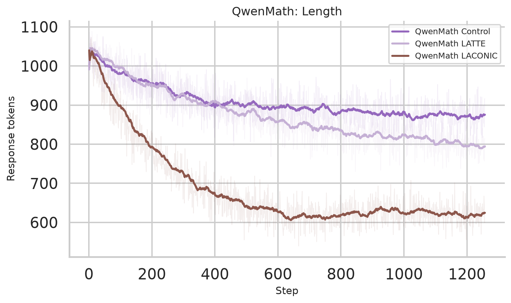

_This is an ongoing post on token-efficient LLM RL. Any suggestions for experiments or feedback are more than welcome!_

## TL;DR

I studied using Lagrangian relaxation in-depth in order to manage response length and format compliance in LLM RL without manual penalty tuning. 
Preliminary results show that, at least in the RLVR context, **most RL methods are not as effective as a traditional implementation of Lagrange relaxation** for controlling these auxiliary objectives while preserving task performance.

## Introduction

Recently I found out about Constrained Markov Decision Processes (CMDPs) (represented by [CPO](https://arxiv.org/abs/1705.10528), [RCPO](https://arxiv.org/abs/1805.11074), and interestingly, [TRPO](https://arxiv.org/abs/1502.05477) itself), which are a variant of the standard MDP framework where the agent must optimize some primary reward **while respecting constraints on secondary cost channels**. 
 
This problem formulation appears quite interesting to LLM RLVR, wherein we usually only care about some primary reward (e.g. task performance), but also have separate behaviors that we want to control (e.g. response length, format compliance), either because they improve training throughput, or they make training significantly easier (among many, MANY other potential reasons).

Thus, this blogpost is sort of an exploration of classical RLVR methods through the lens of constrained optimization.

## But First, Some Background...

### Group Relative Policy Optimization (GRPO)
In LLM RL, policy-gradient methods tend to be favored for their relative simplicity and ease of implementation (although [recent works](https://arxiv.org/abs/2602.19362) appear [to be revisiting this decision](https://openreview.net/forum?id=RduOiisl1S)). The most well known of these methods, [(Outcome Supervision) GRPO](https://arxiv.org/abs/2402.03300), attempts to optimize a contextual bandit objective of the form:
$$\max_{\theta} J(\theta) = \max_{\theta} \mathbb{E}_{q \sim Q, \{\tau_i\}_{i = 1}^G \sim \pi_\theta(\cdot|q)}\left[\frac{1}{G}\sum_{i=1}^G \frac{1}{|\tau_i|}\sum_{t=1}^{|\tau_i|} \frac{\pi_\theta(a_t^i|s_t^i)}{\pi_{\theta_{old}}(a_t^i|s_t^i) }\hat{A}(\tau_i, t)\right]$$
where $Q$ is some prompt distribution, $\tau_i$ represent individual responses to the prompt, and $\hat{A}(\tau_i, t) = \frac{r(\tau_i) - \mu_{\tau}}{\sigma_{\tau}}$ is the group-relative advantage. (Note: I omit KL here because it is not relevant to the formal discussion)

### Auxiliary Rewards in RLVR

As mentioned previously, reward functions in LLM RL are often made up of **primary** objectives (e.g. "Get Question Correct") and **secondary** objectives (e.g. "Don't produce malformed output"). This is a common practice in LLM RL as explained above (though [hardly](https://arxiv.org/abs/2007.03964) [unique](https://arxiv.org/abs/1705.10528) to it.)

Enough has been said about the **primary** objectives and how their apparent sparsity can still result in great empirical performance (how can I NOT link [DeepSeek-R1](https://arxiv.org/abs/2501.12948) when talking about this...), so let's focus instead on the **secondary** objectives, which can quite a bit more complex than we give them credit for.

#### Case Study: Format Compliance As A Secondary Objective

Most commonly, you will see  **format rewards** in mathematics or coding domains as a secondary objective. 

In these domains, responses are cheaply verifiable (via empirical or formal checks), given they come in a easily-parsed format, so it becomes much easier to give a "yes/no" reward signal in general.

[The](https://arxiv.org/abs/2402.03300) [most](https://arxiv.org/abs/2505.24864) [common](https://arxiv.org/abs/2501.12948) [approach](https://arxiv.org/abs/2504.13837) to designing formatting rewards is to **penalize ill-formatted responses with some negative constant reward**. 
 (while base models have gotten stronger at format following, [omit at your own risk](https://arxiv.org/pdf/2411.15124)...). This is a very simple way to encourage format compliance, but it conveniently downplays the non-triviality of **actually figuring out that constant amount to begin with**:
- Set it too low, and the model will never output format-compliant responses, making the task of actually giving it rewards difficult.
- Set it too high, and the model may learn to prioritize format compliance over task quality, leading to suboptimal performance on the primary objective.

Notice while we ask ourselves these questions, we also have **NO GOOD IDEA** of what "too low" or "too high" even means. It is doubtless that we know we can't set the format penalty to 0; that is a no-op. We also know the format penalty can't outscale the primary reward, otherwise the model will just learn to be format-compliant and ignore task quality. In between those two very obvious extremes, however, it becomes very hard to ascribe numeric thresholds and interpretations to the coefficients without just running a sweep and seeing what happens.

This is especially true when model behavior shifts during training, which can change the effective scale of the primary reward and thus the relative importance of the auxiliary reward.

#### Case Study: Response Length As A Secondary Objective

Of all the secondary objectives commonly adopted in LLM RL, perhaps the one which has captivated **industrial** research interest most recently is **response length**. We already know vanilla GRPO [tends to](https://arxiv.org/pdf/2501.12948) **generate longer and longer outputs**, and this is undesirable for a few reasons:
- **Higher Inference Cost**: More forward passes are needed to generate responses, increasing the cost of RLVR training
- **Lower Training Throughput**: Longer responses can lead to slower rollouts, which can bottleneck training speed and increase wall-clock time.
- **Blabbering**: At inference time, the model may produce unnecessarily long outputs when it is uncertain, which can degrade user experience.

<figure>
    
    <figcaption>
    When training <a href="https://arxiv.org/abs/2402.03300">DeepSeek-R1-Zero</a>, DeepSeek noticed an appreciable increase in response length as GRPO training progresses
    </figcaption>
</figure>

[It turns out, there is a structural reason for this bias](https://arxiv.org/abs/2503.20783), and that is that **the GRPO objective systematically encourages wrong yet verbose** responses. Although I couldn't identify **WHY** the specific design choice was made [in the original GRPO paper](https://arxiv.org/abs/2402.03300), this phenomenon can be visualized with a very nice picture from [this paper](https://arxiv.org/abs/2503.20783):

The key intuition is that **in GRPO, all tokens "share" the final advantage signal equally**:
- If the advantage is negative, it becomes **less negative** when the response is longer, which can encourage the model to add more tokens to dilute the negative signal. 
- Conversely, if the advantage is positive, it becomes **more positive** when the response is shorter, which has its own set of problems (like poor-quality reasoning traces).

##### So... Shorter Is Better?

Not so fast.

While not exactly obvious, it is quite logical why shorter responses are not universally superior either:
- **Reward Hacking**: If we naively penalize length, the model can game it by outputting the EOS token all the time.
- **Suppressed Reasoning**: We know from [earlier](https://arxiv.org/abs/2201.11903) [research](https://arxiv.org/abs/2210.03629) can actually arise from contemplative **behaviors**, which in turn help task performance.

That changes the "response length" issue from a simple "shorter is better" problem into a **problem of tradeoffs**.

#### Challenges of Secondary Objectives in LLM RL

By considering both case studies above, we can summarize the main challenges of secondary objectives in LLM RL as follows:
1. **Difficulty of Manual Tuning**: It can be difficult to find the right scalar penalty for an auxiliary objective, and this can change during training as model behavior shifts.
    - Usually, people get around this with parameter sweeps and intuition. But is that necessarily the best way to do it? 
2. **Reward Misspecification**: It is very easy for unexpected consequences to arise from even seemingly simple reward formulations, such as overemphasizing format compliance at the cost of task performance, or encouraging laconic but low-quality responses.

## Constrained RL and Lagrange Relaxation

It turns out, however, that it is relatively easy to reframe these objectives as **soft constraints** (i.e. think of them as  tolerable up to a certain point):
- Formatting rewards: "As long as a sufficiently high percentage of responses are well-formatted, I can mark the LLM's responses correctly and let RL take the wheel from there."
    - Mathematically, $p(\text{format violation}) \le s_{\text{fmt}}$ for some setpoint $s_{\text{fmt}}$.
- Length rewards: "If I could control the average response length to be below some threshold, I could get a better grasp on my training budget and increase training throughput."
    - Mathematically, $\mathbb{E}[\text{response length}] \le s_{\text{len}}$ for some setpoint $s_{\text{len}}$.

See where I'm going with this? This turns our LLM RL problem into a **constrained optimization problem** (extremely loosely, a CMDP).

This is useful to us because [a common technique used to solve CMDPs](https://www-sop.inria.fr/members/Eitan.Altman/TEMP/h.pdf) is indeed, Lagrangian relaxation. Given a problem that looks like this:

$$\max_{\theta} J(\theta)
\quad\text{s.t.}\quad
\mathbb{E}[c_k(\tau)] \le b_k,\;\; k=1,\dots,K,$$

Lagrangian relaxation helps re-state the problem as a **simpler dual problem** (see [Bertsekas](http://www.athenasc.com/nonlinbook.html) for more details):
$$\max_{\theta} J(\theta) - \sum_{k=1}^{K} \lambda_k \big(\mathbb{E}[c_k] - b_k\big) \quad \text{s.t.} \quad \lambda_k \ge 0.$$

wherein after each policy update, the multipliers $\lambda_k$ are updated by the subgradient method ([also displayed in RCPO](https://arxiv.org/abs/1805.11074)):
$$\lambda_k \leftarrow \left[ \lambda_k + \eta_k \big(\widehat{c}_k - b_k\big) \right]_+.$$

If you thought I did this just to wave some cool math at your face... guilty as charged? But more importantly for LLM RL,it means that we can change our line of questioning from "how do we tune arbitrary coefficients to achieve our desired behavior" to "what is our desired behavior, and how can our coefficients adapt to achieve it?"
- We have a mechanism to target some **goal** rather than some obtuse **penalty coefficient**, and
- we can **adaptively** update our coefficients to achieve that goal.

## Research Questions

The above background exposition gives rise to an interesting research question in LLM RL, especially given that [recent](https://arxiv.org/abs/2503.04697) [papers](https://arxiv.org/abs/2602.14468) have started to explore adaptive methods for controlling **response length** in particular:
1. How do classical constrained RL methods like Lagrangian relaxation perform in the context of LLM RLVR for controlling auxiliary objectives like format compliance and response length?
2. How do they compare to more recent methods that have been proposed for similar purposes, such as [LACONIC](https://arxiv.org/abs/2602.14468) and [L1](https://arxiv.org/abs/2503.04697)?

## Introducing LATTE: the method for applying Lagrangian (relaxation) to All The Things Effectively

To answer these questions in the most **bare-bones, first-principles** way possible, I made LATTE.

Like how I make my ACTUAL lattes in real life, LATTE is made so the above constrained-optimization framing is as literal as possible.

There are many possible ways to use this framing, but we will (for now) introduce a few cost functions to be controlled: 

1. Format violation: 
$$c_{\text{fmt}}(\tau) = \mathbf{1}[\tau \text{ is malformed}],$$

2. Length budget excess:
$$
c_{\text{len}}(\tau)
= \mathbf{1}[\tau \text{ is formatted}]
\cdot
\max\left(0, \frac{\ell(\tau) / L_{\max} - s_{\text{len}}}{s_{\text{len}}}\right).
$$

where $\ell(\tau)$ is the response length in tokens, $L_{\max}$ is the generation budget, and $s_{\text{len}}$ is the desired length fraction. 
- This is extremely similar to [LACONIC](https://arxiv.org/abs/2602.14468). In fact, as I will explain later, it is the heuristic nature of [LACONIC](https://arxiv.org/abs/2602.14468)'s multiplier update (as well as its puzzling use of [QwenMath](https://arxiv.org/abs/2409.12122) models to show the performance of LLMs with RL... on... Math...) that made me want to investigate Lagrangian relaxation in the first place.

I will now proceed to show a few LATTE tricks I found necessary to make RLVR look as good (cosmetically) as possible, and to make our Lagrangian relaxation formulas as principled as possible:

### LATTE Trick 1: Designing the Length Penalty

In LATTE, the length penalty is gated by the format compliance indicator, in order to prevent penalizing a malformed answer which is also over-budget.

This design prevents **a known reward-hacking scenario**: When the answer is wrong, the model nevertheless makes its responses as terse as possible to secure brownie points, sabotaging any attempts to explore the response space and potentially getting the main reward the legitimate way.

### LATTE Trick 2: Multiplier Decay

The eagle-eyed among you may notice that [LATTE Trick 1](#latte-trick-1-designing-the-length-penalty) has a side effect: to hit the length "setpoint" (i.e. not in the Lagrangian sense), our actual length-cost setpoint has to be 0.[^1] This means that our dual update is kind of broken, **because the multiplier will never naturally decay when the policy is under budget.**

[^1]: The **EVEN MORE** eagle-eyed among you may notice [from my code](https://github.com/N00bcak/lagrange-all-the-things) that while the format constraint DOES have a nonzero setpoint, it does not show up in the cost function. This is a booboo on my part but does **NOT** affect the experiments, since it shifts the reward distribution by a constant (which in group-relative RL algortihms... does nothing!).

[LACONIC](https://arxiv.org/abs/2602.14468) gets around this by removing the hinge before performing the dual update (i.e. abandoning principled Lagrangian relaxation in favor of a heuristic solution).

We will fix it in a [more](https://arxiv.org/html/2602.02924v2) [principled](https://arxiv.org/abs/2306.00212) way by adding a decay term to the multiplier update:

$$
\lambda
\leftarrow
\left[
\lambda + \eta
\left(
\widehat{g} - \lambda / \lambda_{\max}
\right)
\right]_+
$$

where $\widehat{g}$ is the observed constraint residual. 

Staying within the Lagrangian-relaxation orthodoxy still matters  even though we are **obviously working** in a nonconvex optimization regime. It turns out, nonconvex constrained optimization solutions usually aims for [approximate KKT](https://optimization-online.org/wp-content/uploads/2019/06/7249.pdf) or stationary solutions anyways, and [regularized](https://arxiv.org/abs/1610.04514) / [proximal](https://optimization-online.org/wp-content/uploads/2019/08/7324.pdf) structure is a standard way to stabilize the resulting primal-dual dynamics. 

In that sense, the stabilizing intervention acts on the optimization procedure rather than on the semantics of the constraint, which (accidentally) cements our deliberately simple approach as the more principled one over [LACONIC](https://arxiv.org/abs/2602.14468). Wahoo!

We will now be conducting experiments on various domains **(WIP: open to suggestions)** to answer the research questions posed above, and see how LATTE performs in practice.

## Domain Experiments: Math RLVR
*I expect to update this section with at least the following methods once I find time to implement them: [GR3](https://arxiv.org/abs/2603.10535), [DLER](https://arxiv.org/abs/2510.15110) (this one in particular is a doozy), [BRPO](https://arxiv.org/html/2505.13438v1).*

### Experiments

 We answer both research questions by pitting LATTE against various ablations, as well as [LACONIC](https://arxiv.org/abs/2602.14468) and [L1](https://arxiv.org/abs/2503.04697) baselines.
 
 All trials are run on the [OAT](https://github.com/sail-sg/oat) framework and **trained for 3 epochs** on the [DeepScaleR_40k](https://pretty-radio-b75.notion.site/DeepScaleR-Surpassing-O1-Preview-with-a-1-5B-Model-by-Scaling-RL-19681902c1468005bed8ca303013a4e2) dataset and evaluated on [`AIME`, `AMC`](https://github.com/sail-sg/oat), [`MATH500`](https://arxiv.org/abs/2103.03874), [`Minerva`](https://arxiv.org/abs/2206.14858), [`OlympiadBench`](https://arxiv.org/abs/2402.14008) datasets. 

We will briefly introduce the experiments as and when it becomes useful to know what they are about. For specific hyperparameters, see [Appendix A](#appendix-a-math-rlvr-experiments-appendix).

### Results \& Discussion

We plot the training curves for our experiments below. Each curve is a simple moving average (window size 28) of our experimental values, with a faint shadow representing the raw logged values.

We will also include as a table the best evaluation results for each method.

#### LATTE vs Ablations

The following ablations are chosen to highlight the main feature of LATTE: that it **absorbs all auxiliary rewards** into a single Lagrangian relaxation framework.

They also show how LATTE behaves when tricks such as the multiplier decay, and adaptive length penalty are removed.
- Not included: naive length penalty. We will instead compare against other length-control methods in the next section.

| Method | Description |
| --- | --- |
| Control | Fixed format penalty `0.1` and no active length penalty. This is the "most vanilla" RLVR setup.  |
| Fixed Penalties | Control, but we add a `0.1` fixed length penalty coefficient. |
| LATTE | Adaptive format and length multipliers initialized at `0.0`; update rate `0.02`; format violation setpoint `0.05`; length setpoint `0.25` of max generation length; multiplier cap `0.5`. Decay is applied to both multipliers. |
| No-decay LATTE | LATTE, but instead of a decay term, the length multiplier update is the standard projected subgradient update. |
| Length-only LATTE | LATTE, but the format multiplier is fixed at `0.1` and only the length multiplier is adaptive. |

Here are the results:
<figure>
    
    <figcaption>
    Rollout Accuracy over training steps
    </figcaption>
</figure>

Somewhat unsurprisingly, Control is the winner in terms of task performance (though not by much), but it is followed very closely by LATTE, Length-only LATTE, and Fixed Penalties.
- This is, with non-zero probability, the result of [math data contamination](https://arxiv.org/pdf/2507.10532v1) in [Qwen2.5](https://arxiv.org/abs/2412.15115) models, resulting in a base model which can already perform well on these tasks to begin with.
- But I also cannot definitively prove it **causes** good performance... so it will remain a theory.

What I WILL highlight is that LATTE is the most sample-efficient versus its ablations, and it achieves higher performance earlier than any of them as well.

<figure>
    
    <figcaption>
    Training response length for LATTE and the base-model ablations.
    </figcaption>
</figure>

Here we can see that LATTE is actually again, quite close to Length-only LATTE and Fixed Penalties in terms of final response length, but it is conclusively outdone by No-decay LATTE.

However, No-decay LATTE is a clear loser if we are talking about negotiating the length-accuracy tradeoff, as it also loses out on accuracy by a long mile.

<figure>
    
    <figcaption>
    Length multiplier dynamics across the LATTE ablations.
    </figcaption>
</figure>

An interesting (and expected) behavior here is that No-decay LATTE also tends to oscillate quite a bit. 
- Adopting a control theory view, we can see the subgradient update as an I-controller, which is known to be relatively sluggish to respond to changes in the system. 
- As such, it is also known to oscillate and be suboptimal at managing tradeoffs, which is what we are seeing here.
- Conversely, our decay terms act as damping factors for this dynamical system, which could explain why LATTE has more time to find a better tradeoff between length and accuracy.

<figure>
    
    <figcaption>
    Format multiplier dynamics across the LATTE ablations.
    </figcaption>
</figure>

Where the format multiplier is concerned, we can see the dampener interpretation of the decay term at play.
- No-decay LATTE instantly hits the multiplier ceiling before gently decreasing in the latest stages of training.
- Conversely, LATTE's decay term exerts downward pressure on the multiplier, ensuring multipliers stay high if and only if it is genuinely necessary for the model's current format-compliance behavior.
    - Whether this is better or not in the general case is unclear, and neither will it be clearer in the next plot.

<figure>
    
    <figcaption>
    Format compliance for LATTE and the base-model ablations.
    </figcaption>
</figure>

Unsurprisingly, No-decay LATTE also dominates the format compliance metric, not having a decay-term to weigh it down. 
- The story for No-decay at this point should be rather clear: It spends too much time trying to optimize the auxiliary objectives, and not enough time optimizing the primary objective.

Thanks to its adaptive format multiplier, LATTE is able to kickstart training faster due to a faster spike in format compliance, partially explaining its sample-efficiency. 
- However, it is also able to relax the format multiplier when it is no longer necessary, allowing it to focus on the primary objective and achieve fixed milestones faster than its other counterparts (with the sole exception of Control, who benefits from extra exploration space due to the lack of any length penalty).

##### OOD Evaluation on Ablations
| Method | AIME | AMC | MATH500 | Minerva | OlympiadBench | Overall |
| --- | --- | --- | --- | --- | --- | --- |
| LATTE | 0 | **0.2892** | 0.502 | **0.1287** | 0.1659 | 0.2172 |
| Control | 0.03333 | 0.253 | **0.522** | 0.1213 | 0.1659 | 0.2191 |
| Fixed Penalties | **0.1** | 0.253 | 0.496 | 0.09926 | **0.1704** | **0.2237** |
| Length-only LATTE | 0.06667 | 0.241 | 0.514 | **0.1287** | 0.157 | 0.2215 |
| No-decay LATTE | 0.06667 | 0.2169 | 0.414 | 0.09559 | 0.1393 | 0.1865 |

##### OOD Evaluation Response Length on Ablations
| Method | AIME | AMC | MATH500 | Minerva | OlympiadBench | Overall |
| --- | --- | --- | --- | --- | --- | --- |
| LATTE | 853.3 | 722.2 | 553.9 | 633.4 | 749.2 | 702.4 |
| Control | 990.8 | 862.6 | 645.0 | 746.3 | 849.1 | 818.7 |
| Fixed Penalties | 909.2 | **690.7** | 599.1 | 680.9 | 787.4 | 733.5 |
| Length-only LATTE | 840.3 | 740.1 | 551.3 | 637.1 | **705.4** | 694.8 |
| No-decay LATTE | **769.7** | 695.2 | **523.9** | **559.8** | 707.7 | **651.3** |

#### LATTE vs Length-Control Alternatives

Next, we compare LATTE against other methods that directly try to control output length. 
- We specially use `Qwen2.5-1.5B` as the base model to eliminate a common flaw present in [LACONIC](https://arxiv.org/abs/2602.14468) and [L1](https://arxiv.org/abs/2503.04697), which is that they use `Qwen2.5-Math-1.5B` as the base model, which is already a math-specialized model and can thus mask any pathologies caused by overoptimization of the length penalty.

The methods are as follows:

| Method | Description |
| --- | --- |
| LACONIC | LACONIC learner with fixed format penalty `0.1`; only the length multiplier is adaptive. The reward penalizes positive length excess while leaving shorter completions unpenalized.  |
| L1 Exact | Reward Function:`correctness - alpha * \|target_length - response_length\| - format_penalty`.|
| L1 Max | Samples target lengths from 512 to 2048 tokens and provides a clipped length bonus.|

<figure>
    
    <figcaption>
    Training raw reward for LATTE and the length-control method baselines.
    </figcaption>
</figure>

Once we remove the crutch that is `Qwen2.5-Math-1.5B`, we can see that LATTE is able to achieve **greater sample efficiency** and **a significantly better final performance** than the other methods.

<figure>
    
    <figcaption>
    Training response length for the same method comparison.
    </figcaption>
</figure>

It of course, pays for this with a slightly longer response length than **LACONIC**, and at present it is not entirely obvious which has the better accuracy-length tradeoff. I am open to suggestions for how to figure this out.

Strangely, **L1-Exact** appears to be almost completely unable to learn. Full disclosure: I ran 3 experiments trying to tune hyperparameters so it could work, and this is already the best result among them all.
- I am forced to conclude at this point that L1 Exact does not seem to be a good method for controlling response length in LLM RLVR, at least not without significant hyperparameter tuning.

<!-- 
<figure>
    
    <figcaption>
    Final reward-length tradeoff. Circles mark the final point, and crosses mark the best-reward point observed during training for each run.
    </figcaption>
</figure> -->

##### OOD Evaluation on Length-Control Alternatives

| Method | AIME | AMC | MATH500 | Minerva | OlympiadBench | Overall |
| --- | --- | --- | --- | --- | --- | --- |
| LATTE | 0 | **0.2892** | **0.502** | **0.1287** | **0.1659** | **0.2172** |
| LACONIC | **0.06667** | 0.2289 | 0.482 | 0.09191 | 0.1644 | 0.2068 |
| L1 Max | 0 | 0.1687 | 0.45 | 0.09191 | 0.1437 | 0.1709 |
| L1 Exact | 0 | 0 | 0.022 | 0.05515 | 0.01333 | 0.0181 |

##### OOD Evaluation Response Length on Length-Control Alternatives

| Method | AIME | AMC | MATH500 | Minerva | OlympiadBench | Overall |
| --- | --- | --- | --- | --- | --- | --- |
| LATTE | 853.3 | 722.2 | 553.9 | 633.4 | 749.2 | 702.4 |
| LACONIC | 829.8 | **652.9** | **548.1** | **583.8** | **720.7** | **667.1** |
| L1 Max | **817.5** | 767.3 | 597.2 | 744.2 | 787.9 | 742.8 |
| L1 Exact | 1921.4 | 1892.9 | 1886.5 | 1919.1 | 1924.6 | 1908.9 |

It seems that the OOD methods would suggest that with the base model, [LACONIC](https://arxiv.org/abs/2602.14468) is better at the accuracy-length tradeoff than LATTE.

#### QwenMath Transfer

Just to be safe, I wanted to see that [LACONIC](https://arxiv.org/abs/2602.14468) could actually blow LATTE out of the water in its niche (i.e. training on `Qwen2.5-Math-1.5B`).

You already know what these methods are, so I'll just show the results.

<figure>
    
    <figcaption>
    Training raw reward on `Qwen/Qwen2.5-Math-1.5B`.
    </figcaption>
</figure>

<figure>
    
    <figcaption>
    Training response length on `Qwen/Qwen2.5-Math-1.5B`.
    </figcaption>
</figure>

Again, there is no obvious winner here, with LATTE clearly winning in terms of sample efficiency, but with an unclear tradeoff between final accuracy and final response length (as compared to LACONIC).
- Clearly, LATTE is better at final accuracy. 
- But LACONIC is better at final response length.
- Both are encroaching on each other as training progresses, but I think with 3 epochs it is plenty to say that they are basically exploring roughly the same Pareto frontier already.

##### OOD Evaluation on QwenMath Transfer
| Method | AIME | AMC | MATH500 | Minerva | OlympiadBench | Overall |
| --- | --- | --- | --- | --- | --- | --- |
| QwenMath Control | 0.1667 | 0.4458 | **0.638** | **0.1985** | 0.2815 | **0.3461** |
| QwenMath LATTE | **0.2** | 0.4337 | 0.624 | 0.1801 | 0.2726 | 0.3421 |
| QwenMath LACONIC | 0.1 | **0.494** | 0.602 | **0.1985** | **0.2904** | 0.337 |

##### OOD Evaluation Response Length on QwenMath Transfer

| Method | AIME | AMC | MATH500 | Minerva | OlympiadBench | Overall |
| --- | --- | --- | --- | --- | --- | --- |
| QwenMath Control | 1089.5 | 843.2 | 644.3 | 736.7 | 828.6 | 828.5 |
| QwenMath LATTE | 1066.6 | 903.8 | 632.2 | 751.5 | 791.1 | 829.0 |
| QwenMath LACONIC | **927.4** | **671.2** | **557.4** | **599.3** | **689.5** | **689.0** |

Again, not exactly conclusive here, but it is pretty intriguing that we did not get the advertised results of LACONIC on `Qwen2.5-Math-1.5B` ; namely, that **there is an accuracy tradeoff, but the accuracy makes it worth it for the length reduction**.
- A big reason is our tighter generation budget for evaluation (2048 tokens vs 32k tokens in the original paper).
    - However, I would contend my budget is more reasonable given the authors train on similarly-scaled length budgets. If anything, **it is weird to suddenly allow 32k tokens at evaluation time when the training budget is only 2048 tokens**.
- However, I also could not help but wonder whether this is because of any unintentional flaws introduced in [LACONIC](https://arxiv.org/abs/2602.14468)'s heuristic multiplier update, which could have made it less effective at optimizing the primary reward in the first place. 

## Conclusion for now?
One can never be too sure, but I think the results are promising enough to warrant further exploration for Lagrangian relaxation in LLM RLVR **beyond the confines of response length**.

As with the math domain experiments, I plan to explore the following domains (if I have the time to implement them, and the compute to run them):
- **Coding RLVR**: Really similar to Math RLVR. Verifiable, structured, and comes with clear auxiliary tradeoffs (such as code formatting & syntactic correctness).
- **QA RLVR**: Slightly more open-ended but I also expect things like language consistency to shine here.
- **Multi-Turn RLVR**: The least surprising of the bunch given that [CPO](https://arxiv.org/abs/1707.05300) and [RCPO](https://arxiv.org/abs/1805.11074) were designed with multi-step MDPs in mind, but I would expect this to come with its own set of challenges (following the game's rules, more complex reward shaping, etc.).

## Appendix A: Math RLVR Experiments Appendix

#### Training Setup

| Setting | Value |
| --- | --- |
| Hardware | 4x RTX 3090 |
| OAT prompt template | `qwen_math` |
| Precision | FP16 |
| Base checkpoint | `Qwen/Qwen2.5-1.5B` |
| Math checkpoint | `Qwen/Qwen2.5-Math-1.5B` |

#### Salient Hyperparameters

| Hyperparameter | Value |
| --- | --- |
| Algorithm | [Dr. GRPO](https://arxiv.org/abs/2503.20783), except [GRPO](https://arxiv.org/abs/2402.03300) ablations where noted |
| Learning rate | `1e-6` |
| Learning-rate schedule | Constant |
| PPO epochs per update | `1` |
| KL coefficient / beta | `0` |
| Rollouts per prompt | `8` |
| Global batch size | `128` |
| Per-device train batch size | `2` |
| Prompt max length | `1024` tokens |
| Generation max length | `2048` tokens |
| Max model length | `3072` tokens |
| Rollout temperature / top-p | `1.0` / `1.0` |
| Evaluation temperature / top-p | `0.6` / `0.95` |
| Evaluation frequency | Every `16` training steps |
| Lagrange update rate | `0.02` |
| Format violation setpoint | `0.05` |
| Length setpoint | `0.25` of max generation length |
| Multiplier cap | `0.5` |

#### Method-Specific Hyperparameters

| Method | Method-specific settings |
| --- | --- |
| L1 Exact| `l1_alpha=0.0003`, `l1_min_tokens=512`, `l1_max_tokens=2048`; exact length penalty is `l1_alpha * abs(target_length - response_length)`. |
| L1 Max | `l1_alpha=0.0003`, `l1_min_tokens=512`, `l1_max_tokens=2048`, `l1_delta=0.5`|
