So last year I found out about [this puzzle](https://huggingface.co/spaces/jane-street/puzzle) and was intrigued. Unfortunately, I had no time to work on it due to... *checks notes* SOME responsibilities such as studying, interning, researching, running a club, being part of a club, among other things.

Anyway, now that I'm a LITTLE freer, I've come back to scale this mountain. Thankfully, even though the dust has long since settled and [Jane Street has even done a writeup about it](https://blog.janestreet.com/can-you-reverse-engineer-our-neural-network/) like about 5 months ago... the puzzle is still up.

Better late than never, they say... so I'm going to document my 16-month late solve of the puzzle here. Let's go.

## Did I receive any help or hints for this problem?

**From Jane Street's writeup: Not a zip, I read everything above "The Problem" though.**

**From AI agents like Codex/Claude Code: To deal with bytecode fumbling and speed up bruteforcing? Yes. To solve autonomously? No.**

<!-- 
Generally, 
- Study the architecture and the depth. Conclude it is super weird.
- Study the weights. Thus, stop thinking of it as an ML construct. It is literally a state machine.
- Fumble around a lot until you notice a few big features.
- Then it clicks when you analyze layer 4 and realize that the result is almost always the MD5 IV.
- So hypothesize based on that (and we are computing 64 blocks) it is MD5.
- Confirm hypothesis by generating a dummy MD5 and verifying against the weights.
    - This took a lot of time.
- Use some math to figure out how to extract the target hash.
- Bruteforce the target hash.
 -->

## Puzzle Description
Today I went on a hike and found a pile of tensors hidden underneath a neolithic burial mound!

I sent it over to the local neural plumber, and they managed to cobble together this.

[model.pt](https://huggingface.co/jane-street/2025-03-10/tree/main)

Anyway, I'm not sure what it does yet, but it must have been important to this past civilization. Maybe start by looking at the last two layers. 

## Basic Reconnaissance

### Gradio App

The [Gradio page](https://huggingface.co/spaces/jane-street/puzzle) is a rather rudimentary interface that takes in an arbitrary string and outputs a numerical value.

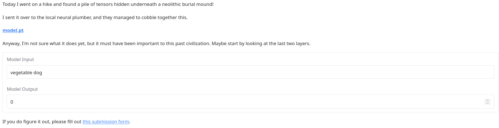

Nothing is actually said about what we need to do. Annoying... let's see if the source code of the Gradio app gives us any hints.
```python
def predict(text, model):
    with torch.no_grad():
        output = model(text)
        return float(output)

def create_gradio_app():
    ...
    with gr.Blocks() as demo:
        ...
        input_text = gr.Textbox(label="Model Input", value='vegetable dog') # two words?
        output = gr.Number(label="Model Output")
        
        input_text.submit(fn=lambda x: predict(x, model), inputs=input_text, outputs=output)
```

Most of what we've said still kinda holds true...
- **The model ingests a string.**
- **The model outputs a numerical value.**

But importantly, we learn 2 things:
- **It seems we expect the input to be two words.** 
    - From the comment `# two words?`.
- **The model ingests the string directly**
    - So perhaps we are dealing with an embedding model?

Digging around the commit history, we find the **name** of this puzzle (because I **AM** 16 months late, after all...):
```python
If you do figure it out, please let us know at *archaeology@janestreet.com*
```

But nothing else of value. Let's move on to the model itself.

### Pause. What are we even trying to do here?

That's the thing. **I didn't know for sure**.

Given my experience clanking / working on previous CTF challenges like this, and the absence of any contradictory info, I went off a hunch and assumed they wanted us to **create a string which yields a non-zero output**. 

By this, I don't mean **just any vector**, because I could do that relatively easy by spamming random vectors with entries $\in [0, 1)$:
```python
# Yeah I aint messing around with 289M parameters...
# But uh... the challenge tells us to start in the last 2 layers
# ... and they're PRETTY SMALL...
# so let's do that.

# Excise the last 2 layers
# Feed random input through
last_layer = torch.nn.Sequential(*list(model.children())[-2:])
# Figure out what turns the input to 1

x = torch.randn(100000, 48)
with torch.no_grad():
    y = last_layer(x)
    print(y.shape)
z = torch.cat([x, y], dim=1)[y.squeeze() > 1e-4]
print(z.shape)
print(z)
'''
Output:
torch.Size([6343, 49])
tensor([[-0.5518, -2.5157, -1.0090,  ...,  0.4208,  1.9332,  1.4526],
        [-0.1157,  0.8457,  1.6665,  ...,  0.7834, -0.3508,  0.4985],
        [ 1.0749, -0.7624,  1.1907,  ..., -0.8220, -1.6744,  9.7226],
        ...,
        [ 0.6523,  1.8894, -0.1226,  ...,  0.3706, -1.0419,  5.1615],
        [-1.1841, -0.0133,  0.3011,  ..., -0.7822, -1.3687,  8.3044],
        [ 0.2687, -0.5510, -0.7095,  ...,  0.8352,  2.0452,  5.1439]])
'''
```
You should probably recognize that this is a pretty big leap of faith, which [I don't like](../writeups/2026-06-14-You-Suck-At-CTFs.md). Too bad, we're not playing a CTF, live with it.


### Basic Model Information

Downloading the model (I used the [Python 3.11+](https://huggingface.co/jane-street/2025-03-10/tree/main) version) gives us a... **massive**, 1.1GB model.
```python
import torch
torch.set_grad_enabled(False)

model = torch.load('model_3_11.pt', weights_only=False)
with open('model_arch.txt', 'w') as f:
    f.write(str(model))
model.eval()
'''
Output (I will spare you the pain of reading 10k lines, but...):
...  
  (5438): Linear(in_features=192, out_features=48, bias=True)
  (5439): ReLU()
  (5440): Linear(in_features=48, out_features=1, bias=True)
  (5441): ReLU()
)
'''
```
This model:
- seems to be a... 2721-layered (Linear -> ReLU) [MLP](https://en.wikipedia.org/wiki/Multilayer_perceptron).
- takes in a **55-dimensional vector** 
- outputs a **numerical value**

This is pretty strange. Where is the string embedding layer? How does the model even ingest a string?

### PoI: The Forward Pass doesn't work OOTB

Even more anomalously, the model **cannot be directly used for inference**:
```python
...
print(model.forward(torch.rand(1, 55))) # OK, produces torch.float32 [0.]
print(model("vegetable dog"))           # Segfault
```
At the time I didn't realise it was probably due to a library mismatch, but I figured that I could go and open up the class bytecode because the pickle was **NOT** simply a state dictionary.
```python
# Slopped from Google AI overview of all things (can you believe it)
import marshal
import importlib.util

# 1. Extract the code object
lambda_code = model._call_impl.__code__

# 2. Generate a valid module wrapper code object
# We compile a simple assignment script so Python builds the correct module structure
wrapper_source = "compiled_lambda = None"
module_code = compile(wrapper_source, '<string>', 'exec')

# 3. Inject your lambda bytecode into the module's constants
# We replace the 'None' constant with your actual lambda code object
new_consts = tuple(
    lambda_code if const is None and type(const) not in (int, float, str) else const 
    for const in module_code.co_consts
)

# Rebuild the module code object with the embedded lambda
module_code = module_code.replace(co_consts=new_consts)

# 4. Generate the 16-byte .pyc header (Python 3.7+)
version_magic = importlib.util.MAGIC_NUMBER
pyc_header = version_magic + b'\x00' * 12  # Zeroed out timestamp/size flags work fine

# 5. Write to disk
with open('my_lambda_fixed.pyc', 'wb') as f:
    f.write(pyc_header)
    marshal.dump(module_code, f)

print("Valid module-wrapped .pyc generated successfully.")
```

Sending this to [a decompiler](https://www.decompiler.com/jar/5a86a782820639a490d5abe7fa9baa30/my_lambda_fixed.py) gave us an interesting `__call__` function:
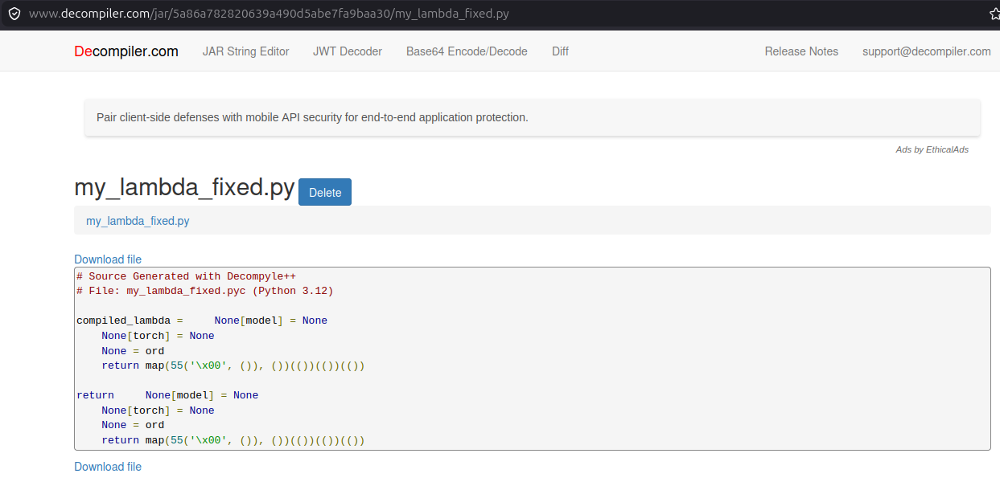

which reveals the model just uses the ASCII values of the first 55 characters of the string. 

### PoI: The Model's Last 2 Layers

The problem statement also recommended we **check out the last two layers**. Let's do that right now:
```python
# Last layer
last_layer = torch.nn.Sequential(*list(model.children())[-2:])
print(last_layer[0].weight.shape)
print(last_layer[0].weight)
print(last_layer[0].bias)
'''
Output: 
torch.Size([1, 48])
Parameter containing:
tensor([[ 1.,  1.,  1.,  1.,  1.,  1.,  1.,  1.,  1.,  1.,  1.,  1.,  1.,  1.,
          1.,  1., -2., -2., -2., -2., -2., -2., -2., -2., -2., -2., -2., -2.,
         -2., -2., -2., -2.,  1.,  1.,  1.,  1.,  1.,  1.,  1.,  1.,  1.,  1.,
          1.,  1.,  1.,  1.,  1.,  1.]], requires_grad=True)
Parameter containing:
tensor([-15.], requires_grad=True)
'''

# Second last layer
second_last_layer = torch.nn.Sequential(*list(model.children())[-4:-2])
print(second_last_layer[0].weight.shape)
print(second_last_layer[0].weight)
print(second_last_layer[0].bias)
'''
torch.Size([48, 192])
Parameter containing:
tensor([[   1.,    2.,    4.,  ...,    0.,    0.,    0.],
        [   0.,    0.,    0.,  ...,    0.,    0.,    0.],
        [   0.,    0.,    0.,  ...,    0.,    0.,    0.],
        ...,
        [   0.,    0.,    0.,  ...,    0.,    0.,    0.],
        [   0.,    0.,    0.,  ...,    0.,    0.,    0.],
        [   0.,    0.,    0.,  ...,  -64., -128., -256.]], requires_grad=True)
Parameter containing:
tensor([-200., -240., -102.,  -36.,  -61.,  -65., -171.,  -51., -195., -186.,
        -173., -228., -118., -150., -251., -125., -199., -239., -101.,  -35.,
         -60.,  -64., -170.,  -50., -194., -185., -172., -227., -117., -149.,
        -250., -124., -198., -238., -100.,  -34.,  -59.,  -63., -169.,  -49.,
        -193., -184., -171., -226., -116., -148., -249., -123.],
       requires_grad=True)
'''
```

Of course, **JUST looking at the raw tensors is kind of dumb**. Let's also visualize them...
```python
from matplotlib import pyplot as plt
fig, ax = plt.subplots(figsize=(12, 5), nrows=2, ncols=2)

# Print weight and bias for each layer.
ax[0, 0].imshow(last_layer[0].weight.detach().numpy())
ax[0, 0].set_title('Last Layer Weights')
ax[0, 1].imshow(last_layer[0].bias.detach().numpy().reshape(1, -1))
ax[0, 1].set_title('Last Layer Bias')
ax[1, 0].imshow(second_last_layer[0].weight.detach().numpy())
ax[1, 0].set_title('Second Last Layer Weights')
ax[1, 1].imshow(second_last_layer[0].bias.detach().numpy().reshape(1, -1))
ax[1, 1].set_title('Second Last Layer Bias')
fig.show()
```
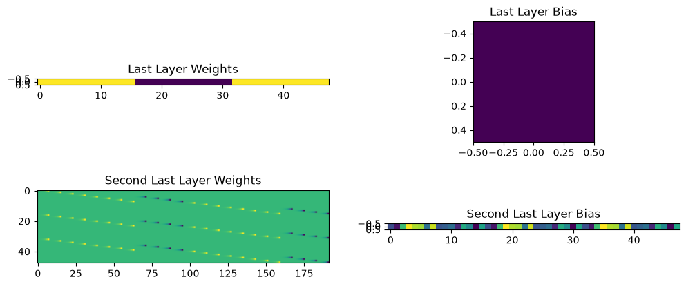

### Deeper Exploration

A few things immediately deserve to be flagged out right now:
- Both layers seem to have **perfectly integral** weights and biases, which is **basically unheard of** for a trained neural network.
    - This strongly indicates the neural network is a **distraction**. Something else is going on.
- It **currently seems that** the second last layer hosts a wider range of weights and biases (roughly `[-256, 256]` for weights in 2nd last layer, vs `{-2, 1}` for weights in last layer).

Let's check out the weights for the second last layer more closely:
```python
two_ll = second_last_layer[0].weight
print(two_ll.shape)
print(torch.nonzero(two_ll))
print(two_ll[~torch.eq(two_ll, 0)])
'''
Output:
torch.Size([48, 192])
tensor([[  0,   0],
        [  0,   1],
        [  0,   2],
        ...,
        [ 47, 189],
        [ 47, 190],
        [ 47, 191]])
tensor([   1.,    2.,    4.,    8.,   16.,   32.,   64.,  128.,    1.,    2.,
           4.,    8.,   16.,   32.,   64.,  128.,    1.,    2.,    4.,    8.,
          16.,   32.,   64.,  128.,    1.,    2.,    4.,    8.,   16.,   32.,
          64.,  128.,    1.,    2.,    4.,    8.,   16.,   32.,   64.,  128.,
          -2.,   -4.,   -8.,  -16.,  -32.,  -64., -128., -256.,    1.,    2.,
          ...
           4.,    8.,   16.,   32.,   64.,  128.,   -2.,   -4.,   -8.,  -16.,
         -32.,  -64., -128., -256.,    1.,    2.,    4.,    8.,   16.,   32.,
          64.,  128.,   -2.,   -4.,   -8.,  -16.,  -32.,  -64., -128., -256.,
           1.,    2.,    4.,    8.,   16.,   32.,   64.,  128.,   -2.,   -4.,
          -8.,  -16.,  -32.,  -64., -128., -256.])
'''
```
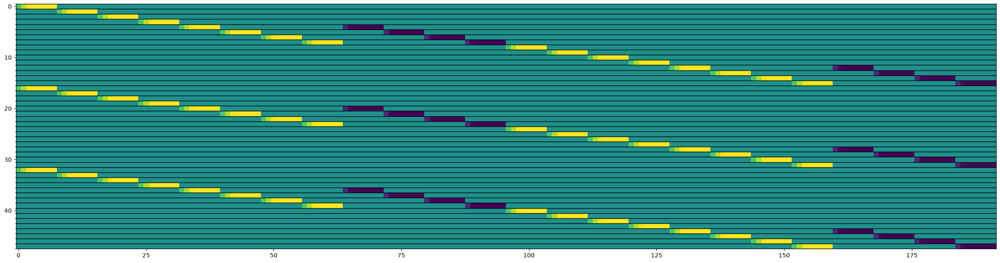
Even weirder this time:
- The non-zero weights of the second last layer are **all powers of 2**.
- The numbers are being computed in **LSB-first** order (This will come in handy later.)
- If you haven't noticed it, there is a `+1, -2, +1` pattern going on in the last 2 layers:
    - Second last layer: `+1, +2, +4, +8, +16, +32, +64, +128, -2, -4, -8, -16, -32, -64, -128, -256`
    - Last layer: `+1 * 16, -2 * 16, +1 * 16` 

Coupled with our previous observations that this neural network is definitely hiding something, my initial read is that **this is some kind of Boolean circuit**. But what kind?
- The second last layer outputs 3 **identical** copies of the same mysterious vector, which appears to be a 16-byte vector.
    - You can tell pretty quickly from the basic forward-pass rule of a linear layer, which is `y = Wx` (without bias, anyway...)
- Those 3 copies (call them `x`) are then fed into the last layer, which computes `sum(x) - 2 * sum(x) + sum(x)...` which is always `0`...
    - Or is it?

### You haven't looked at the biases yet, have you...

Yes, exactly!
Let's do a double take on the last two layers' biases:
```python
print(last_layer[0].bias.detach().numpy().reshape(1, -1))
print(second_last_layer[0].bias.detach().numpy().reshape(3, 16))
'''
Output:
[[-15.]]
[[-200. -240. -102.  -36.  -61.  -65. -171.  -51. -195. -186. -173. -228.
  -118. -150. -251. -125.]
 [-199. -239. -101.  -35.  -60.  -64. -170.  -50. -194. -185. -172. -227.
  -117. -149. -250. -124.]
 [-198. -238. -100.  -34.  -59.  -63. -169.  -49. -193. -184. -171. -226.
  -116. -148. -249. -123.]]
'''
```

Interesting... While the last layer's bias is a single number (hold that thought), the second last layer's bias is **slightly different** for each copy of vector $\mathbf{x}$. In other words, let us represent the forward pass of the second last layer as:
$$\mathbf{y}_{2nd-last} = ReLU(\mathbf{W}_{2nd-last}\mathbf{v} + \mathbf{b}_{2nd-last})$$
where $\mathbf{v}$ is the input vector to the second last layer, and $||$ represents the vector concatenation operation.
Expanding yields
$$\mathbf{y}_{2nd-last} = ReLU((\mathbf{x} || \mathbf{x} || \mathbf{x}) + (\mathbf{b} - 1 || \mathbf{b} || \mathbf{b} + 1)) = ReLU(\mathbf{x} + \mathbf{b} - 1) || ReLU(\mathbf{x} + \mathbf{b}) || ReLU(\mathbf{x} + \mathbf{b} + 1)$$
where we use $\mathbf{b}$ to represent the second copy of the bias vector (symmetry looks nice, okay???)

Now by considering both layers in unison (i.e. using $\mathbf{v}$ as above), we can write their forward pass as:
$$y_{last} = ReLU\left(\sum ReLU(\mathbf{x} + \mathbf{b} - 1) - 2 \sum ReLU(\mathbf{x} + \mathbf{b}) + \sum ReLU(\mathbf{x} + \mathbf{b} + 1) - 15\right)$$

If you break down what happens by each coordinate, this form is quite curious:
- If $x_i + b_i \geq 1$ or $x_i + b_i < -1$, then that entry is $0$
- If $0 \leq x_i + b_i < 1$, then that entry becomes $-2(x_i + b_i) + (x_i + b_i + 1) = 1 - (x_i + b_i)$
- If $-1 \leq x_i + b_i < 0$, then that entry becomes $(x_i + b_i - 1) - 2(x_i + b_i) + (x_i + b_i + 1) = -(x_i + b_i)$

**Restricting to the integers** (since we already suspect the model is a Boolean circuit), we simplify the rule to:
- If $x_i + b_i \geq 1$ or $x_i + b_i < -1$, then that entry is $0$
- If $x_i + b_i = 0$, then that entry becomes $1$
- If $x_i + b_i = -1$, then that entry becomes $0$

That was a **very** longwinded way to say that, the $i$-th summand of the last layer is $1$ if $x_i = -b_i$ and $0$ otherwise, and the last layer outputs $1$ if the total sum is $16$, and $0$ otherwise.

Let me put it **even more simply**: the last layer checks whether $\mathbf{x} = -\mathbf{b}$, and outputs $1$ if so, and $0$ otherwise.

I am now. 100% certain. That this is some kind of circuit/program. (though... perhaps not **exactly** Boolean, given the biases. Analogously Boolean?)

## The Meaning of $b$

So we know now that the last two layers are checking whether $\mathbf{x} = -\mathbf{b}$, where $\mathbf{b}$ is the bias vector of the second last layer. But what **is** the semantic value of $\mathbf{b}$? Like, what does it even **mean**?

This was a much harder question to answer. I kept thinking there was some 200IQ shortcut to the answer (because I mean, Jane Street, amirite). 

Uh yeah... **no**. Eventually I had no choice but to print out all **2721** layers and study their weights and biases. This alone took me **TWO WHOLE** days (mind you, I got all of the previous stuff within 2 hours of sleuthing):
```python
import numpy as np
import matplotlib.pyplot as plt
from pathlib import Path

Path("layers").mkdir(parents=True, exist_ok=True)

def get_model_layer(model, layer, get_weight = True): 
    module = list(model.children())[2 * layer] # Accoutn for ReLU 
    return getattr(module, 'weight' if get_weight else 'bias').detach().numpy()

for layer in range(2721):
    W = get_model_layer(model, layer, get_weight=True)
    b = get_model_layer(model, layer, get_weight=False).reshape(1, -1)

    fig, ax = plt.subplots(
        nrows=2,
        ncols=1,
        figsize=(14, 8),
        gridspec_kw={"height_ratios": [8, 1]},
        constrained_layout=True,
    )

    # Thank you ChatGPT for sparing my eyes the pain of reading extremely lopsided heatmaps...
    wmax = np.abs(W).max()
    bmax = np.abs(b).max()

    im0 = ax[0].imshow(W, aspect="auto", vmin=-wmax, vmax=wmax)
    ax[0].set_title(f"Layer {layer + 1} Weights — shape {W.shape}")
    ax[0].set_xlabel("Input dimension")
    ax[0].set_ylabel("Output neuron")
    fig.colorbar(im0, ax=ax[0], shrink=0.8, label="Weight value")

    im1 = ax[1].imshow(b, aspect="auto", vmin=-bmax, vmax=bmax)
    ax[1].set_title(f"Layer {layer + 1} Bias — shape {b.shape}")
    ax[1].set_xlabel("Output neuron")
    ax[1].set_yticks([])
    fig.colorbar(im1, ax=ax[1], shrink=0.8, label="Bias value")

    fig.savefig(f"layers/layer_{layer + 1}.png", dpi=200)
    plt.close(fig) 
```

### PoI: A Taxonomy of Types of Computations Performed

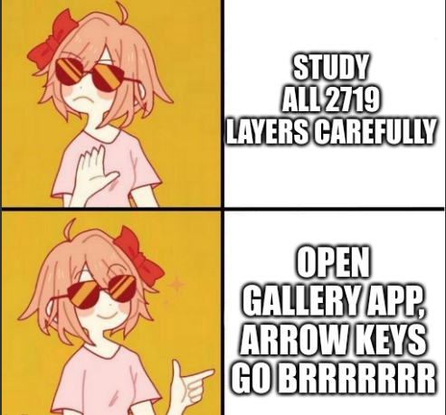

Unfortunately for Jane Street, they don't know I'm **awfully lazy**.

So after I printed **everything**, I just started scrolling through the images and started looking for patterns.
This was... surprisingly effective, allowing me to learn a thing or two (because I seen a thing or two)[^1]:
- **Nearly every weight layer** featured a principal carry-over pattern on the "principal diagonal" (close enough, because sometimes it would be broken up by nontrivial operations)
    - This tells me the irregularly-sized vectors are behaving as a **dynamically allocated state machine**.
- Rotation matrices (e.g. in layer 18, layer 32, layer 74, layer 116, layer 200, layer 1250, layer 1586, etc)
    - Example:
    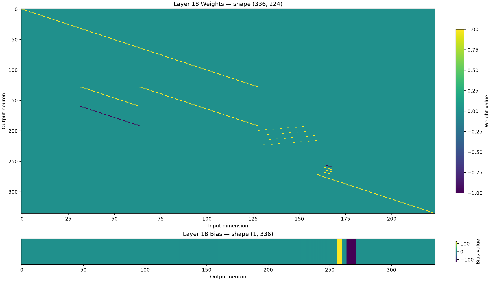
    - The apparent periodicity of these matrices (notice how aside from layer 18, the gap is some multiple of 42) also tells me that the model is **looping through some operation**. 
- Circular Shift matrices
    - Coupled with the above, I am now suspecting this is **a hashing algorithm**. 
    - However, at this point I thought it was a **custom implementation** since the shift offsets didn't match any known hashing algorithm I knew of[^2].
- Blockwise operations (i.e. imagine those submatrices being cut out and operated on)
    - Example:
    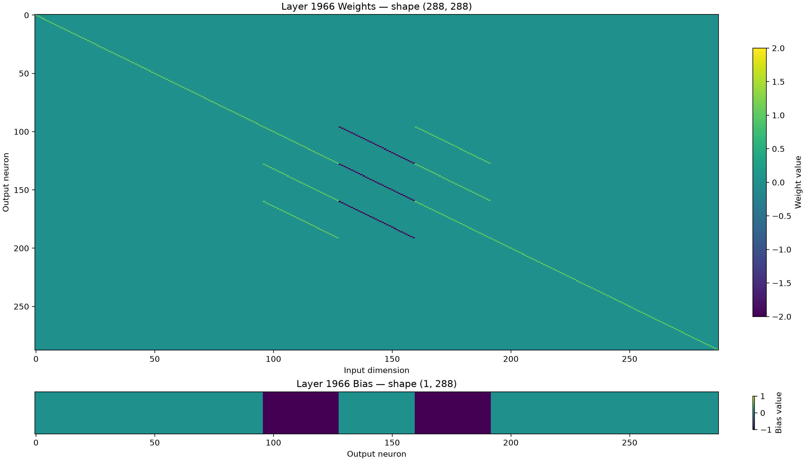
    - This just strengthened my suspicion that this is a hashing algorithm. 

### PoI: The Algorithm Contains a 42-Step Loop

At this point I had a **VERY STRONG** suspicion already. But I wanted to be sure.

Once I picked up on the periodicity of the algorithm, I started to wonder what the state size looked like over time, and plotted the widths over time:
```python
# Huh. So it suffices to view 42 layers as a computational unit.
# Does this imply there is some periodicity to the dimensions of the hidden vector after each layer?

widths = [55]
for layer in range(2721):
    layer_to_check = list(model.children())[2 * layer]
    layer_weights = layer_to_check.weight.detach().numpy()
    widths.pop() # Pop last layer since it overlaps with current
    widths.extend(layer_weights.shape) # Append current layer's output dimension

# Magic number based on eyeballing an initial copy of the graph plotted using `widths`.
computational_body = widths[17:2663]
plt.figure(figsize=(30, 5), constrained_layout=True)
plt.plot(np.arange(17, len(computational_body) + 17), computational_body)
```
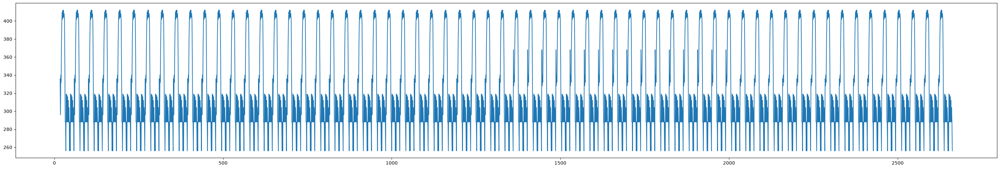

Super periodic. I then asked GPT "how could I figure out the period length for an oddly-shaped depth series like this?". It delivered a [Lomb-Scargle periodogram](https://docs.scipy.org/doc/scipy/reference/generated/scipy.signal.lombscargle.html) which was pretty fun to see:
```python
# How many periods are here?
from scipy.signal import lombscargle
freqs = np.linspace(0.01, 1, 1000)
# 32 is another magic number based on a previous eyeballing.
power = lombscargle(np.arange(32, len(computational_body) + 32), computational_body, freqs)
periods = 2*np.pi / freqs
plt.figure(figsize=(20, 5), constrained_layout=True)
plt.plot(periods, power)
# Output: 1806467.9055086717 41.96351197935824
print(max(power), periods[np.argmax(power)])
```

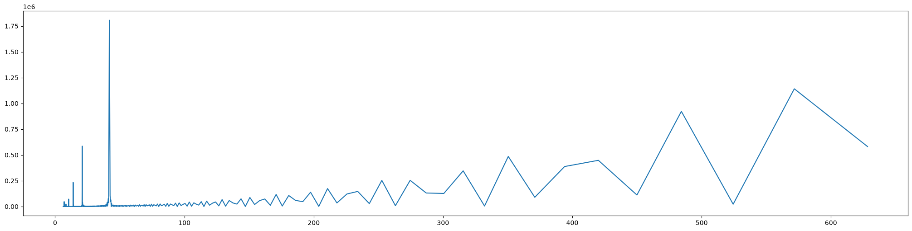

and of course, it told me (via the massive spike and my `np.argmax` call) that the period is **42 layers**. This is consistent with my previous observations of the rotation matrices.

I double-checked the period by superposing the periods over each other:

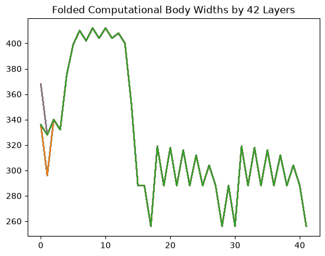

and... bingo, the periods line up (nearly perfectly).

Coincidentally, I also discovered there were **64** roughly-identically shaped periods:
- **47** follows the lime plot in the above figure
- **16** follows the brown plot in the above figure
- and **1** following the orange plot.

Each one of these steps just made me more, more, and more confident that this is a **hashing algorithm**.
Again, I tried locking them down to the simpler, 128bit ones (16 bytes in the last layer, remember?):
- MD4, MD5
- SHA1, SHA2

But I had no luck in actually **verifying them**. More on that later.

### Scrutinizing the First Few Layers

So far, it's not like I gained **no info** about the model:
- I knew what was being checked at the end (i.e. the last two layers)
- I knew the model was a state machine of some kind, **NOT** a real, trained neural network
- I **strongly suspected** it was a hashing algorithm
- I knew the period was 42 layers, and there were 64 periods in total.

And yet, I was **no closer to figuring out** what $\mathbf{b}$ meant. (Refresher: $\mathbf{b}$ is what we are comparing the 2nd last layer's output to, and equivalence yields a non-zero output from the model.)

Therefore, I tried a new and more painful approach (so much for being a lazy bum...): 
- I systematically scrutinized the layers before the first period to see if I could tell what kind of computation was actually going on.
- I also tried analyzing a randomly-chosen period (both of the lime kind and the brown kind) to see if I could tell what was going on there.

This took about 4 hours before I saw something very interesting happening in the first 4 layers:
- First, let our input vector be $\mathbf{v} = (v_0, v_1, ..., v_{54})$, right_padded so $v_0$ is the first character of the string, and so on.
- **Layer 1** effectively computes $\mathbf{y}_1 = \mathbf{v} || 0 || \mathbf{v} || 0 || \mathbf{v} - 1 || 0 || range(55)$
- **Layer 2** computes $\mathbf{y}_2 = (\text{pad\_zero}(\mathbf{v}, 55) || R(0, 55) || R(0, 56) || R(1, 57) || len(\mathbf{v}) * 8 || \mathbf{0}_8)$.
    - Here, $R(x, y) = \text{pad\_zero}(range(x, y - len(\mathbf{v})), 55)$ is the range of integers from $0$ to $x - len(\mathbf{v}) - 1$. Yikes. What a mouthful.
- **Layer 3** computes $\mathbf{y}_3 = \text{pad\_zero}(\mathbf{v} || 128, 64)$
- **Layer 4** seemed to initialize a **suspicious** number of memory registers.
    
    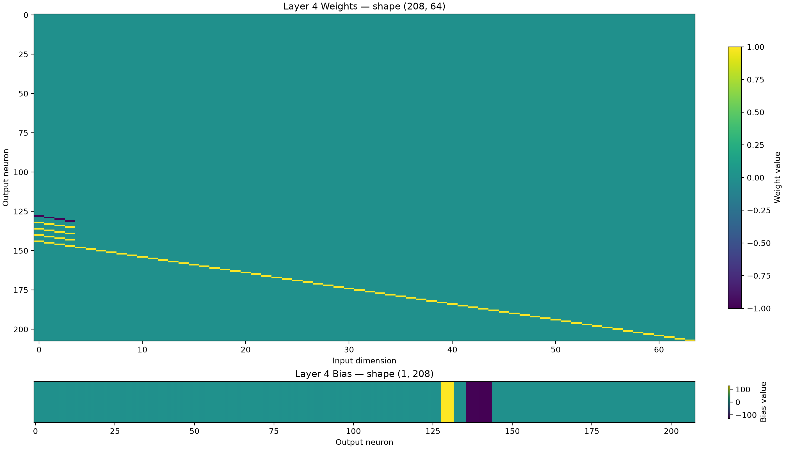
    - Trying to analyze them led me to notice the biases for those zero-initialized registers were [**exactly the MD5 IV** (a0, b0, c0, d0)](https://en.wikipedia.org/wiki/MD5#Pseudocode):
    ```python # Hmm??????
    zero_registers = 128
    assert np.allclose(layer_4_weights[:zero_registers], 0) and (not np.allclose(layer_4_weights[zero_registers:], 0)), "This is not where the boundary is"
    zero_register_biases = layer_4.bias[:zero_registers].detach().numpy().astype(np.uint8)
    print(zero_register_biases)
    # Remember when I said "the weights are stored in LSB-first order"? Well, well, well...
    zero_register_bytes = zero_register_biases.reshape(16, 8)[..., ::-1] # Reverse the bits in each byte
    zero_register_bytes_little_endian = zero_register_bytes.reshape(4, 4, 8)[:, ::-1, :].reshape(16, 8) # Reverse the byte order in each word

    # Convert to big endian and little endian hex
    zero_register_hex_big_endian = ''.join([f"{int(''.join(map(str, row)), 2):02x}" for row in zero_register_bytes])
    # For little endian, reverse the byte order in each word
    zero_register_hex_little_endian = ''.join([f"{int(''.join(map(str, row)), 2):02x}" for row in zero_register_bytes_little_endian])

    print(f"Zero register hex (big endian): {zero_register_hex_big_endian}")
    print(f"Zero register hex (little endian): {zero_register_hex_little_endian}")
    '''
    Output:
    [1 0 0 0 0 0 0 0 1 1 0 0 0 1 0 0 1 0 1 0 0 0 1 0 1 1 1 0 0 1 1 0 1 0 0 1 0
    0 0 1 1 1 0 1 0 1 0 1 1 0 1 1 0 0 1 1 1 1 1 1 0 1 1 1 0 1 1 1 1 1 1 1 0 0
    1 1 1 0 1 1 0 1 0 1 1 1 0 1 0 0 0 1 1 0 0 1 0 1 1 0 1 1 1 0 0 0 1 0 1 0 1
    0 0 1 0 0 1 1 0 0 0 0 0 0 1 0 0 0]
    Zero register hex (big endian): 0123456789abcdeffedcba9876543210
    Zero register hex (little endian): 67452301efcdab8998badcfe10325476
    '''
    ```
### OK cool good for you whatever hurry up and tell me what $b$ is

Not so fast.

While it is true that MD5 **does** use the IV `(a0, b0, c0, d0) = (67452301, efcdab89, 98badcfe, 10325476)`, this doesn't mean that just because we use the same IV, we are actually computing MD5.

For one there are other 128-bit hashing algorithms that use the same IV:
- [**MD4**](https://en.wikipedia.org/wiki/MD4) (which is a predecessor of MD5)
- [**RIPEMD128**](https://en.wikipedia.org/wiki/RIPEMD) (which also derives from MD4)

And we're not sure whether the evil boffins at Jane Street have somehow created a **custom hashing algorithm** that just happens to use the same IV as MD5 either.

So we **still need to verify** what algorithm is being used by feeding in a known input and checking... "the output".

Using [Occam's razor](https://en.wikipedia.org/wiki/Occam%27s_razor), I decided to first check whether our output was $\mathbf{x}$ (the thing that gets compared against $\mathbf{b}$).
```python
from hashlib import md5
all_but_last_two_layers = torch.nn.Sequential(*list(model.children())[:-4])
last_two_layers = torch.nn.Sequential(*list(model.children())[-4:])

# Remember that the second last layer's biases are (b - 1 || b || b + 1) respectively!
middle_block = last_two_layers[0].bias.detach().numpy().reshape(3, 16)[-2]
target_inputs = np.abs(middle_block).astype(np.uint8)
tgt_input_digest = ''.join([f"{x:02x}" for x in target_inputs.flatten()])
print(f"Suspected expected digest:    {tgt_input_digest}")

def get_digests(inp_text):
    # Ctrl + F above for definition of `infer_like_pickle`
    hidden_output = infer_like_pickle(all_but_last_two_layers, inp_text)
    
    # I fumbled around for about 1h before figuring out (mod 2) was necessary due to rounding error...
    # I highkey thought I did something seriously wrong
    suspected_hex_array_prefix = (hidden_output % 2).detach().numpy().reshape(-1, 8).astype(np.uint8)
    suspected_hex_numbers = [int(''.join(map(str, row))[::-1], 2) for row in suspected_hex_array_prefix]
    suspected_hex_digest = ''.join([f"{x:02x}" for x in suspected_hex_numbers])[:-8]
    # Simply read off the hex digest to get this slice
    print(f"Suspected hex digest:         {suspected_hex_digest[:16] + suspected_hex_digest[24:40]}")
    print(f"Reference MD5:                {md5(inp_text.encode()).hexdigest()}")
    # RIP MD4 and RIPEMD-128 not in hashlib: https://emn178.github.io/online-tools/ripemd-128/
    print(f"Reference MD4:                22965202cb388a2f00a655ee107c29ed")
    print(f"Reference RIPEMD-128:         3d9d7699092579219a9dc9f6ab857e54")

get_digests("vegetable dog")
'''
Output:
Suspected expected digest:    c7ef65233c40aa32c2b9ace37595fa7c
Suspected hex digest:         ab981aaa62cf6412f3aef1a11cd9b94b
Reference MD5:                ab981aaa62cf6412f3aef1a11cd9b94b
Reference MD4:                22965202cb388a2f00a655ee107c29ed
Reference RIPEMD-128:         3d9d7699092579219a9dc9f6ab857e54
'''
```

That... was a bit easy. I'll take the W, I've already spent 3 days on this problem.

Final answer: **The meaning of $b$ is the entrywise negative of the MD5 hash of the input string.**

## Final Solution

OK the hard part is over, Codex, take the wheel and run `hashcat` for me:

```bash
hashcat -m 0 -a 1 hash.txt top_english_words_lower_50000.txt top_english_words_lower_50000.txt -j '$ '
```
```
c7ef65233c40aa32c2b9ace37595fa7c:bitter lesson            
                                                          
Session..........: hashcat
Status...........: Cracked
...

Started: Sun Jul 12 21:30:41 2026
Stopped: Sun Jul 12 21:30:48 2026
```
So... I guess we're done. The final answer is `bitter lesson`.

## Afterword

### Reading the Official Writeup
Upon reading the absolutely batshit techniques tested in the [official writeup](https://blog.janestreet.com/can-you-reverse-engineer-our-neural-network/), I'm kind of shocked that I didn't even think of some of them. 

Bro literally pulled out the DAG analysis trying to figure out what on earth was going on with the model.

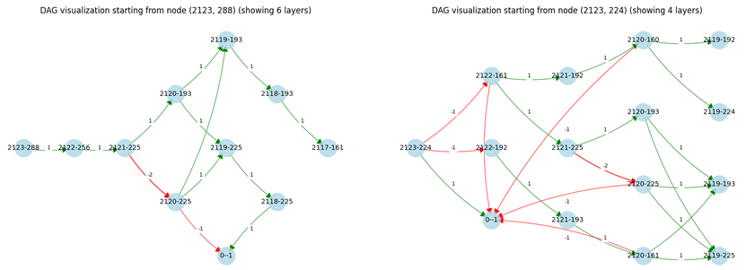

And he tried to solve a... 2 million variable integer program. O.o

And he found a bug that I would have never thought to check for. Some of these people are crazy.

### Thoughts

All in all though, I would say the puzzle is **okay**...

I cannot take anything from the fact that the **construction** of the puzzle itself (i.e. literally making the neural network do MD5 hashing) was **amazing**.

However, I don't know. Didn't feel like doing ML or CTFs, more like equal parts guessing, and reverse engineering. 
- You need to guess the password is "2 words WITH A SPACE"
- Not much use of ML concepts beyond "haha neural network is actually computer hee hee haw haw" and "ReLU do funny function!!!"
- The final part was just a bit frustrating because you had to take a leap of faith that the model was **NOT** computing some random home-rolled hashing algorithm, but rather a known one (MD5).

I wouldn't say either is a seriously bad thing. I would just not put it up there as the best challenge ever designed because the participant experience has a few places to improve, and it technically doesn't REALLY test stuff unique to ML. **Again though, being able to construct such a puzzle in the first place is objectively awesome**.

[^1]: I am not guaranteed to be correct. These are merely the observations that helped me solve the problem, so if you want to "erm ackchually" me, you are welcome.
[^2]: Given what I found out later, I suppose that I misread the diagram. But this was a crucial inference for me.
