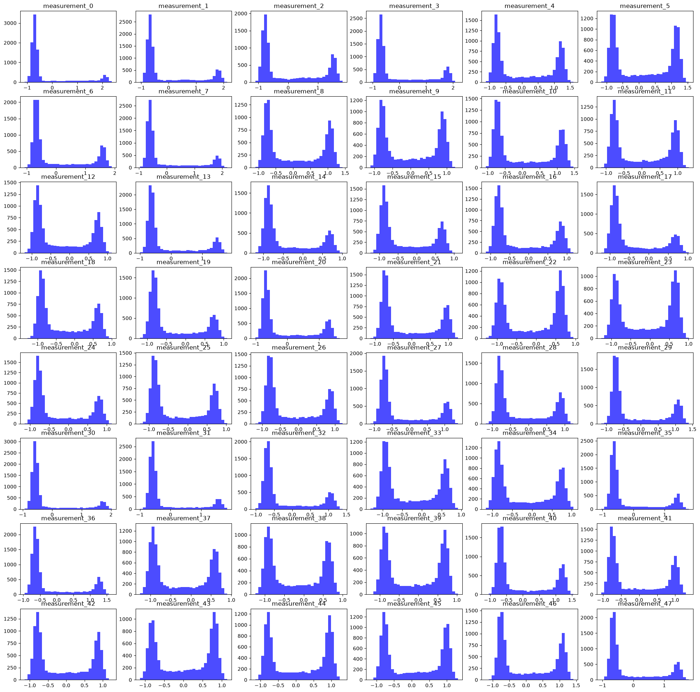
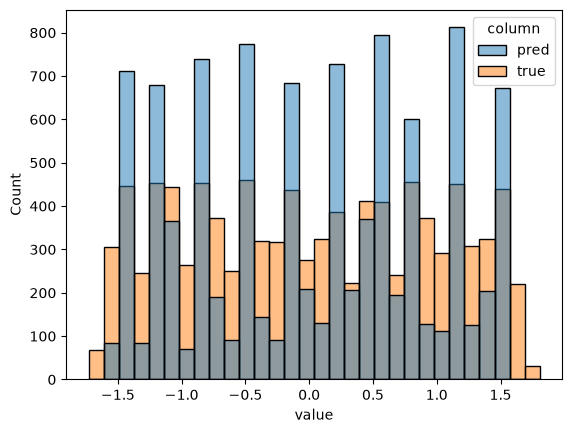
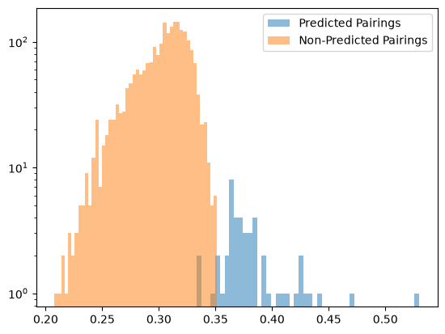
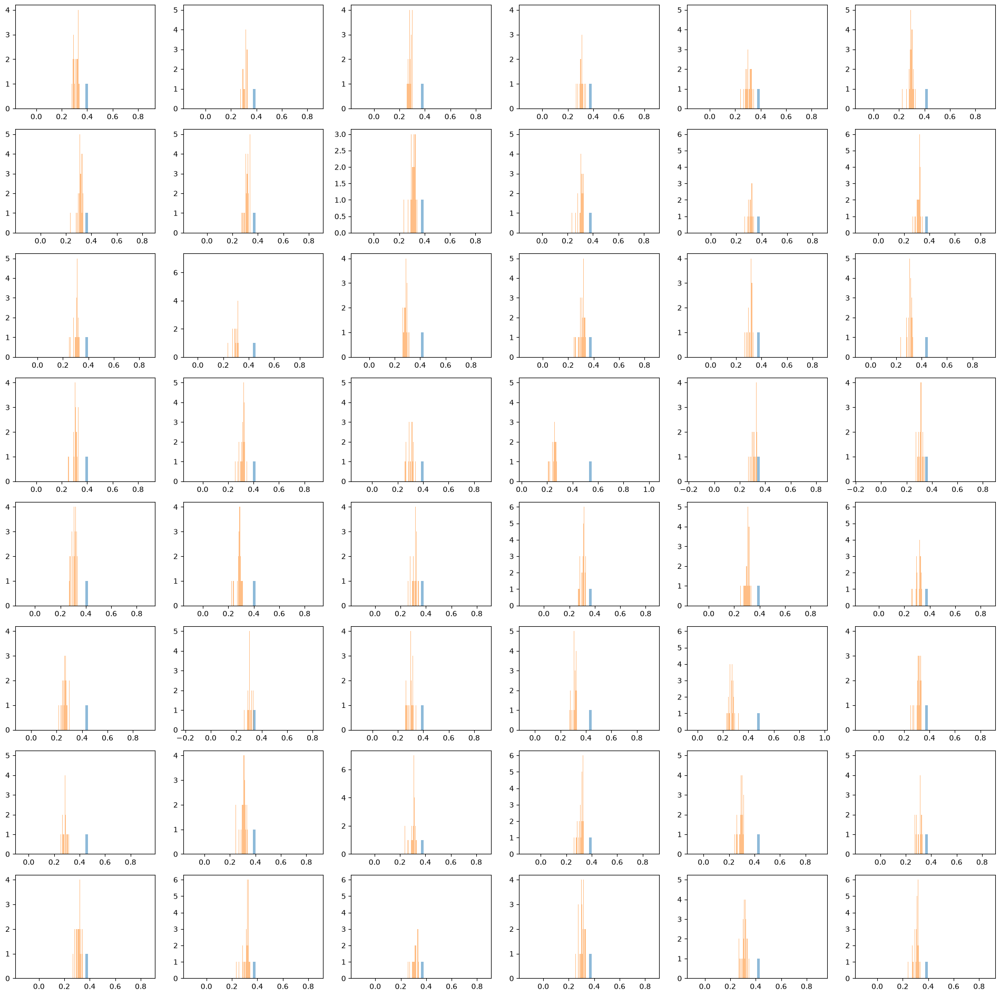
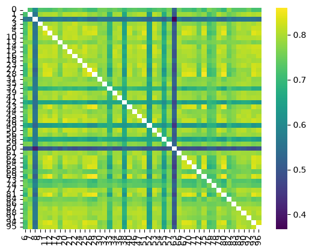

After solving the [previous puzzle](./2026-07-11-Jane-Street-baited-me-to-do-RE-under-the-guise-of-ML.md), I set my sights on a new puzzle that Jane Street released.

I am proud to announce I am "only" 5 months late to the party this time. Let's go.

## Did I receive any help or hints for this problem?

**From AI agents like Codex/Claude Code: To wildly optimize hillclimbing code, to search up the assignment problem, and to autocomplete. So... not in a problem-spoiling way?**

<!-- 
Generally, 
- Instantly discover 1 output layer, 48 input layers of shape (96, 48), and 48 more output layers of shape (48, 96) in the first 2 seconds of the puzzle.
- Think of ways to fingerprint a residual neural net:
    - Residual Alignment (true but unsuitable)
    - Neural Collapse + the associated rank collapse phenomenon (true but unsuitable)
- Fumble around a bit
    - Try linear approximation
    - Try some folk knowledge that the weights learn to "read" each others' output spaces.
- Reorder matrices and retrieve full blocks
    - Using Linear Sum Assignment where costs are estimated by Gram matrix similarity (i.e. measure whether, at an intuitive level, their geometry is similar)
- Now we have full blocks, we need to recover the order.
    - Hillclimbing would be pretty funny but that would cost a lot of time and be a pain to work with.
    - Idea: Seed the hillclimb with a "good enough" sort.
- Fumble around even more
- Find a "good enough" sort (by eyeballing)
- Oops, the hillclimbing algorithm is too slow.
    - Ask Codex to optimize it, then it gets the solution in a flash
- Wonder why the solution actually works.

- Read other peoples' blogs and papers, new reaction montage to crazy techniques.
 -->

## Puzzle Description
Oh no! I dropped an extremely valuable trading model and it fell apart into linear layers! I need to rebuild it before anyone notices, but I can't remember how these pieces go together, or how it was trained.

All I have left are the pieces of the model and some historical data. Can you help me figure out how to put it back together?

Luckily I still have the source code of the layers that the neural network is made of. They look like this:

```python
class Block(nn.Module):
    def __init__(self, in_dim: int, hidden_dim: int):
        super().__init__()
        self.inp = nn.Linear(in_dim, hidden_dim)
        self.activation = nn.ReLU()
        self.out = nn.Linear(hidden_dim, in_dim)

    def forward(self, x):
        residual = x
        x = self.inp(x)
        x = self.activation(x)
        x = self.out(x)
        return residual + x

class LastLayer(nn.Module):
    def __init__(self, in_dim: int, out_dim: int):
        super().__init__()
        self.layer = nn.Linear(in_dim, out_dim)

    def forward(self, x):
        return self.layer(x)
```
The solution to this puzzle is a permutation. For each index from 0 to 96 (inclusive), give the index of the piece that is applied in that position.

## Basic Reconnaissance

### Analyzing the Gradio App

Not much is interesting here. (Don't believe me? Check it out [here](https://huggingface.co/spaces/jane-street/droppedaneuralnet/blob/main/app.py))
So let's dive into the artifacts instead.

### Analyzing Historical Data

Opening the dataset yields the following columns:
```python
import numpy as np
import polars as pl
import seaborn as sns
from matplotlib import pyplot as plt

from pathlib import Path
root_data_path = Path("historical_data_and_pieces")

hist_data = pl.read_csv(root_data_path / "historical_data.csv")
print(hist_data.shape[0])
print(hist_data.columns())
'''
(Yeah I'm not going to list them out one by one, so abridged) Output:
10000
[f'measurement_{i}' for i in range(48)] + ['pred', 'true']
'''
```

where the `measurement_i` columns are ostensibly the input features, and `pred` and `true` are the predicted and true values respectively.

The measurement columns are all rather interestingly distributed:
- Bimodal
- Extreme (i.e. modes exist at tails)
- Bound to a fixed interval (-ish)

but I never got to pursuing this line of thought, so I sadly can't tell you much more:
```python
feature_columns = hist_data.drop(['pred', 'true']).columns

# Print the distribution of each datapoint
dist_fig, dist_ax = plt.subplots(nrows=8, ncols=6, figsize=(24, 24))

extract_num_regex = re.compile(r'measurement_(\d+)')

for col in feature_columns:
    col_num = int(extract_num_regex.match(col).group(1))
    row = col_num // 6
    col_idx = col_num % 6
    dist_ax[row, col_idx].hist(hist_data[col], bins=30, color='blue', alpha=0.7)
    dist_ax[row, col_idx].set_title(col)
plt.show(dist_fig)
```



For what it's worth, I **also** plotted the `pred` and `true` columns, but as before, not much was worth exploring there...

```python
# Pred and true histograms
pred_and_true = hist_data.unpivot(
    on=["pred", "true"],
    variable_name="column",
    value_name="value",
)

sns.histplot(data=pred_and_true, x="value", hue="column", bins=30, alpha=0.5)
```


We **DO** get about 10k rows of data though, which will be handy to verify our solution with.
- However, I need to stress that this is not in any way a continuous or informative signal, so we can't perform gradient descent on it or whatever. Shame.

### Analyzing the Pieces

By contrast, our model pieces give us a lot more relevant info for free...
```python
weight_dicts = {
    ckpt_num: torch.load(
        root_data_path / "pieces" / f"piece_{ckpt_num}.pth", 
        weights_only=True, 
        map_location=torch.device('cpu')
    ) for ckpt_num in range(97)
}

for i, weight_dict in weight_dicts.items():
    print(i, weight_dict.keys(), weight_dict['weight'].shape, weight_dict['bias'].shape)
```

Of the ensuing 97 lines of output, a few quirks stood out:
- Output Line 86: `85 odict_keys(['weight', 'bias']) torch.Size([1, 48]) torch.Size([1])`
    - This is very **very** obviously the last layer.
- Exactly **half** of the remaining pieces have a weight matrix of shape `(48, 96)` (and bias `(48,)`), while the other half have a weight matrix of shape `(96, 48)` (and bias `(96,)`).
    - This is a great help. **There was no guarantee that `input_dim != hidden_dim`**, so I appreciate not having to figure **THAT** out...

That's kind of it though. Unless you want to print the weights and **pretend** you can manually interpret them, there's not much else to do here. So let's move on.

## Problem Breakdown

It should be quite clear what the real problem statement is (epecially because they alluded as much):
- You have a very simple 48-layer deep [ResNet](https://arxiv.org/abs/1512.03385) (Residual Neural Network), whose weights have been torn up, shuffled, and given to you in a random order.
- You need to do two things (or one? I thought splitting the task up was easier):
    1. Figure out each `Block`'s weights (i.e. pair the input and output weights together)
    2. Figure out the order of the `Block`s (i.e. figure out which block goes where in the ResNet)

At first glance, this is a super tough problem, and to be fair, it is (I spent about 3 days on this!):
- If you wish to solve the problem as one atomic unit, you were very much asking to have a **bad time**.
    - You would have to solve a problem of search space `96!`. 
- Alternatively, if you split the problem into two stages, the search space becomes `48! * 48!`(number of one-to-one bipartite graph matchings, by ordering of blocks).
    - This is still ridiculous, but it is **obviously** less than `96!`.
    - However, you would need to be **sure** you have the correct pairings before starting to order... or once again, you would be solving the problem as one atomic unit, and have a bad time.

It's also a very **open-ended** problem, with at least 3 different **high-level** perspectives I am aware of (especially after [reading other peoples' writeups](#reading-others-writeups)).


But that sign won't stop me, because I can't read. Let's solve the problem despite knowing better.

### Stage I: Pairing Weights Together

Unfortunately for me, I found the problem of solving the entire thing at one go too difficult (as most mere mortals like me would), so I've decided to try and pair the weights together first.

The key intuition I decided to rely on (omitting about 2 hours of fumbling around) is that there must be a "common" language through which the weights of a block are "communicating" with each other.

If that sounds ludicrously fluffy, I understand. But here's why it's not as batshit as it initially sounds:
- We already know (empirically) that adjacent layers in a neural network tend to **become** coadapted, due to [observations that freezing layers in neural networks can initially disrupt performance](https://arxiv.org/pdf/1411.1792)
- We also know that each weight matrix is essentially a linear transformation, itself well-known to be a geometric operation. 
    - Composing linear operations, therefore, denote a series of mappings through successive geometric spaces which can naturally be thought of as identical (at least, in between layers).[^1]
- In fact, this geometric alignment between layers [was also empirically observed in CNNs](https://openreview.net/pdf?id=b5l1BwFxoQ), further lending credence to the idea that training establishes a "common language" between adjacent layers.

Two questions remain, of course:
1. How do we measure this common language?
2. How do we use this measurement to pair the weights together?

#### Measuring the Common Language

To do so, we can **borrow a few concepts from freshman linear algebra**:
- Firstly, **define** $\mathbf{W}_{in}$ as the weight of the first block and $\mathbf{W}_{out}$ as the weight of the second block.
    - This is because we are checking how $\mathbf{W}_{in}\mathbf{x}$ aligns with the latent subspace of $\mathbf{W}_{out}$, which we will denote as $\text{sim}(\mathbf{W}_{in}, \mathbf{W}_{out})$.
- We can use [Singular Value Decomposition](https://en.wikipedia.org/wiki/Singular_value_decomposition) to extract the left and right singular eigenvectors of each weight matrix, and test how well they align with each other. 
    - Further still, we can weight the influence of "effective" dimensions using the singular values, yielding the final metric
    $$\text{sim}(\mathbf{W}_{in}, \mathbf{W}_{out}) = \sum_{i = 1, j = 1}^{d, d} \sigma_{in,i}^2 \sigma_{out,j}^2 \cos^2 \theta_{ij} = \sum_{i = 1, j = 1}^{d, d} \sigma_{in,i}^2 \sigma_{out,j}^2  \left(\frac{\mathbf{v}_{out, j} \cdot \mathbf{u}_{in, i}}{\|\mathbf{v}_{out, j}\| \|\mathbf{u}_{in, i}\|}\right)^2$$
    where $\sigma_{in,i}$ and $\sigma_{out,j}$ are the singular values of the input and output matrices respectively, and $\theta_{ij}$ is the angle between the $i$-th left singular vector of $\mathbf{W}_{out}$ and the $j$-th right singular vector of $\mathbf{W}_{in}$.
    - It can be proven this is maximized only when the singular vectors of the input and output matrices are aligned, which is exactly what we want to measure. [Proof is given here, and I am ashamed to confess I went by vibes when using this metric](#appendix-svd-align-metric-proof).
        - Though in fairness to me, proving this would have been unimportant. It doesn't answer the main question of whether maximizing this metric even yields the correct pairings, which is what I was more concerned about.
- Alternatively, we could be more direct in our approach and directly compute the [Gram matrices](https://en.wikipedia.org/wiki/Gram_matrix) of the input and output weight matrices in Euclidean inner product space, and measure how well they align with each other. 
    - This yields the final metric
    $$\text{sim}(\mathbf{W}_{in}, \mathbf{W}_{out}) = \frac{\langle \mathbf{W}_{out}^T\mathbf{W}_{out}, \mathbf{W}_{in}\mathbf{W}_{in}^T \rangle}{\|\mathbf{W}_{out}^T\mathbf{W}_{out}\|_F \|\mathbf{W}_{in}\mathbf{W}_{in}^T\|_F}$$
    where $\langle \cdot, \cdot \rangle$ is the Frobenius inner product, and $\|\cdot\|_F$ is the Frobenius norm.
    - Moreover, because [Gram matrices](https://en.wikipedia.org/wiki/Gram_matrix) encode the geometry of the latent space in question, this metric has a nice geometric interpretation: it directly measures **how well** the latent space defined by the left singular vectors of $\mathbf{W}_{in}$ aligns with that defined by the right singular vectors of $\mathbf{W}_{out}$, including the influence of their singular values.[^2]

#### A Caveat

Of course, these metrics are not **correct** in that they will **DEFINITELY** recover the pairings per se...
- But we didn't make any assumptions beyond "gradient descent is used to train the network", so... there **SHOULDN'T** be any weird failure modes other than "the metric just isn't good enough"...
- Then again, our question is very ill-defined to begin with, so it **would** be rather difficult to prove that **ANY** metric is definitively good enough.
    - We can only pray that our metric allows us to **somewhat cleanly separate** the correct pairing, from all other incorrect ones.

[^1]: I didn't know when solving, but there [does exist a paper](https://arxiv.org/pdf/1806.00900) which develops this idea into a flow invariant, which looks weirdly similar to the fingerprint I ended up developing (if you assume the constant value is small relative to the Gram matrices).

[^2]: It turns out this is identical to the SVD alignment metric. [Proof given here](#appendix-gramian-align-metric-proof).

#### Pairing the Weights Together

Once we have some similarity metric, it remains to pair the weights together. Apparently, min-cost one-to-one bipartite assignment is [a well known problem](https://en.wikipedia.org/wiki/Assignment_problem), and [scipy](https://docs.scipy.org/doc/scipy/reference/generated/scipy.optimize.linear_sum_assignment.html) has the right tool for the job. So using our **Gram metric**:
```python
from scipy.optimize import linear_sum_assignment

def hidden_gram_alignment(in_idx, out_idx, include_bias=True, eps=1e-12):
    W_in = weight_dicts[in_idx]["weight"]
    W_out = weight_dicts[out_idx]["weight"]

    G_in = W_in @ W_in.T # Want the left singular vectors of W_in
    G_out = W_out.T @ W_out # Want the right singular vectors of W_out

    # Frobenius inner pdt
    numerator = torch.sum(G_in * G_out)
    # Frobenius norms
    denominator = (
        torch.linalg.matrix_norm(G_in)
        * torch.linalg.matrix_norm(G_out)
    ).clamp_min(eps)

    return (numerator / denominator).item()

gram_alignments = np.array([[
        hidden_gram_alignment(in_idx, out_idx)
        for out_idx in out_half
    ] for in_idx in in_half
])

# The formulation from scipy is minimization, so we need to negate the gram alignments to maximize them.
gram_pair_rows, gram_pair_cols = linear_sum_assignment(-gram_alignments)

gram_pairings = [(
        in_half[row],
        out_half[col],
        gram_alignments[row, col],
    ) for row, col in zip(gram_pair_rows, gram_pair_cols)
]
```

Let's do a sanity check for the 2nd best pairing:
```python
# Get second best pairing by deleting used connections one by one

optim_gram_cost = gram_alignments[gram_pair_rows, gram_pair_cols].sum()
new_best_gram_cost = np.inf

for in_idx, out_idx, alignment in gram_pairings:
    new_gram_alignments = gram_alignments.copy()
    new_gram_alignments[in_half.index(in_idx), out_half.index(out_idx)] = -np.inf

    new_gram_pair_rows, new_gram_pair_cols = linear_sum_assignment(-new_gram_alignments)
    new_gram_cost = gram_alignments[new_gram_pair_rows, new_gram_pair_cols].sum()

    if new_gram_cost < new_best_gram_cost:
        new_best_gram_cost = new_gram_cost

print(f"Original optimal gram cost: {optim_gram_cost:.4f}")
print(f"Second best gram cost: {new_best_gram_cost:.4f}")
print(f"Difference: {optim_gram_cost - new_best_gram_cost:.4f}")
'''
Output:
Original optimal gram cost: 18.4547
Second best gram cost: 18.0958
Difference: 0.3590
'''
```

OK. Not a **BIG** gap, but at least there are no other pairings as good as the optimal one... We need more insurance.

Let's also check whether our selected pairings are in any way special.
```python
selected_matrix = np.zeros_like(gram_alignments, dtype=bool)
for in_idx, out_idx, alignment in pairings_by_confidence:
    in_idx_pos = in_half.index(in_idx)
    out_idx_pos = out_half.index(out_idx)
    selected_matrix[in_idx_pos, out_idx_pos] = 1

plt.hist(gram_alignments[selected_matrix], bins=48, alpha=0.5, label='Predicted Pairings')
plt.hist(gram_alignments[~selected_matrix], bins=48, alpha=0.5, label='Non-Predicted Pairings')
plt.legend()
plt.yscale('log')
```



OK, the split is much better and lends credence to our method... but I'm still not quite convinced for the last few trailing features...
```python
# Yikes. What if we stratified by input row...

strat_fig, strat_ax = plt.subplots(nrows=8, ncols=6, figsize=(24, 24))
for i, in_idx in enumerate(in_half):
    strat_ax[i // 6, i % 6].hist(gram_alignments[i][selected_matrix[i]], bins=48, alpha=0.5, label='Predicted Pairings')
    strat_ax[i // 6, i % 6].hist(gram_alignments[i][~selected_matrix[i]], bins=48, alpha=0.5, label='Non-Predicted Pairings')

plt.show()
```



OK. Phew. The separation is clean enough that I am convinced our method is good enough to pair the weights together. Let's move on.

### Stage II: Ordering the Blocks

Now, assuming we didn't make a mistake in the previous stage, we simply need to re-order the blocks now.

We can actually rely on the predictions given in the historical data to verify our ordering at this point.
- It is quite clear that the goal is **0 MSE** wrt the prediction column...
- ... although I don't know if the configuration is unique.

Anyways, here's how I intend to check for that MSE from here on out:
```python
# Evaluate against full dataset
full_inp = torch.tensor(hist_data[feature_columns].to_numpy(), dtype=torch.float32)
full_pred = torch.tensor(pred_col.to_numpy(), dtype=torch.float32).unsqueeze(dim = -1)

def load_block(block, in_idx, out_idx):
    block.inp.weight.data = weight_dicts[in_idx]['weight']
    block.inp.bias.data = weight_dicts[in_idx]['bias']
    block.out.weight.data = weight_dicts[out_idx]['weight']
    block.out.bias.data = weight_dicts[out_idx]['bias']

def load_layers(layer_tuples, device = 'cpu'):
    for in_idx, out_idx in layer_tuples:
        load_block(layers[f'block_{in_half.index(in_idx)}'], in_idx, out_idx)
    
    # Change to GPU
    for layer in layers.values():
        layer = layer.to(device)

def evaluate_model(layers, pairings, full_inp, full_pred):
    pred = full_inp.clone()
    for in_idx, out_idx, _ in pairings:
        load_layers([(in_idx, out_idx)])
        pred = layers[f'block_{in_half.index(in_idx)}'](pred)
    pred = layers['output'](pred)

    mse = F.mse_loss(pred, full_pred)
    print(f"MSE of predicted ordering: {mse.item():.6f}")
    return mse.item()
```

Just as a baseline, our MSE without doing anything is:
```python
# Baseline MSE
mse = evaluate_model(layers, gram_pairings, full_inp, full_pred)
'''
Output: 
MSE of predicted ordering: 0.765972
'''
```

which is... pretty bad, but reminder that **0 MSE** means **BOTH** that our block pairings and block orderings have to be correct, so we won't go back to square one just yet.

Now, the **obvious** solution for the ordering problem here is some kind of beam search or hillclimb apparatus (in other words, local search).

But I felt that approach would be kind of unsatisfying (you wouldn't do this to me, would you, Jane Street...), so I tried a few more "elegant" solutions first...

Big mistake.

#### Offset Alignment

Because when you have a hammer, everything looks like a nail.

I thought I could actually retrieve the pairings by looking at the **geometric alignment** of the previous output layer and the next input layer, then using **linear sum assignment** + choosing an arbitrary cut edge to "unroll" the circular graph into a linear one.
- Geometrically, the idea made sense.
- Practically, I got a very poor signal-to-noise ratio, so I didn't even try to use them as an ordering...
    - Comparing $\mathbf{G}_{out} = \mathbf{W}_{out}\mathbf{W}_{out}^T$ and $\mathbf{G}_{in} = \mathbf{W}_{in}^T\mathbf{W}_{in}$ (i.e. the analogue of the previous stage) -> **did not account for Residual Stream**
    - Comparing $\mathbf{G}_{out} = \mathbf{W}_{out, 1} \mathbf{W}_{in, 1} \mathbf{W}_{in, 1}^T \mathbf{W}_{out, 1}^T$ and $\mathbf{G}_{in} = \mathbf{W}_{in, 2}^T \mathbf{W}_{out, 2}^T \mathbf{W}_{out, 2} \mathbf{W}_{in, 2}$ (i.e. the analogue of the previous stage but with the residual stream) -> **Low SNR**

For some perspective, this is the alignment plot for the latter... poor range and unclear pairing signals... 



#### Trying Other Pairing Heuristics

I don't really feel like sharing about these in too much detail (not least because the heuristics weren't very well-motivated), but I did try a few other heuristics to pair the blocks together:
- Using the top singular value of the linear approximation to the residual block (i.e. $\mathbf{W}_{out}\mathbf{W}_{in}$) and sorting (both in ascending, and descending, order):
    - Ascending: `MSE of predicted ordering: 0.670536`
    - Descending: `MSE of predicted ordering: 0.835847`
- Compare the norm ratios of the input vector to the residual correction (i.e. $\frac{\|f(\mathbf{x}) - \mathbf{x}\|}{\|\mathbf{x}\|}$) and sorting (both in ascending, and descending, order):
    - Ascending: `MSE of predicted ordering: 0.035037`
        - **NOT BAD!** Doesn't give a perfect ordering though...
    - Descending: `MSE of predicted ordering: 0.818759`
- Using [Residual Alignment](https://arxiv.org/abs/2401.09018) to check if low-rank SVD decompositions of residual Jacobian $i$ could diagonalize the residual Jacobian $j$:
    - This was a massive failure because it turns out, despite the latent states $\mathbf{h}$ being low-rank corrections of $\mathbf{x}$, we couldn't calculate good residual Jacobians using just $\mathbf{x}$.
    - And of course, we can't calculate $\mathbf{h}$ because we don't know the ordering of the blocks yet, resulting in the epic fail below:


(Epic failure because we expected diagonalization along the top and left edges...)

So... unfortunately, we're going to need to resort to local search after all... :(

#### Local Search

The good thing is, because we spent so long fumbling around and deluding ourselves into thinking we could sort the layers relatively goodly, we **do** have a starting point that is much better than blind ordering (~0.03 MSE vs ~0.76 MSE). So we can use that as a starting point for our local search.

In any case, here's how my local search was formulated:
- State: Arbitrary permutation of the blocks
- Initial State: Our 0.03 MSE ordering from earlier
- Neighboring States: **All** permutations that can be reached by swapping two blocks
- Cost Function: MSE of the predicted ordering using **512 randomly selected samples**
    - You might think this is a bad proxy, and it is, but it runs far too slowly on my computer to use the full dataset. So I had to make do
- Search Strategy: First-Improvement Hillclimbing (i.e. just swap whenever you see improvement)
    - Again, not motivated by any notions of optimality, just a quick Proof-of-Concept to see if anything more powerful was needed.

```python
from functools import lru_cache
random_indices = np.random.choice(len(hist_data), size=512, replace=False)
full_inp = torch.tensor(hist_data[feature_columns][random_indices].to_numpy(), dtype=torch.float32)
full_pred = torch.tensor(pred_col[random_indices].to_numpy(), dtype=torch.float32)

def hillclimb_exhaustive(unordered_layers, retries = 10):
    @lru_cache(maxsize = 100_000)
    def evaluate(ordered_layers):
        # Pass through all ordered layers
        hidden_activation = full_inp
        for in_idx, _ in ordered_layers:
            hidden_activation = layers[f'block_{in_half.index(in_idx)}'](hidden_activation)
        outputs = layers['output'](hidden_activation)
        loss = F.mse_loss(outputs.squeeze(), full_pred)
        return loss.item()

    def get_neighbors(current_ordering):
        # # Given an ordering, yield all possible neighbors by swapping two elements.
        n = len(current_ordering)
        for i in range(n):
            for j in range(i + 1, n):
                neighbor = current_ordering.copy()
                neighbor[i], neighbor[j] = neighbor[j], neighbor[i]
                yield neighbor

    def initialize(unordered_layers):
        load_layers(unordered_layers, device = 'cpu')
        return unordered_layers

    for retry in range(retries):
        print(f"Starting hillclimb attempt {retry + 1}/{retries}")
        current_ordering = initialize(unordered_layers)
        current_best_loss = evaluate(tuple(current_ordering))

        print("Starting from initial ordering with loss:", current_best_loss)

        improved = True
        while improved:
            improved = False
            iter_ordering = current_ordering.copy()
            
            for neighbor in get_neighbors(iter_ordering):
                neighbor_loss = evaluate(tuple(neighbor))
                if neighbor_loss < current_best_loss:
                    current_best_loss = neighbor_loss
                    current_ordering = neighbor
                    print(f"Found better ordering with loss: {current_best_loss:.6f}")
                    improved = True
                    break
            
        if current_best_loss > 1e-6:
            print(f"Warning: Hillclimb did not converge to a sufficiently low loss. Final loss: {current_best_loss:.6f}")
            if retry < retries - 1:
                print("Retrying with a new random initialization...")
            else:
                print("All retries exhausted. Hillclimb did not converge to a sufficiently low loss.")
                return False, []
        else:
            print(f"Hillclimb converged to a sufficiently low loss: {current_best_loss:.6f}")
            print("Final ordering of layers (in-half, out-half):", current_ordering)
            return True, current_ordering
            
cand_perms = [(in_idx, out_idx) for in_idx, out_idx, _ in sorted_norm_pairings]
print(cand_perms)
with torch.no_grad():
    hillclimb_exhaustive(unordered_layers=cand_perms)
```

The initial run of this solution was pretty dang slow. **5 minutes later**, I decided to soup it up with one more trick before trying something more powerful.
- Observe that our MSE is much lower than what we started with, so it **MIGHT** mean that our ordering is ALMOST correct. 
    - Hence, we prioritize checking swaps of adjacent block first, gradually increasing the distance between the blocks to swap. 

```python
    def get_neighbors(current_ordering):
        # In fact I suspect that if the MSE is low, our ordering is ALMOST good.
        # Prioritize near swaps first.
        for swap_gap in range(1, len(current_ordering)):
            for i in range(len(current_ordering) - swap_gap):
                j = i + swap_gap
                neighbor = current_ordering.copy()
                neighbor[i], neighbor[j] = neighbor[j], neighbor[i]
                yield neighbor
```

I'm rather thankful that that was enough, because this actually resulted in a **0 MSE solution** in about 15s...

```
Hillclimb converged to a sufficiently low loss: 0.000000
Final ordering of layers (in-half, out-half): [(43, 34), (65, 22), (69, 89), (28, 12), (27, 76), (81, 8), (5, 21), (62, 79), (64, 70), (94, 96), (4, 17), (48, 9), (23, 46), (14, 33), (95, 26), (50, 66), (1, 40), (15, 67), (41, 92), (16, 83), (77, 32), (10, 20), (3, 53), (45, 19), (87, 71), (88, 54), (39, 38), (18, 25), (56, 30), (91, 29), (44, 82), (35, 24), (61, 80), (86, 57), (31, 36), (13, 7), (59, 52), (68, 47), (84, 63), (74, 90), (0, 75), (73, 11), (37, 6), (58, 78), (42, 55), (49, 72), (2, 51), (60, 93)]
```

Yippee!!!

### Final Solution

Note that because I didn't use the full dataset, I could not **YET** guarantee that this is the correct solution. So let's check it against the full dataset:

```python
# Sanity check on FULL DATASET
import hashlib

full_inp_full = torch.tensor(hist_data[feature_columns].to_numpy(), dtype=torch.float32)
full_pred_full = torch.tensor(pred_col.to_numpy(), dtype=torch.float32)
# Final order: 
final_order = [(43, 34), (65, 22), (69, 89), (28, 12), (27, 76), (81, 8), (5, 21), (62, 79), (64, 70), (94, 96), (4, 17), (48, 9), (23, 46), (14, 33), (95, 26), (50, 66), (1, 40), (15, 67), (41, 92), (16, 83), (77, 32), (10, 20), (3, 53), (45, 19), (87, 71), (88, 54), (39, 38), (18, 25), (56, 30), (91, 29), (44, 82), (35, 24), (61, 80), (86, 57), (31, 36), (13, 7), (59, 52), (68, 47), (84, 63), (74, 90), (0, 75), (73, 11), (37, 6), (58, 78), (42, 55), (49, 72), (2, 51), (60, 93)]

for in_idx, out_idx in final_order:
    load_layers([(in_idx, out_idx)], device = 'cpu')
    full_inp_full = layers[f'block_{in_half.index(in_idx)}'](full_inp_full)
full_inp_full = layers['output'](full_inp_full)

mse = F.mse_loss(full_inp_full.squeeze(), full_pred_full)
if mse.item() < 1e-8:
    submission_string = ''.join(f'{in_idx},{out_idx},' for in_idx, out_idx in final_order) + '85'
    print(f"We got it! Submit this: {submission_string}")
    # Hash the submission string to verify correctness
    submission_hash = hashlib.sha256(submission_string.encode()).hexdigest()
    print(f"Submission hash: {submission_hash}")

'''
Output: 
We got it! Submit this: 43,34,65,22,69,89,28,12,27,76,81,8,5,21,62,79,64,70,94,96,4,17,48,9,23,46,14,33,95,26,50,66,1,40,15,67,41,92,16,83,77,32,10,20,3,53,45,19,87,71,88,54,39,38,18,25,56,30,91,29,44,82,35,24,61,80,86,57,31,36,13,7,59,52,68,47,84,63,74,90,0,75,73,11,37,6,58,78,42,55,49,72,2,51,60,93,85
Submission hash: 093be1cf2d24094db903cbc3e8d33d306ebca49c6accaa264e44b0b675e7d9c4
'''
```

And thus, (despite a really large leap of faith at the start), we solved the problem. Phew.

## Reading Others' Writeups

There were a few cool perspectives that I found while scouring the Internet:

1. **Training Dynamics Perspective**: The gradients of the residual blocks share certain properties as a result of certain training assumptions, resulting in a "fingerprint" that can be used to identify the blocks.
    - This perspective is due to [I Dropped A Neural Net by Hyunwoo Park](https://arxiv.org/abs/2602.19845). Interesting.
2. **Combinatorial Optimization Perspective**: Outside of the fact that you're supposed to extract signals from neural networks, this is quite the textbook discrete optimization problem. In fact, this reminds me of the [Assignment Problem](https://en.wikipedia.org/wiki/Assignment_problem).
    - I entered the puzzle wanting to do ML though, so I **tried very hard** to resist using this method at all. Sorry, I failed. :(
    - Anyway, this perspective is due to [Wang Yi](https://wangyi.ai/blog/2026/02/16/solving-jane-street-dropped-neural-net/).
3. **Geometric Perspective**: Adjacent layers of a neural network exhibit coupling behaviors that can be exploited to figure out the order of the layers.
    - This is my perspective, and I hope it was be an interesting little morsel to read about (especially since it's not going to be very rigorous (I think).)

But to be completely honest, I think the writeup I loved most was none of the above. You cannot deny the solutions above use highly complex and nigh-magical techniques, and I am obviously glad to have learnt about them. But none of them felt *authentic*. None were really interested in teaching you how to **FIGURE OUT** the solution, and instead just showed you whatever they already figured out.

It's a really complex feeling. But I found a bit of closure in [David Teather's writeup](https://dteather.com/blogs/js-dropped-my-nn/), which I find to trace the likeliest path that any problemsolver would take to solve this problem.
Notice his process was:
- Incremental
- Beset by complications
- Guided by intuition
- and ultimately, consolidated [with help from others](https://dteather.com/blogs/js-dropped-my-nn/#solving-the-pairing-problem).

And I find that somewhat comforting.

## Thoughts

If this were a CTF challenge, or some kind of project at work or in school, I would have been very frustrated by the lack of information given to me. 

But I guess that's just how real-world problems are sometimes. You will **NEVER** know all you need to solve a problem, and you need to make simplifications and assumptions to make progress (of course, while checking afterwards that your assumptions were internally consistent).

In that sense, I kind of appreciate a puzzle like this, and the diverse array of solutions that people devised to solve it. It was a very fun and educational experience, and I hope you enjoyed reading about it as much as I enjoyed solving it.

But now, onto the next puzzle (if it even exists).