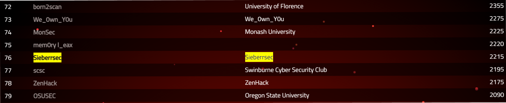
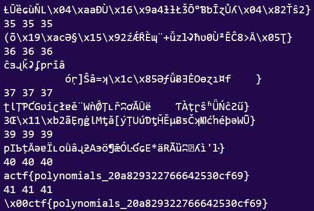
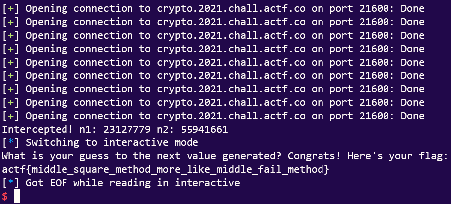

ångstromCTF2021 was, in all honesty, probably the most serious I've been on a CTFTime CTF.

The spread of challenge difficulties was just right for a beginner like me. While I could not do any of the harder challenges (includes my nemesis, block ciphers), I was nonetheless able to solve quite a sizable number, including some I did not think possible.

In the end, we reached 71st place in the CTF!



# Writeups
I made writeups for the following two challenges (because I'm the most proud of them heh):
1. [(Crypto) Subsitution](#substitution)
2. [(Crypto) I'm So Random](#im-so-random)

## Substitution
```
[Source](https://files.actf.co/3c66d046b7d644f65c4e4bbb0c7aa4c4420ef1b6fda684e1b00c261ccf6472be/chall.py)

nc crypto.2021.chall.actf.co 21601

Author: EvilMuffinHa
```

### Reconnaissance
We are given the following code:
```python
#!/usr/bin/python

from functools import reduce

with open("flag", "r") as f:
    key = [ord(x) for x in f.read().strip()]


def substitute(value):
    return (reduce(lambda x, y: x*value+y, key))%691


print("Enter a number and it will be returned with our super secret synthetic substitution technique")
while True:
    try:
        value = input("> ")
        if value == 'quit':
            quit()
        value = int(value)
        enc = substitute(value)
        print(">> ", end="")
        print(enc)
    except ValueError:
        print("Invalid input. ")
```

We can therefore make some observations:
1. If we recover the key, we recover the flag.
2. We need to understand how that `substitute()` function works. (because I didn't before I saw this challenge)
3. Since `691` is a prime, we know that there is a `bijective` mapping between each `input value` and its `substituted value`.

### Figuring out what `substitute()` does
Rewriting the code we get:

```python
def substitute(value):
    return (reduce(lambda x, y: x*value+y, key))%691

def sub(value):
    c=key[0]
    for i in range(1,len(key)):
        c=(c*value+key[i])%691
    return c
```

And since the two functions give the `same output` for some `dummy key`, they are the same. (You can verify this by running it repeatedly.)

Thus we can see that the `substitution` algorithm is just, in math terms:

$$\text{Define } key=\{x_i | 1 \leq i \leq n\}\text{, and input } i \text{, where }n=len(key).$$

$$substitute(n)=(i \cdot ... i \cdot (i \cdot (i \cdot x_1 + x_2) + x_3) ... + x_n) \pmod{691} \equiv \sum_{r=1}^{n} [i^{n-r} \cdot x_r] \pmod{691}$$

(Disclaimer: I lost my whiteboard workings so if this is incorrect please do notify me and I will give you a cookie 🍪.)

### The Exploit
Notice that:
1. `substitute()` is just a glorified weighted checksum.
2. We can request for as many `substitute()`s as we desire.

It should be pretty obvious that we simply need to solve a series of `n` linear congruences to retrieve the flag.

This can be done by representing the `linear congruences` in a `matrix` and their `results` in a `vector`.

The only problem being that we don't know how long the flag is...

So we will just **BRUTEFORCE IT** >:D.

### The Script
Writing everything in SageMath,

```python
from sage.all import *
from pwn import *

r=remote('crypto.2021.chall.actf.co', 21601)
def substitute(i):
    r.recvuntil('> ')
    r.sendline(str(i))
    return int(r.recvline()[3:])

R=Integers(691)
leest=[substitute(i) for i in range(5)]
for i in range(5,50):
    leest.append(substitute(i))
    A=Matrix(R,[[R(j)**R(k) for k in range(i+1)] for j in range(i+1)])
    v=vector(R,leest)
    sol=list(A.solve_right(v))
    print(''.join([chr(c) for c in sol][::-1]))
    # Sanity Check information unnecessary. Thus they were all removed.
```
We simply run the code to obtain the flag!



Flag:
`actf{polynomials_20a829322766642530cf69}`

## I'm So Random

```
Aplet's quirky and unique so he made my own [PRNG](https://files.actf.co/a155e414e8cc7e0279ffe40225d7295fda5c2b79116313c2cb8fb8bf22dda70d/chall.py)! It's not like the other PRNGs, its absolutely unbreakable!

nc crypto.2021.chall.actf.co 21600

Author: EvilMuffinHa
```

### Reconnaissance

We are presented with the following code:
```python
import time
import random
import os

class Generator():
    DIGITS = 8
    def __init__(self, seed):
        self.seed = seed
        assert(len(str(self.seed)) == self.DIGITS)

    def getNum(self):
        self.seed = int(str(self.seed**2).rjust(self.DIGITS*2, "0")[self.DIGITS//2:self.DIGITS + self.DIGITS//2])
        return self.seed


r1 = Generator(random.randint(10000000, 99999999))
r2 = Generator(random.randint(10000000, 99999999))


query_counter = 0
while True:
    query = input("Would you like to get a random output [r], or guess the next random number [g]? ")
    if query.lower() not in ["r", "g"]:
        print("Invalid input.")
        break
    else:
        if query.lower() == "r" and query_counter < 3:
            print(r1.getNum() * r2.getNum())
            query_counter += 1;
        elif query_counter >= 3 and query.lower() == "r":
            print("You don't get more random numbers!")
        else:
            for i in range(2):
                guess = int(input("What is your guess to the next value generated? "))
                if guess != r1.getNum() * r2.getNum():
                    print("Incorrect!")
                    exit()
            with open("flag", "r") as f:
                fleg = f.read()
            print("Congrats! Here's your flag: ")
            print(fleg)
            exit()
```

In brief, it creates a PRNG that generates numbers like so:

1. Generate 2 pseudo-randomly seeded PRNGs. (post-solve addendum: see [middle-square method](https://en.wikipedia.org/wiki/Middle-square_method))
2. When each `getNum()` is called, 
    
    a. Square the seed
    
    b. Pad the seed so it is 16 digits long.
    
    c. Extract the middle 8 digits of the seed.
    
    d. Return seed.
    
    e. Next `getNum()` will use this new seed.
3. Multiply the two PRNG-generated numbers to create a pseudo-random number (we will call this the `Result`).

That's cool. But where's the vulnerability?

### The Exploit

Here >:D.

Notice that:
1. `Result` is pretty small (16 digits at best).
   
   a. Easily factorized.
2. 
The pseudo-randomly generated number is always the product of the two PRNG-generated numbers.


    a. So in the event that they are prime, factorizing the pseudoprime `Result` will leak both pseudo-random seeds.

3. For every pair of pseudo-random seeds, the PRNG-generated number is ALWAYS the same.
    
    a. That means that we can simply intercept the pseudo-random seeds and continue generating new `Result`s as if nothing had happened.

This gives me an idea for an exploit:
1. Generate numbers repeatedly until we get a pseudoprime `Result`.
    
    a. This will happen with an $$\approx$$ 1/64 chance.
    
    (A consequence of the [Prime Number Theorem](https://primes.utm.edu/howmany.html) states that any integer `n` digits long has an $$\approx \frac{1}{ln(n)}$$ chance of being prime. We have our PRNG-generated numbers being at most 8 digits.)
2. Factorize `Result` to intercept the seeds of the two PRNGs.
3. Create our own PRNGs with the two intercepted seeds and generate `Result`s to get flag!

There's really not much else to say, this solution was pretty simple in my eyes.

### Script
```python
# So here's the plan...
# We hope for a pseudoprime seed...
# And if we get it... we win! :D
from pwn import *
from sage.all import *

# context.log_level='DEBUG'

class Generator():
    DIGITS = 8
    def __init__(self, seed):
        self.seed = seed

    def getNum(self):
        self.seed = int(str(self.seed**2).rjust(self.DIGITS*2, "0")[self.DIGITS//2:self.DIGITS + self.DIGITS//2])
        return self.seed

const=24
j=0
while sum([i[1] for i in factor(const)])!=2:
    if not j%3:
        r=remote("crypto.2021.chall.actf.co",21600)
    r.recvuntil('? ')
    r.sendline('r')
    const=int(r.recvline()[:-1])
    j+=1
n1,n2=[i[0] for i in factor(const)]
print(f"Intercepted! n1: {n1} n2: {n2}")
r1 = Generator(n1)
r2 = Generator(n2)

r.recvuntil('? ')
r.sendline('g')
r.sendline(str(r1.getNum()*r2.getNum()))

r.recvuntil('? ')
r.sendline(str(r1.getNum()*r2.getNum()))

r.interactive()
```

And thus we run the exploit:



And receive our flag!

```actf{middle_square_method_more_like_middle_fail_method}```
