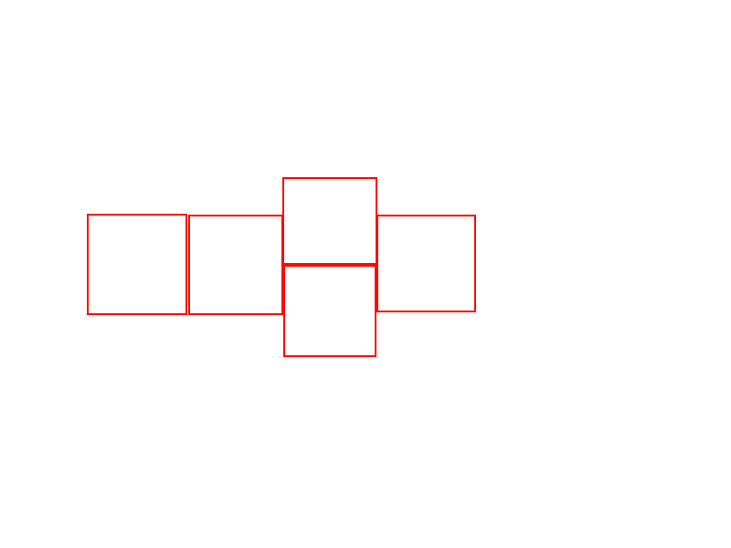
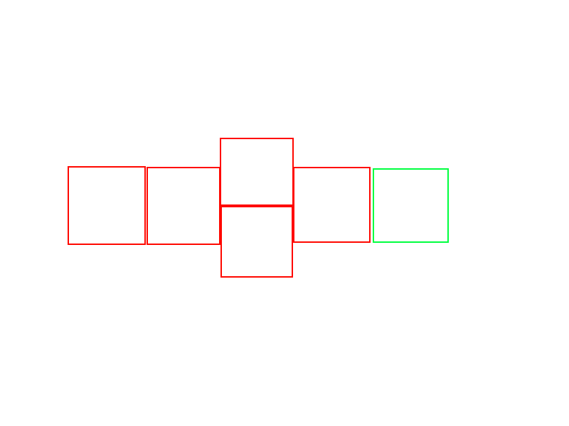
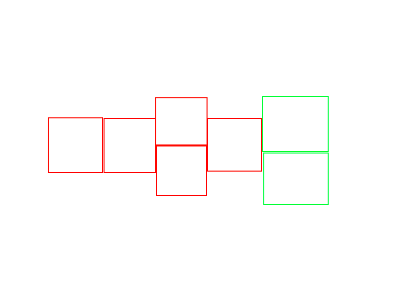

### Unfortunately I'm ~~a little~~ VERY MUCH short on time, let's cut to the chase.


# Writeups (WIP, might add more as time goes on)
1. [(PPC) Hopscotch (151 Solves / 436 Points)](#hopscotch)

## Hopscotch

```
Keith wants to play hopscotch, but in order to make things interesting, 
he decides to use a random number generator to decide the number of 
squares n to draw for a round of hopscotch. He then creates a hopscotch 
board on the floor by randomly creating a sequence of ones (one square) 
and twos (two squares) such that the sum of all the numbers in the sequence
is n. Given 1 <= n <= 1000, find the number of valid hopscotch boards (mod 10000) 
he can create. 

Sample Input: 5 
Sample Output: 8

nc hopscotch.hsc.tf 1337
```

### Problem Analysis
Basically, find the number of sequences from **ones and twos** one can make that add up to $$n$$.

This writeup is mainly a response to the other one on [CTFTime](https://ctftime.org/writeup/29013).

While it is by no means bad (and you should go and rate the writer 5.0 for their work :O), I hope to share a more `mathematical` explanation for the problem solution.

### Combinatorics: Recurrence Relations
Perhaps we should take the hopscotch board metaphor and extend it a bit further.

Basically, say we have a hopscotch board with a total of $$m$$ squares, where $$m \in \mathbb{Z}$$. Let $$F_m$$ describe the number of ways one can make a hopscotch board with $$m$$ squares in total.

(For illustration purposes, I have elected to use $$m=5$$ and a **badly**-drawn hopscotch board.)



For a board with $$m+1$$ squares total, we could just tack on another square at the back:



Similarly, for a board with $$m+2$$ squares total, we could just tack on another two squares at the back:



**Conversely**, this also means for any hopscotch board with $$m$$ squares, it could have been constructed from a hopscotch board from $$m-1$$ (if it had 1 square at its right end) or $$m-2$$ squares (if it had 2 squares at its right end).

**Therefore**, the __total__ number of ways one can construct a hopscotch board with $$m$$ squares is the same as the **TOTAL** number of ways that one can construct a hopscotch board with $$m-1$$ squares and $$m-2$$ squares.

Mathematically, 

$$F_m=F_{m-1}+F_{m-2}$$

Would you look at that. The Fibonacci sequence.

### Solve Script
Taking what we have gathered from our combinatorial analysis, we can compute the __number of sequences from **ones and twos** one can make that add up to `n`__ using a Fibonacci sequence.

```python
from pwn import *
fibo=[1,1]

def precompute(): 
    # Precomputation is faster, although frankly unnecessary.
    while len(fibo)<=1000:
        fibo.append((fibo[len(fibo)-1]+fibo[len(fibo)-2])%10000)
precompute()
r=remote('hopscotch.hsc.tf',1337)
r.recvuntil('\n')
try:
    while True:
        num=int(r.recvline()[:-1])
        r.sendline(str(fibo[num]))
        r.recvuntil(': ')
except Exception as e: # I'm lazy to detect the flag, so I'll just catch it...
    print(e)
    r.interactive()
```

And we're done!

Flag: `flag{wh4t_d0_y0U_w4nt_th3_fla5_t0_b3?_'wHaTeVeR_yOu_wAnT'}`