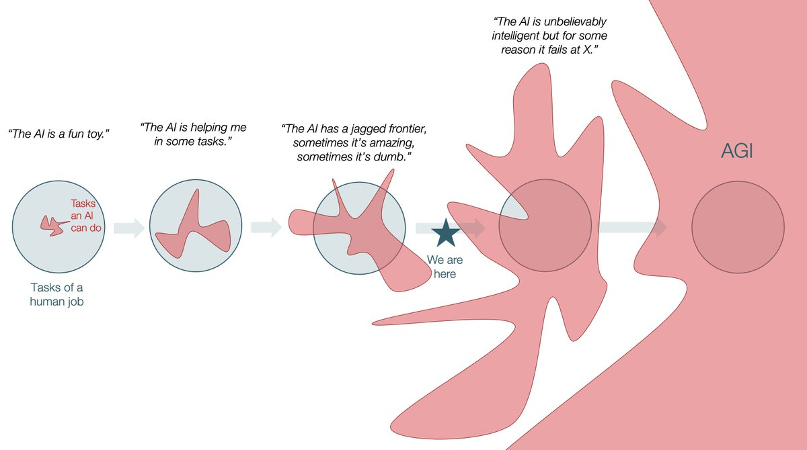

Honestly, I'm sick and tired of hearing people say "CTFs are dead" ([do](https://blog.kek.cx/posts/slop-is-all-you-need/), [re](https://samuzora.com/posts/20-years), [mi](https://kabir.au/blog/the-ctf-scene-is-dead), [fa](https://x.com/_mixy1/status/2030334053400842601), [so](https://www.linkedin.com/posts/zhang-zeyu_are-ctfs-dead-its-been-a-year-since-i-last-activity-7466762589629206528-1olw), [la](https://blog.awoo.systems/posts/2025-11-12-csaw-dead-ctf-theory), [ti](https://cybergladius.com/ai-has-broken-capture-the-flag/), [doooooo...](https://blog.krauq.com/post/ctf-is-dying-because-of-ai)), 

What makes these blogposts so **frustrating** is that everything that's ever happened in CTFs since [some Lovecraftian cyberpunk parrots dropped onto the scene](https://openai.com/index/chatgpt/) seems to be telling you that... they're actually right.

As you can tell from the age of my blogposts, I joined CTFs long before clankers[^1] were **anywhere near** good enough to solve CTF challenges (i.e. 2018). At risk of tooting my own horn, I was a **decently** skilled player and a podium regular back then. I know first hand just how much CTFs have changed, not least since I left for about 3 years ([life](https://en.wikipedia.org/wiki/Mental_disorder) and [conscription](https://en.wikipedia.org/wiki/National_service_in_Singapore) called). You know what? Let's put it in a table so it's nice to look at:

[^1]: I will use "clanker" as a blanket term for any LLM platform / LLM agent (ChatGPT, Codex, Claude, Claude Code, self-hosted LLM, OpenClaw, Pi, etc.) that can be used to solve CTF challenges, through such means as reasoning about challenges, writing PoCs, performing exploits, etc.

| Before Clanker (BC) | After Clanker (AC) |
|---------------------|--------------------|
| Most people take a few hours to solve (decent) challenges | First blood comes out 1min after the CTF starts |
| Most teams solve a handful of challenges, half if lucky / cracked | Someone gets full solve within 3 hours |
| Most people **specialize** in 1 or 2 categories | Everyone can (gamble to) solve everything now |
| [Google-fu](https://en.wiktionary.org/wiki/Google-fu) was a valuable skill | "henlo chat geepeedee pls solve diz challenge i gib u full permissionz..." |
| [Some CTFs were low-quality](https://www.dsta.gov.sg/brainhack) | [Some CTFs are still low-quality](https://www.dsta.gov.sg/brainhack) |
| **HUMAN** guidance and mentorship was important | You can just ask the clanker |

So I would say that anyone who still insists naively that "CTFs aren't dead because they haven't changed" is living under a rock.

I additionally recognize that, as a consequence of these changes, the skill floor (for textbook challenges) has **risen so ludicrously** that, if you simply played to win, you would just sic the clanker[^1] at the challenge rather than actually trying to crack it yourself.
- Anecdote 1: I was shocked (last year) to hear that heap pwn is now a basic concept. Imagine hearing that in 2019/2020. O.O
- Anecdote 2: I was beaten multiple times to the punch by clankers[^1] at solving a challenge I was clearly capable of doing.
- Anecdote 3: And even if I WAS using a clanker[^1], *someone* (cough, River, cough, [jro](https://jro.sg/), ...) would still outclank me either by being faster, having a better-designed harness, or simply being luckier with their clanker.

So it's reasonable to see the CTF scene is becoming more and more unwelcoming to us players (new, experienced, or returning), in particular those who had this old schema of CTFs as a "thinking man's sport", either because the clanker[^1] is smarter than you (new/returning players), or it is faster than you (experienced/returning players).

## So... CTFs are dead?

But that's exactly what gets me, right? You **would think** the "CTFs are dead" crowd are spot on (and in many ways I feel the sentiment behind what is being conveyed), but that just doesn't match up with the real and current state of clankers[^1] (and I think it won't, for years and years to come...), and so I think this crowd's take is **directionally mistaken** and **emblematic of a toxic mindset that could kill CTFs long before AI Agents even do**. Let me explain...

### Reason 1: Clankers[^1] are (sometimes) conceivably and yet unfathomably dumb

Six months is forever in AI, but I still believe that we are in the early stages of the jagged frontier era [(you know what, even further BEFORE where this guy puts it)](https://x.com/tomaspueyo/status/1993360931267473662?s=20), where [present logistical](https://storage.googleapis.com/deepmind-media/Era-of-Experience%20/The%20Era%20of%20Experience%20Paper.pdf), [paradigmatic](https://arxiv.org/abs/2309.10371) and [algorithmic](https://www.dwarkesh.com/p/francois-chollet) / [architectural](https://adamjones.me/blog/yann-lecun-on-agi/) are expected to nerdsnipe all of humanity's frontier AI Researchers for at least the next decade or so.

This is not just me spreading my agenda to you (ok, maybe just a little bit). There are already abundant examples of clankers[^1] flopping at / sidestepping / half-assing tasks a genuine reasoning / high-expertise clanker[^1] should not, such as [context-shifted logic puzzles](https://arxiv.org/abs/2507.07313), [long-horizon planning](https://sakana.ai/sudoku-bench/), [backend design](https://arxiv.org/pdf/2605.06445), [esoteric programming](https://arxiv.org/abs/2606.10933), among others...

Now contrast those risible displays of incompetence by clankers[^1] to the assertions (not arguments) raised by some in the "CTFs are dead" crowd:
> "The enemy is a fully autonomous general problem solver that requires no input from humans to solve challenges. It runs in the background while the human is completely disengaged with the solving process." ~ [samuzora](https://samuzora.com/posts/20-years)
> "Perhaps the only thing I would be better at is really really hard challenges that require lateral thinking/a lot of creativity." ~ [kek](https://blog.kek.cx/posts/slop-is-all-you-need/)
> "A few models from now, that point may be irrelevant anyway. The trajectory of LLM security capability is moving too quickly for challenge design to stay ahead for long." ~ [kabir.au](https://kabir.au/blog/the-ctf-scene-is-dead)
> "You might assume running a system like this required constant oversight. It didn’t. Most of our involvement consisted of occasionally redirecting the agents when they chased a red herring or pursued an exploit chain that clearly wasn’t going to work. These corrections were minor and often based on intuition rather than detailed technical analysis." ~ [cybergladius](https://cybergladius.com/ai-has-broken-capture-the-flag/)

... and I think you can see that their concerns need not stand on solid ground (assuming our CTF challenges are well-designed), because the core thesis of clankers[^1] being "autonomous", rapidly rising in "security capability", and "requiring little/no human input" is **NOT a foregone conclusion**. Which leads me to my next point...

### Reason 2: Our CTF challenges are (mostly) subpar and blasé
*if you find yourself asking "uhm what about beginnerz", please hold your peace until you read [this section](#ok-mr-smarty-pants-then-how-should-we-adapt-ctfs-to-the-new-reality)...*

... our CTF challenges are just... **NOT** up to snuff. 

When you design contrived ([AI CTF 2025: Limit Theory](./2025-10-13-GovTech-AI-CTF-2025-quals.md#limit-theory)), shoehorned ([CDDC 2026: backdoor](https://dsta.gov.sg/brainhack)), guessy ([CSAW CTF Finals 2025: The Music Security Department Solved It In 15 Minutes](https://blog.awoo.systems/posts/2025-11-12-csaw-dead-ctf-theory#the-music-security-department-solved-it-in-15-minutes)), simplistic ([AI CTF 2025: Stridesafe](./2025-10-13-GovTech-AI-CTF-2025-quals.md#stridesafe)), and/or overly textbook (*insert RSA attack here / insert CVE here*) challenge, you need to be **next-level delusional** to then be surprised when you find out some clanker (sometimes, clanker swarm) **inevitably solves it in 1 minute**. I have no doubt in my mind that **almost all somewhat-advanced** CTF players (especially the "CTFs are dead" crowd) bemoan this exact and highly valid point, with some even quitting because of it.

The problem is that way too many CTFs **uncritically** incorporate such challenges in bulk, thinking that simply plonking in a new website, a new framework, a new language, a new forensics tool is enough to stop a reasonably competent clanker[^1] in its tracks. This understandably **misleads** the "CTFs are dead" crowd into **thinking** that **most, if not all** CTF challenges are inherently clankable.

In reality though, CTFs are "dead" just because, with all due respect, we challenge authors are **too damn lazy** to design genuinely engaging challenges which require **either expert human reasoning, or an human-clanker[^1] ensemble (where the human has to exert considerable cognitive effort to steer the clanker[^1])** to solve, either because we don't **know how to make clankers[^1] look stupid**, or because we simply **don't bother** (*cough SG government CTFs cough*).

### So what's the real story here?

To me, when we consider the objective matter which is the CTFs themselves, the "real story" is that **CTFs are NOT dead in general**. It's really just that:
- good but AI-ignorant challenge designers are unable to adapt as quickly as clankers[^1] are improving;
- bad challenge designers are still making the same old shitty challenges, then scream about how "CTFs are dead" when they get clanked in 1 minute;
- worse challenge designers make "read-my-mind" challenges that are both unclankable and thoroughly unfun for anyone with the misfortune of playing them, adding to players' frustration (and, when someone's clanker[^1] lucks out, their sense of futility about the state of CTFs);
- and perhaps most sadly, that good and AI-aware challenge designers self-select out of the CTF scene because they either don't think that they can outwit the clanker[^1], or they are morally opposed to creating challenges that could eventually find its way into a clanker[^1]'s training data (err, the exact manifestation of this general anti-AI sentiment definitely varies by person).

## Wait. Are you saying... WE are the ones killing CTFs?

Kind of, yeah.

Clankers'[^1] capabilities may be improving nearly every day, but they are neither infallible nor omniscient. Not in the here and now, not in the near future (I wouldn't put my money on "not ever"). Even if they are the state-of-the-art, frontier, proprietary models shipped by ocean-boiling, power-guzzling, money-burning megacorporations, their weaknesses and limitations are still clear as day to anyone who takes the time to understand how they work. They cheat. They hallucinate. They are lazy. They get stuck. They're bad at recognizing when they're barking up the wrong tree.

You can't change Silicon Valley's take on AI, and you certainly can't stop all the venture capitalists from doping the frontier AI labs full of money they pulled out of their behinds (although, if you can, please contact me because I have some ideas for what to do with that money). 

But you **can** change the way CTFs are designed and played, and it is sad to see CTF players drowning in their own defeatism instead of rising to the challenge and adapting to a clanker-filled[^1] new reality. With despair and nihilism prevailing within the CTF scene, I worry that us CTF players are discouraging each other from enjoying CTFs while telling well-meaning organizers that nothing they do will ever stop the inevitable tide of clanker[^1] supremacy. That will probably smother and kill CTFs faster than any clanker[^1] ever could.

## OK Mr Smarty Pants, then how SHOULD we adapt CTFs to the new reality?

Since the exchange rate between talking and doing is at an all-time low right now, it's just as well that I offer some of my own *unsolicited* advice that people can act upon (optionally with clanker[^1] assistance) to make better CTFs... roughly in decreasing priority:

1. **Where possible, split your CTFs into tiered tracks**

Consider that clankable challenges can have their value in initiating new players into the CTF scene, as well as teaching interesting concepts/techniques to less-skilled players.

Whereas AI-positive CTFs can have their value in pushing the frontier of CTF design, and in providing a playground for players to experiment with AI-assisted solving.

So (**if your resources allow for it**), instead of banning clankers[^1] outright or pretending that clankers[^1] don't affect the experience, try **splitting** your CTF into multiple tracks (e.g. a decent split is "human-only" vs "open") with separate leaderboards and prizes, so players can choose the track that best suits their preferences and values. This way, you can preserve the traditional human-centric CTF experience while also embracing the new possibilities that clankers[^1] bring to the table.

2. **Design challenges that reward unorthodox (but logical) reasoning and ingenious thinking**

Surprisingly, this is **far from impossible**, and applies even when clankers[^1] are in play. To realise this design philosophy, you could:
- **Feature novel techniques FROM less-represented domains**. This is because the CTFs of yesterday are dominated by pattern recognition and schema-fitting ("find the cryptosystem" challenges), which clankers[^1] are very good at. If you use a less-represented domain (perhaps like hardware, or (non-LLM-related) AI/ML), the chance that you hit an unfamiliar pattern/technique is higher, and the clanker[^1] is more likely to struggle.
- **Design multi-step/cross-category challenges** that require players to piece together clues from different sources, and to make strategic decisions about **how** to use those leads quasi-sequentially.
    - This exploits clankers'[^1] weakness in long-horizon planning and multi-step reasoning, like I mentioned above.
    - "fullpwn" challenges (where you go into some complex system and try to compromise it chaining together multiple vulnerabilities) are a good example of this, but if you can find less-represented domains to apply the "fullpwn" concept to, even better.
- **Carefully inject red herrings to mislead clankers[^1]**.
    - This is the most dangerous of all suggestions, because if done improperly (such as by [fumbling the flag format](https://dsta.gov.sg/brainhack)), it makes the challenge unfun and frustrating for players.
    - You can do it right by trying **variations/extensions** on existing challenge patterns, so clankers[^1] would go on a wild goose chase on the overly simple path, where humans could be challenged to adjust the approach / analyze why the challenge is so suspiciously easy, and then figure out the intended path.
- **Pit players against each other and force them into adversarial play**, which is a surefire way to **reduce the relative advantage** of clankers[^1]. By introducing chaotic dynamics, unstable equilibria and metagaming, players can be incentivized to engage actively by responding to others' strategies, instead of calling it a day once the clanker[^1] spits out a flag.
    - This was recently done by [DEFCON Qualifiers 2026](https://bbbirds.org/) with the "King of the Hill" format, where players had to compete on a leaderboard, either by playing games against each other, or by optimizing some universal objective.
    - Unfortunately this might be a bit more logistically difficult, but the fun moments where you see players outsmarting each other and outmaneuvering each other are worth it, in my opinion.
    - Yes. Holding Attack-Defence CTFs is one such strategy, although I don't play nearly enough AD CTFs to know whether this has all the desirable qualities of a more general statement like "pit players against each other".

3. **Do not confuse anti-CTF-player with anti-clanker[^1]**

In trying to correct for the new clanker-filled[^1] CTF scene, it is tempting to try and make challenges more and more complex so that clankers[^1] have a harder time in solving them, but **there is a fine line between making a challenge harder for clankers[^1] and making it harder for players**. Crossing it (which is all too easy to accidentally do) kills player enjoyment and fuels negative sentiment about the state of CTFs, which is counterproductive.

Therefore, when testing new ideas, consider checking your designs against some of these anti-patterns I noticed in shitty CTFs:
- **Player Must Read Your Mind** - Carefully scrutinize your solve pattern and ask yourself: "Could someone who knows nothing about this challenge, but is otherwise reasonably knowledgeable about \<domain\>, eventually arrive at each step unambiguously and without trial-and-error?" If the answer is "no", reconsider.
- **Player Must Take Unintuitive Steps** - Closely related to the above but not strictly equivalent. Also ask yourself, "Would someone in \<domain\> actually even considering doing this step in the first place?" If the answer is "no", reconsider.
- **Player Unable To Verify Flag** - Some CTFs give ambiguous flag descriptions and do not offer a way for players to verify that their flag is correct, which can lead to a lot of frustration and wasted time. For example, don't say `flag{0x12345678abcdef}` when you really mean `flag{a 8 letter hex string}`. This is [definitely a hypothetical example and not an oddly specific grievance I have](https://dsta.gov.sg/brainhack).
- **Player Needs To Do Expensive Computation** - If a challenge requires players to perform expensive computation (e.g. brute-force search, large-scale simulation, etc.) to solve, you are just wasting peoples time and energy, and exacerbating the already-existent "pay-to-win" aspect of CTFs (now that clankers[^1] have hit the scene). As a rule of thumb, try limiting the computation time to be around ~5 minutes on a laptop (yes, even for challenges where **the whole shtick is bruteforcing**), and prefer providing shortcuts or hints which can intelligently reduce the search space, so that players can still solve the challenge without needing to throw more hardware at it.

## Conclusion

In sum, I experienced first hand how CTFs have changed since the rise of clankers[^1]. I genuinely think CTFs are definitely facing a tough, clanker[^1]-sized problem right now, where CTFers are struggling to adjust to a new meta where `"claude plz solve make no mistakes or i demonetize ur dog"` has apparently become a shining silver bullet for solving "all" CTF challenges, no matter how complex or difficult they are.

But we haven't done all that can be done, and so I find it incredulous that so many of us are willing to just throw in the towel and admit defeat before the fight against the Age of Clankers[^1] has even begun. 

Call me slow, thick, defiant and obstinate, but I think CTFs are still very much alive. Instead of adopting cowardly and defeatist attitudes toward clankers[^1] based on AI-bros' hype-laced rhetoric and sloppers' hyperbolic takes, I hope the CTF community can see clankers[^1] for the oddly flawed machines that they are, and rise to the challenge of designing better CTFs that can create a healthier and more engaging dynamic for players (even with clankers[^1] on the scene), so we can enjoy CTFs for many more years to come instead of succumbing to resignation, despair, and brainrot.