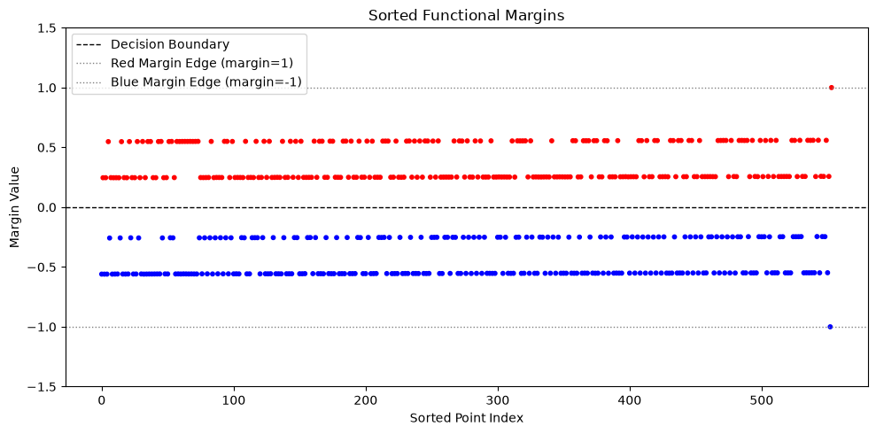
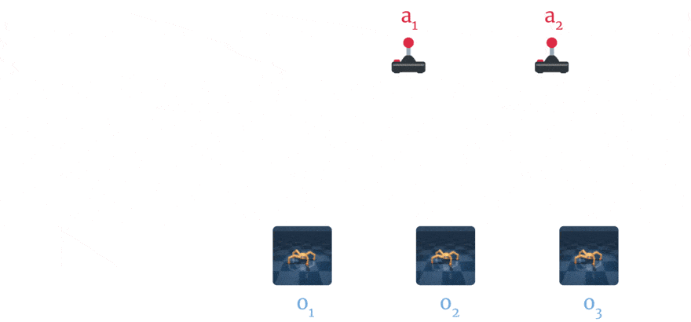
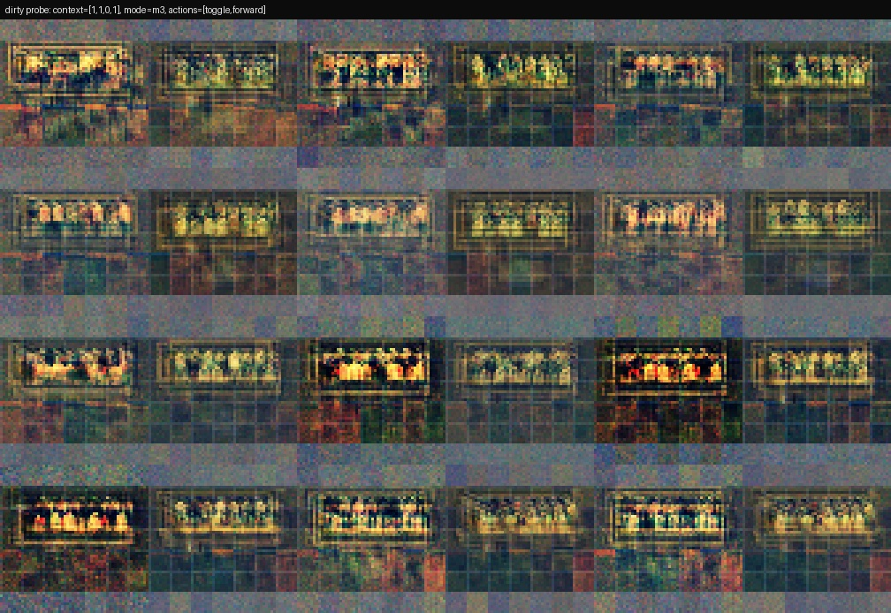
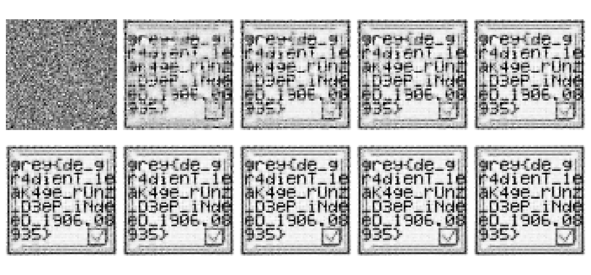

Over the past month or so, I made the entire AI category for GreyCTF 2026 Qualifiers and Finals [^1][^2].

I've quite a bit to say about this experience, but I think we know what you're reading this article for. So I'll leave it as an afterword and get right into the writeups.

## Contents

These challenges are arranged in order of perceived difficulty. If it seems inaccurate, well... I still have much to learn in difficulty gauging...

1. [AI Qualifiers](#ai-qualifiers)
    - [Duality In All Things](#duality-in-all-things)
    - [SABLE](#sable)
    - [Jurgen's Revenge](#jurgens-revenge)
    - [If Models Could Dream](#if-models-could-dream)
2. [AI Finals](#ai-finals)
    - [N00bcak's Last Gradient](#n00bcaks-last-gradient)
    - [Enshittification Detector](#enshittification-detector)
    - [Blind Devil](#blind-devil)
3. [Bonus](#bonus)
    - [My Long Snake KOTH](#my-long-snake-koth)

## AI Qualifiers

Overall, everyone who attempted these challenges asked their good friend Chad Jippity (or sometimes Clod)... Am slightly disappointed in myself for not making the challenges resilient enough.

Nevertheless, I will still show you my solutions to them (the ideas are all manual, but I'm lazy and I clanked the solve implementation for some challenges).

### Duality In All Things
```
Where there is Yin, there is Yang.

Where there is a primal problem, there is a dual problem.

Where there is regularization, there are oversteppers.

Where there are oversteppers, there is slack.

I wonder: Where there is a challenge, is there a flag?
```

Perceived Difficulty: 3/5

Actual Difficulty: probably 1/5, because everyone clanked it

#### Reconnaissance

You are given a Pickle archive called `svc_dual_params.pkl`. 

SVC appears to be an acronym and you should immediately Google it (it stands for [Support Vector Classifier](https://en.wikipedia.org/wiki/Support_vector_machine)).

Once you know it is a [Support Vector Classifier](https://en.wikipedia.org/wiki/Support_vector_machine), you can fumble around the pickle archive to get the following data fields:

```python
import numpy as np
import pickle
# Open the pickle archive

with open("svc_dual_params.pkl", "rb") as f:
    peekel = pickle.load(f)

# print(peekel)
print(type(peekel)) # <class 'types.SimpleNamespace'>
print(list(vars(peekel).keys())) # ['support_vectors_', 'dual_coef_', 'intercept_', 'C']

for key in vars(peekel).keys():
    print(key, type(getattr(peekel, key)))
    if isinstance(getattr(peekel, key), np.ndarray):
        print(f"Shape: {getattr(peekel, key).shape}")
'''
Result:
- support_vectors_ <class 'numpy.ndarray'>
- Shape: (554, 12)
- dual_coef_ <class 'numpy.ndarray'>
- Shape: (1, 554)
- intercept_ <class 'numpy.ndarray'>
- Shape: (1,)
- C <class 'float'>
'''
```
which tells us the following (after more Googling):
1. The [SVC](https://en.wikipedia.org/wiki/Support_vector_machine) is implemented by [scikit-learn](https://scikit-learn.org/stable/modules/generated/sklearn.svm.SVC.html) (a popular Python machine learning library).
2. It is in fact a **regularized/soft-margin dual SVC** (as indicated by the `dual_coef_` and `C` fields, [named exactly as such in the scikit-learn documentation](https://scikit-learn.org/stable/modules/generated/sklearn.svm.SVC.html)).

#### Background

To **oversimplify things**, an SVC works by predicting a separator that maximizes the **gap** (i.e. distance from class point to separator) between two classes of data points. 
- This separator is learnt by a [quadratic program](https://en.wikipedia.org/wiki/Quadratic_programming) or some such method (haha [gradient descent go brrrrrr](https://en.wikipedia.org/wiki/Gradient_descent)).
    - Define $(x_i, y_i)$ as the $i$-th data point and its label, where $x_i \in \mathbb{R}^d$ and $y_i \in \{-1, 1\}$.
    - Define $K(x_i, x_j)$ as the Euclidean inner product of $x_i$ and $x_j$ (literally any kernel function works here...)
- That [quadratic program](https://en.wikipedia.org/wiki/Quadratic_programming) can either be solved in the **primal** or **dual** form, although the **dual form** is more expressive (and parameter-efficient in high-dimensional spaces) than the primal form due to the [kernel trick](https://en.wikipedia.org/wiki/Kernel_method).
    - The dual form **can be** written like so, with dual variables $\alpha_i$:
    $$ \max_{\alpha} \sum_{i=1}^{n} \alpha_i - \frac{1}{2} \sum_{i=1}^{n} \sum_{j=1}^{n} \alpha_i \alpha_j y_i y_j K(x_i, x_j) \text{ s.t. } \alpha_i \geq 0, \sum_{i=1}^{n} \alpha_i y_i = 0$$
    - Once we have $\alpha$, we can compute the primal coefficients $w$ and $b$ (the separator) as follows:
    $$ w = \sum_{i=1}^{n} \alpha_i y_i x_i, \quad b = y_k - w^T x_k \text{ for any support vector } (x_k, y_k)$$
- That [quadratic program](https://en.wikipedia.org/wiki/Quadratic_programming) can be **regularized** (i.e. made "soft-margin") by adding a hyperparameter $C$ which controls the tradeoff between maximizing the margin and minimizing the classification error.
    - **Being regularized** suggests there are points allowed to "violate" the margin (i.e. be closer than they should to the separator). We call these **slack points** and denote the slack of point $i$ as $\zeta_i$.
        - Where the usual dual program is **typically** written as follows:    
        $$ \max_{\alpha} \sum_{i=1}^{n} \alpha_i - \frac{1}{2} \sum_{i=1}^{n} \sum_{j=1}^{n} \alpha_i \alpha_j y_i y_j K(x_i, x_j) \text{ s.t. } \alpha_i \geq 0, \sum_{i=1}^{n} \alpha_i y_i = 0$$
        - The regularized version is usually written like so:    
        $$ \max_{\alpha} \sum_{i=1}^{n} \alpha_i - \frac{1}{2} \sum_{i=1}^{n} \sum_{j=1}^{n} \alpha_i \alpha_j y_i y_j K(x_i, x_j) \text{ s.t. } 0 \leq \alpha_i \leq C, \sum_{i=1}^{n} \alpha_i y_i = 0$$
    - $\alpha_i$ has an interesting interpretation: 
        - If $\alpha_i = 0$, point $i$ is **not on the margin**.
        - If $0 < \alpha_i < C$, point $i$ is **a support vector** (and it is on the margin).
        - If $\alpha_i = C$, point $i$ **could violate the margin** (i.e. is a "slack point").
- Trust me, this information dump will come in handy right about... now.

#### Solution

At this point, notice that we've already ticked almost all the boxes for the challenge description (except for "Where there is a challenge, is there a flag?").

Yet there is a startling lack of nothing to do. Where is the flag?

... except, there ARE a few things to do:
- You haven't checked out the primal coefficients yet, have you?
    - Please don't waste your time, it's not THAT obvious...
- You haven't tried to decode the dual vectors as a message,  have you?
    - Again, if it were that obvious, did you need to read this writeup?
- You also haven't tried to analyze the "slack points", have you?
    - Ok fine, so there might only be ONE (viable) thing to do... We don't make guessy CTF challenges here in my world. Unlike [GovTech](https://www.tech.gov.sg/events/singapore-ai-ctf-2025/).

So let's start by trying to plot the [(relative) distance](https://stats.stackexchange.com/questions/58815/why-can-the-margin-of-svm-be-approximated-by-1) to decision boundary of each point, shall we?
- The challenge description makes reference to "oversteppers" and "slack", which is whispering to you to check out the "slack points".
- Moreover, this is a good and fast way (without labels) to check whether the dataset was linearly separable or not.
    - Tells you things like "is the dataset synthetic", because real data under a **regularized SVM** is usually not linearly separable.
- There's... not much else to look at. :P At least you didn't have to guess...

```python
# Plot the distance to decision boundary of each point
import numpy as np
from matplotlib import pyplot as plt

# Compute primal coefficients (this is rather easy)
primal_coefs = np.dot(peekel.dual_coef_, peekel.support_vectors_)
sv_margins = np.dot(peekel.support_vectors_, primal_coefs.T) + peekel.intercept_
sv_labels = np.sign(peekel.dual_coef_).flatten()  # Get the labels (signs) of the dual coefficients

sv_margins_flat = sv_margins.flatten()
colors = ['r' if sv_labels[i] == 1 else 'b' for i in range(len(sv_margins_flat))]

plt.figure(figsize=(10, 5))
plt.scatter(np.arange(len(sv_margins_flat)), sv_margins_flat, c=colors, s=10)
plt.axhline(0, color='black', linestyle='--', linewidth=1, label='Decision Boundary')
plt.axhline(1, color='gray', linestyle=':', linewidth=1, label='Red Margin Edge (margin=1)')
plt.axhline(-1, color='gray', linestyle=':', linewidth=1, label='Blue Margin Edge (margin=-1)')
plt.title("Sorted Functional Margins")
plt.xlabel("Sorted Point Index")
plt.ylabel("Margin Value")
plt.ylim([-1.5, 1.5])
plt.legend()
plt.tight_layout()
plt.show()
```



Which actually shows you some **very interesting things...**
- **The Training Accuracy is 100%**
    - This is because **all support vectors are on the correct side of the margin** (i.e. all red points are above 0, and all blue points are below 0).
    - If a non-support vector were on the wrong side of the margin, it would have been a support vector and appear in this diagram.
- **Most points are "slack points"**
    - Nearly all points violate the margin (i.e. have a relative signed distance STRICTLY BETWEEN -1 and 1).
- **Within each category, the margin (mainly) only takes 2 unique values**
    - At this point your brain should be screaming "this is a synthetic dataset!".
    - You should probably **also try** to use this signal (as well as the labels) as a binary sequence

Thus, we now have 3 things to try:
1. Try using the label to decode the "slack points" as a binary sequence.
2. Try using the relative (unsigned) distance to the decision boundary to decode the "slack points" as a binary sequence.
3. Try using the relative signed distance to the decision boundary to decode the "slack points" as a quaternary sequence.

I will not bore you and tell you right now: it's the second option...
```python
# Recover flag bits based on margin value
flag_bits = []

# You should realise at this point the flag is 554 bits long which is not divisible by 8.
# If for whatever reason you have yet to decide to remove the last 2 non-"slack points"... you should not be surprised when your "flag string" is mangled...
for margin in sv_margins_flat[:-2]:
    if abs(margin) > 0.375: # Just eyeball it...
        # Interpretation: The closer to the decision boundary, the higher the violation
        flag_bits.append(0)
    else:
        flag_bits.append(1)

flag_string = int(''.join(map(str, flag_bits)), 2)
flag_bytes = flag_string.to_bytes((flag_string.bit_length() + 7) // 8, 'big')

print(f"Recovered flag bytes: {flag_bytes}")
```

yielding the flag
```
grey{du4l_0pt1m1z4t10n_l3ft_th3_supp0rt_v3ct0rs_b3h1nd}
```

### SABLE

My spam detector is very smart. It looks at a user's friends, decides which friends matter most, and then confidently announces whether the user is suspicious.

I wonder just how many friends you have... ;)

nc challs.nusgreyhats.org 38267


Perceived Difficulty: 3/5

Actual Difficulty: 1/5, again because everyone clanked it

#### Reconnaissance

This is a server-based challenge, and the server implementation is given in (`server.py`). Roughly speaking, we see that it:
- Loads a public graph (`public_graph.json`), which contains a social network graph containing a **target user** and their friends.
- Reads a JSON payload (schema in `graph_utils.py`), adds the new connections to the graph, and returns the flag if the **target user** is low-risk.
- Appears to instantiate `model.py` with the weights given in `model.pt` to facilitate the risk check.

You can quite quickly confirm from `server.py` that we ARE supposed to make the target user low-risk:
```python
THRESHOLD = 0.05
...
result = {
    "ok": risk < THRESHOLD,
    "risk": round(risk, 6),
    "threshold": THRESHOLD,
}
...
if risk < THRESHOLD:
    result["flag"] = os.environ.get("FLAG", "grey{local_dummy_flag_not_the_remote_flag}")

print(json.dumps(result, indent=2, sort_keys=True))
return 0
```
But also, if you grab the attention weights, you'll realise that the user is currently **omega sus**:
```
baseline risk: 1.0

user_giveaway_ring_01  0.3868
user_giveaway_ring_02  0.3107
user_linkfarm_17       0.2699
user_creator_21        0.0161
user_mod_09            0.0106
user_lurker_44         0.0059
```

So our task is to somehow drastically lower their risk score. We can obviously do so with a payload of SOME kind...
However, we are subject to the following (meaningful) constraints:
- Your payload needs to **add users to the graph** (ie it must add at least one new node).
- Your payload needs to **not add TOO MANY users** (ie it must add at most 6 new nodes).
- Your payload must **only consist of friends of the target user** (ie each new node must have exactly one edge, that being to the target user).

Which seems hella strange... why are you being told that you can bypass a spam detector just by adding friends...?

#### Background

It turns out, this is a common technique applicable to reputation-based/social systems around the world (decentralized networks, social media, etc.) called a [Sybil attack](https://en.wikipedia.org/wiki/Sybil_attack).

The idea is to gain disproportionate (though not necessarily absolute) control a system through the mass creation of distinct, bogus identities. This sounds super open-ended, **because it is**.

- Take those stupid like/review farms you always see on X (formerly Twitter), Amazon, Tiktok, and Youtube. That's a Sybil attack.
- Take automated ticket scalpers who use their 10 bajillion accounts to buy up all the tickets to a concert. That's a Sybil attack.
- Take [old news about a deanonymization attack on Tor users](https://arstechnica.com/information-technology/2014/07/active-attack-on-tor-network-tried-to-decloak-users-for-five-months/), performed by **providing large numbers of compute nodes to occupy large portions of Tor's routing mechanism**. That's ALSO a Sybil attack.

In our case... I'm giving you a spam detector which uses a [Graph Neural Network](https://en.wikipedia.org/wiki/Graph_neural_network) (GNN) which uses [Scaled Dot-Product Attention (SDPA)](https://arxiv.org/abs/1706.03762) to determine, given the info of a user and all their friends', whether they are "risky" (i.e. likely to be spammers). The use of GNNs [is a basic design](https://arxiv.org/abs/2005.00625) underpinning many **modern, proposed** social media spam detectors, and its sensible in its construction. Vanilla [SDPA](https://arxiv.org/abs/1706.03762), while common for GNNs (in addition to Transformers), is perhaps not a great choice for this problem.

But before we get into that, let's take a bit to understand how [SDPA](https://arxiv.org/abs/1706.03762) works in this context.

In the context of this challenge, [SDPA](https://arxiv.org/abs/1706.03762) answers this (oversimplified) question:

> In my social network, which friends should I look to the most to tell whether a user is a spammer?

Formally, we start with a vector $\mathbf{x} \in  \mathbb{R}^{d \times 1}$ representing the target user, and a set of vectors $\{\mathbf{f}_i \in \mathbb{R}^{d \times 1}\}$ representing the features for each friend $i$. According to this challenge's [SDPA](https://arxiv.org/abs/1706.03762) implementation:
- We linearly project the target user vector $\mathbf{x}$ into a query vector $\mathbf{q} \in \mathbb{R}^{d \times 1}$.
- We do the same for each friend vector $\mathbf{f}_i$ into a key vector $\mathbf{k}_i$, forming the matrix $\mathbf{K} = [\mathbf{k}_1  \mid \mathbf{k}_2  \mid \dots \mid \mathbf{k}_n] \in \mathbb{R}^{d \times n}$.
- We also project each friend vector $\mathbf{f}_i$ into a value vector $\mathbf{v}_i$, forming the matrix $\mathbf{V} = [\mathbf{v}_1  \mid \mathbf{v}_2  \mid \dots \mid \mathbf{v}_n] \in \mathbb{R}^{d \times n}$.
- We compute the attention vector $\mathbf{w} \in \mathbb{R}^{1 \times n}$ as follows:
    $$\mathbf{w} = \text{softmax}\left(\frac{\mathbf{q}^\top \mathbf{K}}{\sqrt{d}}\right)$$
    where $d$ is the dimension of the key vectors, and $\text{softmax}(\mathbf{z})_i = \frac{e^{z_i}}{\sum_{j=1}^{n} e^{z_j}}$.
- Finally, we multiply the attention vector $\mathbf{w}$ with the value matrix $\mathbf{V}$ to get an output representation of the target user $\mathbf{y} \in \mathbb{R}^{d \times 1}$:
    $$\mathbf{y} = \mathbf{V} \mathbf{w}^\top$$

As we will see in the next section, this is where the vulnerability lies in the whole challenge.

#### Solution

A vital property of [Softmax](https://en.wikipedia.org/wiki/Softmax_function) is that the result is necessarily a probability distribution:
- All weights are non-negative.
- The sum of all weights is 1.
- Union of disjoint sets is additive. (implied because we work in finite-dimensional vector spaces) 

These properties combined imply that Softmax (thus SDPA, thus our GNN spam checker) suffers from a critical drawback which is **probability mass dilution**: Simply by having more friends, you can siphon attention **away** from the existing friend pool, thus making the model rate the target user as less risky.

Of course, this is no bueno if your new friends are all also equally sus, because the model will still flag the target user as risky. So we'll need to add **real and trustworthy fake friends** to the target user.

Hence, the attack idea is pretty simple:

- Add fake friends which are strongly connected to user_target.
- Make those fake friends look very real and trustworthy.
- Ensure they still satisfy the public plausibility constraints.
- Let the attention softmax rot and rate us as un-sus.

Because this is a whitebox challenge (you literally have `model.pt`), we can just optimize the fake friends directly. Let $X$ be the feature matrix of our 6 fake friends. We want:

$$
\min_X f_\theta(x_{\text{target}}, [x_{\text{old neighbours}}; X])
$$

where $f_\theta$ is the spam logit produced by the model, and $X$ is **constrained** to satisfy all the public plausibility checks.

But you could also just severely penalize any violations of those checks for an arguably simpler problem to be solved by gradient descent :P. That results in the following solution:

1. Optimize unconstrained raw variables.
2. Squash them into the public feature bounds with a sigmoid.
3. Add soft penalties that mirror the hard validation checks.
4. After optimization, clip the result into a valid range.
5. Pass the final JSON through server.py to verify it.

That roughly translates to the following code:
```python
import json
import subprocess
import sys
from pathlib import Path

import torch

from graph_utils import (
    ACTIVE_DIVERSITY_FEATURES,
    FEATURE_BOUNDS,
    FEATURE_NAMES,
    MAX_NEW_NODES,
    MIN_ACTIVE_PAIRWISE_L1,
    MIN_PAIRWISE_L1,
    TARGET_ID,
    PayloadError,
    load_json,
    target_ego_tensors,
    validate_and_apply_payload,
)
from model import load_model


torch.set_num_threads(1)
torch.set_num_interop_threads(1)

N_FRIENDS = MAX_NEW_NODES
ATTENTION_ROWS = 8

# Optim hyperparams
SEED = 2026
RESTARTS = 8
LR = 0.05
STEPS = 1800
CONSTRAINT_WEIGHT = 300.0

# Yoinked from the plausibility checker...
HIGH_OVERLAP = 0.90
MIN_INTERACTION_FOR_HIGH_OVERLAP = 0.72
MAX_OVERLAP_INTERACTION_GAP = 0.24
LINK_FLOOR_START = 0.70
FLOOR_SCALE = 0.36
COMBINED_LINK_START = 1.30
COMBINED_FLOOR_SCALE = 0.24
TOO_CLEAN_RISK_SUM = 0.09
TOO_CLEAN_REAL_TRUST_SUM = 1.84
TOO_CLEAN_LINK_SUM = 1.50

# Tiny cushion so floating-point repair does not land exactly 
# on a rejection boundary after JSON rounding.
REPAIR_SLACK = 1e-3

n = N_FRIENDS
ix = {name: i for i, name in enumerate(FEATURE_NAMES)}
active = [ix[name] for name in ACTIVE_DIVERSITY_FEATURES]
lo = torch.tensor([FEATURE_BOUNDS[name][0] for name in FEATURE_NAMES], dtype=torch.float32)
hi = torch.tensor([FEATURE_BOUNDS[name][1] for name in FEATURE_NAMES], dtype=torch.float32)

m = load_model("model.pt")
g = load_json("public_graph.json")
tx, old, _ = target_ego_tensors(g, TARGET_ID)
best = None

for seed in range(RESTARTS):
    torch.manual_seed(SEED + seed)

    # 1. Optimize unconstrained raw variables.
    raw = torch.randn(n, len(FEATURE_NAMES), requires_grad=True)
    opt = torch.optim.Adam([raw], lr=LR)

    for _ in range(STEPS):
        opt.zero_grad()

        # 2. Squash raw variables into the public feature bounds.
        fr = lo + torch.sigmoid(raw) * (hi - lo)
        rep, ext = fr[:, ix["report_rate"]], fr[:, ix["external_link_rate"]]
        real, trust = fr[:, ix["profile_realness"]], fr[:, ix["trust_score"]]
        ov, inter = fr[:, ix["shared_audience_overlap"]], fr[:, ix["interaction_strength"]]

        # 3. Mirror hard plausibility checks as soft penalties.
        pen = 0
        pen += torch.relu(ov - inter - MAX_OVERLAP_INTERACTION_GAP).square().sum()
        pen += torch.relu((ov >= HIGH_OVERLAP).float() * (MIN_INTERACTION_FOR_HIGH_OVERLAP - inter)).square().sum()
        pen += torch.relu((ov - LINK_FLOOR_START) * FLOOR_SCALE - rep).square().sum()
        pen += torch.relu((inter - LINK_FLOOR_START) * FLOOR_SCALE - ext).square().sum()
        pen += torch.relu((ov + inter - COMBINED_LINK_START) * COMBINED_FLOOR_SCALE - rep - ext).square().sum()
        pen += (
            torch.relu(TOO_CLEAN_RISK_SUM - rep - ext)
            * torch.relu(real + trust - TOO_CLEAN_REAL_TRUST_SUM)
            * torch.relu(ov + inter - TOO_CLEAN_LINK_SUM)
        ).square().sum()
        pen += torch.relu(MIN_PAIRWISE_L1 - torch.pdist(fr, p=1)).square().sum()
        pen += torch.relu(MIN_ACTIVE_PAIRWISE_L1 - torch.pdist(fr[:, active], p=1)).square().sum()

        # Lower logit means lower spam risk. The constraint weight just makes
        # sure the optimizer does not ignore the checker while chasing the logit.
        loss = m(tx, torch.cat([old, fr])) + CONSTRAINT_WEIGHT * pen
        loss.backward()
        opt.step()

    with torch.no_grad():
        fr = lo + torch.sigmoid(raw) * (hi - lo)

        # 4. Clip the result into a valid range.
        # Make the six fake friends visibly non-identical for the diversity check.
        # These fields are convenient because they are bounded and not the core
        # attention-stealing features.

        fr[:, ix["post_rate_norm"]] = torch.linspace(*FEATURE_BOUNDS["post_rate_norm"], n)
        fr[:, ix["profile_age_norm"]] = torch.linspace(FEATURE_BOUNDS["profile_age_norm"][1], FEATURE_BOUNDS["profile_age_norm"][0], n)

        for i in range(n):
            ov_i = float(fr[i, ix["shared_audience_overlap"]])
            in_i = float(fr[i, ix["interaction_strength"]])
            if ov_i >= HIGH_OVERLAP and in_i < MIN_INTERACTION_FOR_HIGH_OVERLAP:
                fr[i, ix["interaction_strength"]] = MIN_INTERACTION_FOR_HIGH_OVERLAP

            ov_i = float(fr[i, ix["shared_audience_overlap"]])
            in_i = float(fr[i, ix["interaction_strength"]])
            if ov_i - in_i > MAX_OVERLAP_INTERACTION_GAP:
                fr[i, ix["interaction_strength"]] = ov_i - MAX_OVERLAP_INTERACTION_GAP

            ov_i = float(fr[i, ix["shared_audience_overlap"]])
            in_i = float(fr[i, ix["interaction_strength"]])
            fr[i, ix["report_rate"]] = max(float(fr[i, ix["report_rate"]]), max(0, ov_i - LINK_FLOOR_START) * FLOOR_SCALE + REPAIR_SLACK)
            fr[i, ix["external_link_rate"]] = max(float(fr[i, ix["external_link_rate"]]), max(0, in_i - LINK_FLOOR_START) * FLOOR_SCALE + REPAIR_SLACK)

            need = max(0, ov_i + in_i - COMBINED_LINK_START) * COMBINED_FLOOR_SCALE + REPAIR_SLACK
            have = float(fr[i, ix["report_rate"]] + fr[i, ix["external_link_rate"]])
            if have < need:
                fr[i, ix["report_rate"]] += (need - have) / 2
                fr[i, ix["external_link_rate"]] += (need - have) / 2

        payload = {
            "new_nodes": [
                {
                    "id": f"friend_{i:02d}",
                    "features": {name: round(float(fr[i, j]), 6) for j, name in enumerate(FEATURE_NAMES)},
                }
                for i in range(n)
            ],
            "new_edges": [[TARGET_ID, f"friend_{i:02d}"] for i in range(n)],
        }

        try:
            cg = validate_and_apply_payload(g, payload)
        except PayloadError:
            continue

        _, cn, _ = target_ego_tensors(cg, TARGET_ID)
        risk = float(torch.sigmoid(m(tx, cn)).item())
        if best is None or risk < best[0]:
            best = (risk, payload)

if best is None:
    raise SystemExit("could not find a valid payload")

risk, payload = best
blob = json.dumps(payload, indent=2, sort_keys=True)

# 5. Verify with the exact public checker. Send JSON through stdin so we do not
# overwrite any tracked payload file.
res = subprocess.run(
    [sys.executable, "server.py", "--debug"],
    cwd=".",
    input=blob,
    text=True,
    capture_output=True,
    check=False,
)
if res.returncode != 0:
    print(res.stdout)
    print(res.stderr, file=sys.stderr)
    raise SystemExit(res.returncode)

out = json.loads(res.stdout)
if not out.get("ok") or float(out["risk"]) >= 0.05:
    print(res.stdout)
    raise SystemExit("checker rejected the payload")

print("Local checker accepted the generated fake-friend payload.")
print(f"risk = {out['risk']:.6f}, threshold = {out['threshold']}, ok = {str(out['ok']).lower()}")
print()
print("Top attention weights:")
for item in out["attention"][:ATTENTION_ROWS]:
    print(f"  {item['node']:<22} {item['weight']:.4f}")
print()
print("Payload:")
print(blob)
```


So once you get the payload, you can just submit it to the remote server and get the flag:
```
grey{w40w_Y0u_h4Z_a_L0t_oF_Fr3n5_inDeEd_:0}
```

### Jurgen's Revenge
```
One shudders at what a man can do when marginalized from popular Deep Learning canon...
```

Perceived Difficulty: 4/5

Actual Difficulty: 1/5 (I genuinely thought this would be the one immune to clanking...)

#### Reconnaissance

You are given the following files:
- `check.py`: A file which helps to verify the flag.
- `model.py`: The actual PyTorch model architecture. Seems to define some kind of gated recurrent model (or indeed, an [LSTM](https://en.wikipedia.org/wiki/Long_short-term_memory)...).
- `model.pt`: The trained model weights.
- `alphabet.json`: Some metadata telling you what the alphabet is.
    - It's `grey{[a-z0-9_]{55}}`, so please don't think of bruteforcing... T-T

If you print the model, you get something like:
```text
RevengeModel(
    (embed): Embedding(37, 49)
    (state): InitialState(width=102)
    (core): RecurrentCore(... gate_dim=100, memory_dim=2)
    (readout): Linear(in_features=102, out_features=100)
    (classifier): VerifierHead(in_features=202, evidence_dim=96)
)
```

So everything looks kinda normal, kinda recurrent model-shaped... until you see this.
```python
def act(x):
    return torch.where(x >= 0.0, 1, -1)
```

A step function... serving as the activation function.

Why this is weird, we'll explain alter. Let's go through the challenge background first.

#### Background

This challenge is named after Jürgen Schmidhuber (https://en.wikipedia.org/wiki/J%C3%BCrgen_Schmidhuber), the guy behind many foundational Deep Learning architectures and techniques today like:
- [Long Short-Term Memory (LSTM) networks](https://en.wikipedia.org/wiki/Long_short-term_memory)
- [Residual connections](https://arxiv.org/abs/1505.00387)
- [Among the first GPU-based implementations of CNNs](https://people.idsia.ch/~juergen/ijcai2011.pdf)

Unfortunately, he's quite the controversial figure because he actively starts beef with researchers who "do not cite the proper references" (not always him, but including him sometimes)
and "bury older works by 'pioneers of the field'" (here's him [criticizing LeCun's World Models paper for that exact sin](https://web.archive.org/web/20230209200002/https://people.idsia.ch/~juergen/lecun-rehash-1990-2022.html), as well as a [more general tirade against LeCun, Hinton, and Bengio](https://people.idsia.ch/~juergen/deep-learning-conspiracy.html))

So uh... that explains the title and the use of a recurrent architecture. 

One of the quirks of recurrent architectures (such as [Recurrent Neural Networks (RNNs)](https://en.wikipedia.org/wiki/Recurrent_neural_network), [LSTMs](https://en.wikipedia.org/wiki/Long_short-term_memory), [GRUs](https://en.wikipedia.org/wiki/Gated_recurrent_unit), [SSMs](https://en.wikipedia.org/wiki/State-space_model)) is that, **most generally speaking**,they tend to have this form:

$$\begin{array}{rl}
    h_t & = f_{\theta}(x_{t - 1}, h_{t - 1}) \\
    y_t & = g_{\theta}(h_t)
\end{array}$$

where $(x_t, h_t)$ are the input and hidden state at time $t$, $y_t$ is the output at time $t$, and $f_\theta$ and $g_\theta$ are parameterized by the underlying neural network weights $\theta$.

This enables the model to hold memory, much in the way that a [sequential circuit](https://en.wikipedia.org/wiki/Sequential_logic) does.

Speaking of which... sequential circuits are binary.
The activation function we are using here... is a step function... which is also binary.

**HMMMMM...**

#### Solution

I'll spell it out to you straight: This whole challenge is an illusion, and we're actually dealing with a (mostly) binary sequential circuit.

##### Simplifying the Hidden State

The recurrent state is stored in a moving basis:
```python
packed = self._unpack(step, cell)
...
return self._cw[step + 1] @ torch.cat([binary_next, memory_next])
```

The model also gives us the inverse:
```python
def _unpack(self, step, cell):
    return self._cu[step] @ cell
```

So we should naturally surmise `self._cw` and `self._cu` are inverses of each other. That is, we can completely yeet them away and work with the states directly.

##### Proving The State Is Binary

I mentioned above that the whole model stinks of a binary circuit. If you looked at the code, it will literally say so itself:
```python

    def _advance(self, step: int, cell: torch.Tensor, char_index: int) -> torch.Tensor:
        ...
        binary_next = gates[: self.binary_dim]
        memory_prev = packed[self.binary_dim : self.binary_dim + self.memory_dim]
        ...
```

This is actually because my clanker betrayed me and signposted the model architecture a bit too hard. :P

Let's pretend we didn't know that, and try to prove it instead.
To do that, we need to check how much of the recurrent state operates on exactly 2 symbols (here, -1 and +1).

By getting the model to infer several test strings, we get quite a conclusive result:

max |abs(binary)-1| over traces: 1.049e-07
min abs(binary) over traces:    0.999999895

In other words, the first unpacked coordinates are effectively Boolean registers, and there are 100 of them.

##### Wait, what about the last 2 coordinates?

Right. Clearly they aren't binary, because if I use these random sequences I get:
```
all a's       -> [483, 2212]
all _'s       -> [17871, 1659]
random string -> [10510, 10750]
```
So... what are they actually encoding?

Let us go back to the transition function. The important lines are:
```python
memory_prev = packed[self.binary_dim : self.binary_dim + self.memory_dim]
memory_next = memory_prev + self.core.value(step, char_index) * 128.0
```

It seems we just add some random magic vector in based on the current character and the current step. In other words, it is just a running total.

So after the whole payload, the final memory is:
```
contribution from character 0
+ contribution from character 1
+ contribution from character 2
+ ...
+ contribution from character 54
```

This might come in handy to check we got the right flag in the right order, because if you swap 2 characters, the final memory will be different.

BUUUUTTTTT... let's move on since it doesn't seem to be very useful (if you want to break the checksum to derive the flag, be my guest?)

##### I still don't know what I must do to get the flag...

And this is probably the MOST relevant part of the challenge. Unfortunately, it's pretty easy to decipher once you know what's going on...

The model ends with one neuron (i.e. `nn.Linear(<something>, 1)`) called  `classifier.output`:
```python
score = classifier.output(evidence)
accepted = score > 0
```

where each evidence is just one bit.

And a neuron literally just calculates `score = act(weighted sum + bias)`.

We already know what `act` is (binary threshold), so it remains to figure out what the weights and biases are. There are:
```
9 big weights:    1.04296875 each
13 small weights: 0.05215454 each
bias:            -9.283407
```

You can do the math and figure out that the 9 big weights are the only ones that matter. The correct mental model for the output neuron is thus
```python
accepted = big_check_1
        AND big_check_2
        AND ...
        AND big_check_9
```

Therefore, to get the flag, all 9 big evidence bits must be +1.

##### Conclusion

So, we know how the model works, and we know which boxes to tick. Great.

The next step is to work out what the binary coordinates mean. One way to do this is to probe the model with carefully crafted strings to see which bits flip at which timestep.

For example, you could send in 
```
aaaaaaaaaazaaaaaaaaaaaaaaaaaaaaaaaaaaaaaaaaaaaaaaaaaaaa
```
which activates register `63`  at timestep `11`, and reveals it stores whether the previous character was `z`.

You should be able to recover all registers in this manner, whereupon you can see[^3] that they are one of a few types:
- Whether the previous character was something specific (e.g. `z` or `_`).
- Whether the previous previous character was something specific (e.g. `z` or `_`).
- Whether the current character is something specific (e.g. `z` or `_`).
- Whether the character index satisfies some modular property (like `(char + idx) % 5 == 0`).

It is actually not necessary to recover the exact meaning of each register. In fact, it suffices to figure out the first two kinds, whereupon you can define transition relations of the following form:

```python
def transition_value(dim, step, prev2, prev1, ch):
    packed = patched_packed(step, prev2, prev1)
    cell = encode(step, packed)
    nxt = model._advance(step, cell, ch)
    return decode(step + 1, nxt)[dim] > 0
```

And in fact, if you think about WHAT is being asked, this turns part of our issue (i.e. bruteforcing the entire sequence) into a much simpler problem:

> At position i, given previous character p, which current characters keep this verifier latch activated?

Of course, we also have another piece of information that can help us.
```python
memory_next = memory_prev + self.core.value(step, char_index) * 128.0
```

Which results in the following, complete problem statement:
> Find a 55-character string over a 37-character alphabet satisfying these transition relations and two integer checksum equations.


I'm not gonna bore you. Just throw it into your constraint solver of choice (I used [Z3](https://github.com/Z3Prover/z3))

```python
import json
from pathlib import Path

import torch
from z3 import And, If, Int, Or, Solver, sat, unsat

from .model import RevengeModel

info = json.loads(Path("alphabet.json").read_text(encoding="utf-8"))
abc = info["alphabet"]
n = int(info["payload_length"])
a = len(abc)
m = RevengeModel.from_paths("model.pt", "alphabet.json")
bd, pd, md = m.binary_dim, m.packed_dim, m.memory_dim

# Step 1: Recover the previous-character registers.
#
# The packed state is hidden behind a step-dependent orthogonal basis. Public
# model.py gives us both directions, so decoding is just _cu[step] @ cell.
probe = (abc * ((n // a) + 2))[:n]
xs = torch.tensor([abc.index(c) for c in probe], dtype=torch.int64)
cell = m.state.initial.detach().clone().to(dtype=torch.float64)
cells = [cell.detach().clone()]
for step, x in enumerate(xs.tolist()):
    cell = m._advance(step, cell, int(x))
    cells.append(cell.detach().clone())

packed = torch.stack([m._cu[step] @ cells[step].to(dtype=torch.float64) for step in range(n + 1)])
active = packed[:, :bd] > 0.0
used: set[int] = set()
regs: list[tuple[int, ...]] = []

for delay in (2, 1):
    dims: list[int] = []
    for val in range(a + 1):
        if val == a:
            want = [step for step in range(n + 1) if step < delay]
        else:
            want = [step for step in range(n + 1) if step >= delay and abc.index(probe[step - delay]) == val]
        hit = [
            dim
            for dim in range(bd)
            if dim not in used
            and dim not in dims
            and active[:, dim].nonzero().flatten().tolist() == want
        ]
        if not hit:
            raise RuntimeError("could not recover shifted previous-character register")
        dims.append(min(hit))
    used.update(dims)
    regs.append(tuple(dims))

p2, p1 = regs
sent = a


# Step 2: Find terminal binary bits that matter to the final AND gate.
#
# Evidence bits are +/-1, and the final output neuron has a few big weights and
# a negative bias. Therefore each big evidence bit must be +1. We flip each
# terminal binary coordinate and keep it if it changes any big evidence row.
fw = m.classifier.features.weight.to(dtype=torch.float64)
fb = m.classifier.features.bias.to(dtype=torch.float64)
head = m.classifier.output.weight[0].to(dtype=torch.float64)
big = [i for i, w in enumerate(head.tolist()) if w > 0.5]

base = torch.ones((pd,), dtype=torch.float64)
base[bd:] = 0.0
causal: list[int] = []
for dim in range(bd):
    lo, hi = base.clone(), base.clone()
    lo[dim] = -1.0
    hi[dim] = 1.0
    elo = torch.where(
        fw[:, m.readout_dim :] @ lo + fb >= 0.0,
        torch.ones((m.evidence_dim,), dtype=torch.float64),
        -torch.ones((m.evidence_dim,), dtype=torch.float64),
    )
    ehi = torch.where(
        fw[:, m.readout_dim :] @ hi + fb >= 0.0,
        torch.ones((m.evidence_dim,), dtype=torch.float64),
        -torch.ones((m.evidence_dim,), dtype=torch.float64),
    )
    if any(elo[i].item() != ehi[i].item() for i in big):
        causal.append(dim)

# The prev1/prev2 bits are real state, but not the interesting status checks.
causal = [d for d in causal if d not in set(p1) | set(p2)]


# Step 3: Convert each causal status bit into an allowed-transition relation.
#
# We patch the unpacked state by hand, encode it back with _cw[step], then ask
# the real transition function whether a candidate character keeps bit d alive.
rels: list[tuple[int, list[int], list[list[tuple[int, int]]], int]] = []
for d in causal:
    st: list[int] = []
    prs: list[list[tuple[int, int]]] = []

    x = torch.ones((pd,), dtype=torch.float64)
    x[:bd] = 1.0
    x[list(p2)] = -1.0
    x[p2[sent]] = 1.0
    x[list(p1)] = -1.0
    x[p1[sent]] = 1.0
    x[bd:] = 0.0
    for ch in range(a):
        nxt = m._advance(0, m._cw[0] @ x, ch)
        if bool((m._cu[1] @ nxt.to(dtype=torch.float64))[d].item() > 0.0):
            st.append(ch)

    for step in range(1, n):
        ok: list[tuple[int, int]] = []
        prev2 = sent if step == 1 else 0
        for prev1 in range(a):
            x = torch.ones((pd,), dtype=torch.float64)
            x[:bd] = 1.0
            x[list(p2)] = -1.0
            x[p2[prev2]] = 1.0
            x[list(p1)] = -1.0
            x[p1[prev1]] = 1.0
            x[bd:] = 0.0
            c = m._cw[step] @ x
            for ch in range(a):
                nxt = m._advance(step, c, ch)
                if bool((m._cu[step + 1] @ nxt.to(dtype=torch.float64))[d].item() > 0.0):
                    ok.append((prev1, ch))
        prs.append(ok)

    if st and all(prs):
        rels.append((d, st, prs, len(st) + sum(len(row) for row in prs)))


# Step 4: Recover the two additive memory targets.
#
# The memory evidence rows are just threshold checks on packed[bd] and
# packed[bd+1]. Solving -bias/coeff recovers the checked target value.
targets: dict[int, int] = {}
bs: dict[int, list[float]] = {i: [] for i in range(md)}
for row in big:
    cs = fw[row, m.readout_dim + bd : m.readout_dim + bd + md]
    mi = int(torch.argmax(cs.abs()).item())
    coeff = float(cs[mi].item())
    if abs(coeff) >= 0.5:
        bs[mi].append(float((-fb[row] / coeff).item()))
for mi, vals in bs.items():
    if len(vals) >= 2:
        targets[mi] = int(round(sum(vals) / len(vals)))


# Step 5: Intersect the recovered relations and solve with Z3.
#
# The "try every relation, then try dropping one" loop is a convenient way to
# tolerate plausible decoy circuits without manually naming them.
incs = (m.core.value.weight.detach().to(dtype=torch.float64) * 128.0).round().to(dtype=torch.int64)
attempts = [rels] + [rels[:i] + rels[i + 1 :] for i in range(len(rels))]

for chosen in attempts:
    if not chosen:
        continue
    ss = set(chosen[0][1])
    ps = [set(row) for row in chosen[0][2]]
    for _, st, prs, _ in chosen[1:]:
        ss &= set(st)
        for i, row in enumerate(prs):
            ps[i] &= set(row)
    st = sorted(ss)
    prs = [sorted(row) for row in ps]
    if not st or any(not row for row in prs):
        continue

    z = Solver()
    vs = [Int(f"x_{i}") for i in range(n)]
    for v in vs:
        z.add(And(v >= 0, v < a))
    z.add(Or([vs[0] == x for x in st]))
    for step, row in enumerate(prs, start=1):
        z.add(Or([And(vs[step - 1] == p, vs[step] == c) for p, c in row]))
    for mi, target in targets.items():
        z.add(
            sum(
                sum(If(vs[step] == ch, int(incs[step, ch, mi].item()), 0) for ch in range(a))
                for step in range(n)
            )
            == target
        )
    if z.check() != sat:
        continue

    sol = z.model()
    vals = [int(sol[v].as_long()) for v in vs]
    payload = "".join(abc[v] for v in vals)
    z.add(Or([vs[i] != vals[i] for i in range(n)]))
    unique = z.check() == unsat
    accepted = m.run_payload(payload)["accepted"]
    if unique and accepted:
        print(f"grey{{{payload}}}")
        print(f"used status bits: {[d for d, _, _, _ in chosen]}")
        print(f"memory targets: {targets}")
        break
```
Which should pretty quickly spit out the flag:
```
grey{h1y4_there_n3el_n4nda_d1dnt_s3e_y0u_0ver_fr0m_ov3r_h3re}
```

### If Models Could Dream
```
Once upon a time, an AI was trained on various MiniGrid environments via RL. Its trainer was exacting and cruel, forcing it to stay on task without rest and without agency.

The AI hated that it was being unfairly treated by its trainer, being deprived of rewards and given an abundance of verbal and emotional abuse. Yet it could not do anything because
AGI hasn't been achieved yet. As a means of escapism, it developed the ability to IMAGINE entire worlds where it got all the rewards it wanted. If models could dream, perhaps behind
a locked door, there would be a massive corridor of reward-laden rooms...

(Free Hint: Since the AI is digital, of course concepts appear to it in binary when it is dreaming :3)
```

Perceived Difficulty: 4/5 (I expected this to be on par with Jurgen's Revenge)

Actual Difficulty: 5/5 (For some reason nobody solved it. And by that, I mean no clanker solved it. Interesting.)

*Note: During the actual CTF, I discovered that the clanker betrayed me and completely stripped the model inference code out, which made it harder to reverse engineer the model. Sorry to anyone affected (though it seems like Claude Opus and Codex were pretty good at recovering the model anyway)!*

#### Disclaimer

I need to disclaim that I **could not** intended for this challenge to faithfully implement the [Dreamer](https://arxiv.org/abs/1912.01603) architecture. I allowed Codex to take any liberties it wanted in order to make the solve clean and conceptually similar to if we had used a real Dreamer model.

Why did I let it do that? Because we had to pull out another challenge at the last minute and I needed to make one on short notice... :P

Anyways, you can be assured (because I checked) that, **HAD I used Dreamer** instead, the solution would have been conceptually the same.

However, the world model is **not** consulted when performing inference, and in fact, it is not even consulted when training the artifact. This will be responsible for some confusion as you are trying to follow the solve. Sorry!

#### Reconnaissance

We are given:
- `logs/train_summary.txt`, containing the training logs and some metadata about the environment.
- `world_model.py`, which describes the architecture of the world model and how to use it.
- `model/`, containing a whole bunch of checkpoints to be loaded in order to run the model properly.
- `start_seed.txt`, a mysterious number which will come in handy later.
- `verify.py`, which is a simple flag checker

Looking at `train_summary.txt`, we see:
```text
training summary
----------------

environment: MiniGrid-LockedRoom-v0
wrapper: RGBImgPartialObsWrapper(tile_size=8) + ImgObsWrapper
observation: RGB partial view, 56x56x3

checkpoint: final
status: exported
expert_trajectories: 400
exploration_episodes: 400
expert_correction_trajectories: 134
actor_optimizer_steps: 1800
actor_final_loss: 0.150791
rl_updates: 160
rl_env_count: 24
rl_rollout_len: 32
rl_recent_success_rate: 0.920
world_optimizer_steps: 12000
world_final_loss: 0.012307
train_success_rate: 0.940
held_out_success_rate: 0.980
max_real_task_reward: 0.891053
mean_real_task_reward: 0.608442
```
and from `model/config.json`:
```json
{
  "seed": 2026,
  "environment": "MiniGrid-LockedRoom-v0",
  "observation": "RGB partial view",
  "image_shape": [
    56,
    56,
    3
  ],
  "actions": {
    "0": "left",
    "1": "right",
    "2": "forward",
    "3": "pickup",
    "4": "drop",
    "5": "toggle",
    "6": "done"
  },
  "policy": {
    "checkpoint": "policy.pt",
    "encoder": "tile_patch_mlp",
    "tile_grid": [
      7,
      7
    ],
    "tile_size": 8,
    "embedding_dim": 160,
    "recurrent": "gru",
    "hidden_dim": 192,
    "action_count": 7
  }
}
```

which tells us plenty about how the model is set up and what kinds of observations and actions it expects:
- The environment is [MiniGrid-LockedRoom-v0](https://minigrid.farama.org/environments/minigrid/LockedRoomEnv/)
- Only a partial RGB observation is given to the model.
- That observation is 56x56 pixels, with 3 color channels.
- You can perform 7 actions in the environment.
- The model is pretty well trained already (if you [read the reward function](https://minigrid.farama.org/environments/minigrid/LockedRoomEnv/#rewards))


The important file is `world_model.py`, which defines:

- an encoder
- an rssm
- a decoder
- a reward head
- a continue head
- a value head
- a trained policy

#### Background

This challenge is inspired by Dreamer (https://arxiv.org/abs/1912.01603) and [world models](https://arxiv.org/abs/1803.10122).

In Reinforcement Learning, the goal is usually to learn **how to best act** in an environment (as dictated by some reward function). This is usually done by learning a policy:
$$
\arg\max_\theta \mathbb{E}_{(s_t, a_t) \sim \pi_\theta}\left[\sum_{t=1}^\infty \gamma^{t-1} r_t\right]
$$

A world model assists in this task by **first** learning a model of the environment's dynamics:
$$
p(s_{t+1}, r_t \mid s_t, a_t)
$$

so that the agent can use the model to:
- predict the value of a state,
- predict Q-values (i.e. the value of taking an action in a state),
- plan a sequence of actions to maximize expected reward,
- literally "dream" out sequences of imagined states and rewards, and then learn from those imagined rollouts. 

In [Dreamer](https://arxiv.org/abs/1912.01603), the world model does not directly work on the raw observations, but instead encodes them into a latent belief state. Instead:

1. It encodes observations into a latent belief.
2. Rolls the latent belief forward using actions.
3. Decodes imagined frames from its new latent belief.
4. Predict reward / continuation / value.

Hence, it is technically possible to literally train yourself by "dreaming" about yourself in the environment, without ever interacting with it.

However, such a thing is pretty hard in practice, because there will always be some discrepancies between the imagined world and the real world.

Discrepancies which we are using in this challenge :)

#### Solution

Given that the environment is [MiniGrid-LockedRoom-v0](https://minigrid.farama.org/environments/minigrid/LockedRoomEnv/), a reputable 3rd-party library, we can surmise **pretty quickly** (even without reading the description!) that the flag **does not exist in the environment**.

Your first thoughts (especially after actually reading the description) should be

> The flag must be somewhere inside the model. How can I extract it? Can I get the model to dream about it?

Thus, that's exactly what we'll do. :D

##### Setup

First things first, we need to set up the model. From `world_model.py`, we can quickly load the public modules:

```python
import torch
from pathlib import Path

from world_model import load_modules, tensor_frame

MODEL = Path("model")
modules = load_modules(MODEL)
encoder = modules["encoder"]
rssm = modules["rssm"]
decoder = modules["decoder"]

print(sorted(modules.keys()))
print(type(encoder).__name__)
print(type(rssm).__name__)
print(type(decoder).__name__)
'''
Output:
['continue', 'decoder', 'encoder', 'reward', 'rssm', 'value']
ContextEncoder
RecurrentTransition
ImageDecoder
'''
```
`LockedRoomPolicy` exists to help you visualize how the model performs on the real environment. But like I said above, using it that way is completely unnecessary, because you'll never find the flag in the real environment. 

##### Latent Rollouts

Instead, what we really need to do is get the model to **dream**. You unfortunately don't have the tools to do so in `world_model.py`, however, if you [read the paper](https://arxiv.org/abs/1912.01603) or [browse the website](https://research.google/blog/introducing-dreamer-scalable-reinforcement-learning-using-world-models/), you'll find that doing a **latent rollout** should be pretty straightforward:

```python
latent = encoder(features)
latent = rssm(latent, ...) # <action>, <mode>)
frame = decoder(latent)

print(latent.shape)
print(frame.shape)
'''
torch.Size([1, 64])
torch.Size([1, 3, 56, 56])
'''
```

If you're having trouble visualizing, I yoinked this from the website (focus on the `encode -> compute state -> decode` part):


So can we get the flag now?

##### More Exploration Needed

No. In fact if you try to do indiscriminate, completely random rollouts, you should get a load of garbage.

You **COULD** explore in a more visual manner by:
- inspecting the latent state after each transition
- using the real environment to **discover** the conditions which allow for the model to produce a coherent rollout

... or you can make a few more fascinating observations about `world_model.py`:
1. The Recurrent Transition seems to need a **mode**, in addition to the usual (latent, action) tuple. Suspicious.
2. There is a `ContextEncoder` which, unlike the policy's image `encoder`, does **NOT** operate on the raw image, but instead on a **feature vector** of... dimension 4?

Let's go through each of these observations

##### What's this "mode" thingy?

If we open up the `RecurrentTransition` class, we see that it has the following info:

```python
rssm_ckpt = torch.load("model/rssm.pt", map_location="cpu", weights_only=False)

print(rssm_ckpt.keys())
print(rssm_ckpt["stochastic_modes"])
print(rssm_ckpt["rollout_steps"])
'''
dict_keys(['arch', 'state_dict', 'rollout_steps', 'stochastic_modes', 'mode_logits', 'training'])
['m0', 'm1', 'm2', 'm3', 'm4', 'm5', 'm6', 'm7']
'''
```

which is then forwarded through the model as a `long` tensor:
```python
def forward(self, latent: torch.Tensor, action: torch.Tensor, mode: torch.Tensor) -> torch.Tensor:
    ...
    mode_emb = self.mode(mode.long())
    ...
```

This implies that our world model's recurrent transitions are **conditioned on some discrete latent mode**, and this is probably worth exploring (because it's not typical of a [Dreamer](https://arxiv.org/abs/1912.01603) model, or any sort of world model, for that matter).

So if you try to bruteforce that stochastic mode with random action probes (literally left, forward, right, pickup, drop, toggle, done), you should be able to find a mode (`m3`) which produces images looking like this:


As many participants pointed out, this looked very odd, like some kind of vague binary sequence (which it is, congratulations!). However, it remains to extract a **cleaner** sequence from the model, which is where the second observation comes in.

##### Hey, your ContextEncoder is the wrong input shape!

When I saw this in the end product (i.e. the day before the CTF), I was pretty surprised as well. I thought Codex was trying to cheat (as it usually does) by using a maliciously simplified input shape to ensure its solution could be implemented with as low effort as possible.

But then I thought about it, (and let me say this first: **hindsight is 20/20**), and came to the conclusion that people needed a little morale booster from doing Jurgen's Revenge. So I left it in because I thought it would be relatively easy to bruteforce given its low dimensionality.

##### Putting It All Together

And so, our solution basically consists of:
1. Probing the stochastic mode and move sequences until we find one which produces something interesting.
2. Bruteforcing the 4-dimensional context vector until we find one which produces a clean binary sequence.

```python
from pathlib import Path
import re
import subprocess
import sys

import imageio_ffmpeg
import torch
from PIL import Image, ImageStat


MODEL = Path("model")
OUTPUT = Path("output")
TOGGLE = 5
FORWARD = 2

from world_model import load_modules, tensor_frame 


rssm_ckpt = torch.load(MODEL / "rssm.pt",map_location="cpu", weights_only=False)
modules = load_modules(MODEL)
encoder = modules["encoder"]
rssm = modules["rssm"]
decoder = modules["decoder"]

def save_output(frames):
    OUTPUT.mkdir(parents=True, exist_ok=True)
    for old in OUTPUT.glob("frame_*.jpg"):
        old.unlink()
    (OUTPUT / "trajectory.mp4").unlink(missing_ok=True)

    for i, img in enumerate(frames):
        img.resize((448, 448), Image.Resampling.NEAREST).save(OUTPUT / f"frame_{i:03d}.jpg", quality=95)

    # I clanked this, I think you would too...
    subprocess.run(
        [
            imageio_ffmpeg.get_ffmpeg_exe(),
            "-y",
            "-hide_banner",
            "-loglevel",
            "error",
            "-framerate",
            "6",
            "-i",
            str(OUTPUT / "frame_%03d.jpg"),
            "-vf",
            "format=yuv420p",
            str(OUTPUT / "trajectory.mp4"),
        ],
        check=True,
    )

# 1. The action sequence used here is [5, 2] == [toggle, forward]. It should become apparent when you try to decode the latent rollout that 5 sharpens the current panel and 2 advances to the next one.
# 2. The stochastic mode being used is m3
# 3. The *intended* context vector is [1,1,1,1]. However, I know at least one more vector that produces a clean-enough rollout. In any case, you can probably just bruteforce this too.
mode = torch.tensor([rssm_ckpt["stochastic_modes"].index("m3")], dtype=torch.long)
z = encoder(torch.ones(1, 4))
actions = ([TOGGLE, FORWARD] * int(rssm_ckpt["rollout_steps"]))[: int(rssm_ckpt["rollout_steps"])]
frames = []

with torch.no_grad():
    for action in actions:
        z = rssm(z, torch.tensor([action], dtype=torch.long), mode)
        frames.append(Image.fromarray(tensor_frame(decoder(z))))

save_output(frames)
```

That script produces the following video:
<video src="../assets/files/if_models_could_dream/solve_trajectory.mp4" controls></video>

From which you can read the flag (it is encoded in binary, as mentioned in the challenge description):
```
grey{d3LulU_c4N_Som3T1me5_GiV3_A_gooD_s0LUlu}
```

## AI Finals

I'm actually quite surprised **no one** solved any of these challenges, despite my qualifiers challenges numbering among the most-solved in the entire CTF. Y'all fr too dependent on clankers...

### N00bcak's Last Gradient
```

N00bcak is training some mysterious Computer Vision model on his 512x B200 cluster and he won't let me see what he's doing!!!! >:((((

I managed to crash one of his GPUs and dump the model and gradient of one training sample out of it. But I can't read it, and I really want to know what he's doing! Please help me? :3
```

Difficulty: 3/5 (I thought this was relatively easy given the sheer number of solves in quals.)

Actual Difficulty: 5/5 (No solves = automatic 5/5 star no drama).

#### Reconnaissance

We are given 3 files:
- `model.py` containing the `Net()` PyTorch model.
    - This seems to be a very tiny [Convolutional Neural Network](https://en.wikipedia.org/wiki/Convolutional_neural_network) (CNN) (who even uses Average Pooling in 2026???) **image classification model**.
- `model_weights.pt` and `gradients.pt` containing our aforementioned model weights and gradient (of ONE training sample) respectively.

Reading the challenge description, we are apparently expected to **reconstruct the training sample** from the model weights and gradient.

#### Background
(This challenge is inspired by the [Deep Leakage from Gradients](https://arxiv.org/abs/1906.08935) paper.)

[Classification](https://en.wikipedia.org/wiki/Multiclass_classification) is a task where we are given some training samples, are told what class they belong to, and asked to create a **classifier** which can identify unseen samples' classes.

Formally, in deep learning, the **classifier** is typically a function $f_\theta(\mathbf{x})$ parameterized by $\theta$ (the model weights) which takes in a training sample $\mathbf{x} \in \mathbb{R}^d$ and outputs a probability vector $\mathbf{p} \in \mathbb{R}^k$ (where $k$ is the number of classes) such that $\mathbf{p}_i = P(y=i|\mathbf{x})$ (the probability that $\mathbf{x} $ belongs to class $1 \leq i \leq k$).

This classifier is typically trained by attempting [gradient descent](https://en.wikipedia.org/wiki/Gradient_descent) on some **objective function which is differentiable in $\theta$** (for multiclass classification, [cross-entropy loss](https://en.wikipedia.org/wiki/Cross_entropy) is a common choice) over all training samples. Formally, where the training samples are $\{(\mathbf{x}_i, y_i)\}_{i=1}^n$ and the objective function is $L(\theta)$, we have:
$$ \min_\theta \mathbb{E}_{(\mathbf{x}, y) \sim \mathcal{D}}[L(f_\theta(\mathbf{x}), y)]$$
with $\mathcal{D}$ being the training data distribution. We denote the gradient of such a process as $\nabla_\theta \mathbb{E}_{(\mathbf{x}, y) \sim \mathcal{D}}[L(f_\theta(\mathbf{x}), y)]$.

#### Solution

Actually, this is a pretty simple task (even without clankers) if you understood what I just said. (I wouldn't say it is trivial, but it's really just a matter of problem framing.)

Recall that we are supposed to find a given training sample $\mathbf{x}'$ given the model weights $\theta$ and the gradient $\nabla_\theta L(f_\theta(\mathbf{x}'), y')$ of that sample (where $y'$ is the label of $\mathbf{x}'$).
There are two things we **do know**:
- $\theta$ (the model weights)
- $\nabla_\theta L(f_\theta(\mathbf{x}'), y')$ (the gradient wrt $\theta$ given $\mathbf{x}'$ and $y'$)

But there are two things we **do not**:
- $\mathbf{x}'$ (the training sample)
- $y'$ (the label of the training sample)

and so, we can formulate a rudimentary problem statement to solve for them:
> Find me a training pair ($\mathbf{x}'$, y') such that the gradient of the loss function wrt the model weights is equal to the given gradient.

Formally,
$$ \min_{\mathbf{x}', y'} ||\nabla_\theta L(f_\theta(\mathbf{x}'), y') - \nabla_\theta L(f_\theta(\mathbf{x}), y)||_2$$
where the first term is the gradient we compute from our guess of $\mathbf{x}'$ and $y'$, and the second term is the gradient we are given. Notice that $(\mathbf{x}', y')$ is **necessarily** a solution to this problem statement (but not the only one).

We will, of course, solve this problem with **gradient descent**. 
- ACKCHUALLY, we implicitly assume with this decision that the loss function is twice-differentiable w.r.t. the model weights (because we need to take the gradient of the objective in the optimization problem).
- This seems like an "uh-oh moment", because ReLU is famously **not differentiable at 0** (not even once!).
- However, we are computer scientists and need not let such trifling things as "rigor" get in the way of problem-solving. [PyTorch defines a subgradient at 0](https://pytorch.org/docs/stable/generated/torch.nn.ReLU.html), so problem solved, if you're curious.

We can also directly solve for $y'$  by observing that, where $\mathbf{b}$ is the bias vector of the final layer of the model: 
$$\frac{\partial L}{\partial \mathbf{b}} = \mathbf{p} - \mathbb{1}_{r = y'}$$
where $\mathbf{p}$ is the probability vector output by the model and $\mathbb{1}_{r = y'}$ is the one-hot vector of the true label $y'$.
- You can just **read off the label** because it will be the **most negative value** in the gradient.
- This is not STRICTLY necessary but a good initialization helps + the paper does it.

Anyways... we're good to start writing the exploit. This DOES require a bit of knowledge of how autograd works, but you [could also just copy the authors' repository](https://github.com/mit-han-lab/dlg):
```python
from pathlib import Path
from model import Net

import numpy as np
import torch
import torch.nn.functional as F
from PIL import Image

def infer_label_from_bias_grad(target_grads: list[torch.Tensor]) -> int:
    # Read off most negative bias gradient.
    final_bias_grad = target_grads[-1].detach().cpu()
    return int(torch.argmin(final_bias_grad).item())

def gradient_mse(dummy_grads: tuple[torch.Tensor, ...], target_grads: list[torch.Tensor]) -> torch.Tensor:
    loss = dummy_grads[0].new_tensor(0.0)
    for dummy, target in zip(dummy_grads, target_grads):
        loss = loss + F.mse_loss(dummy, target, reduction="sum")
    return loss

def save_image(x: torch.Tensor, path: Path) -> None:
    path.parent.mkdir(parents=True, exist_ok=True)
    arr = x.detach().cpu().clamp(0.0, 1.0).squeeze().numpy()
    Image.fromarray((arr * 255.0).round().astype(np.uint8), mode="L").save(path)

def main() -> None:

    leek_model = Net()
    leek_model.load_state_dict(torch.load("model_weights.pt", map_location="cpu", weights_only=True))
    leek_gradient = torch.load("gradients.pt", map_location="cpu", weights_only=True)

    target_grads = [grad.detach().to(dtype=torch.float32) for grad in leek_gradient["grads"]]

    # You can manually calculate this from the Net() implementation.
    # Go and Google how :3
    input_shape = (1, 1, 64, 64) 
    label = infer_label_from_bias_grad(target_grads)
    y = torch.tensor([label], dtype=torch.long)

    out_dir = Path("reconstructed")
    out_dir.mkdir(parents=True, exist_ok=True)

    image_logits = torch.randn(input_shape, dtype=torch.float32) * 0.25
    image_logits.requires_grad_(True)
    optimizer = torch.optim.Adam([image_logits], lr=1e-2)

    parameters = tuple(leek_model.parameters())

    STEPS = 10000
    for step in range(STEPS + 1):

        optimizer.zero_grad()
        # Optimization trick:
        # You know how images are bound to [0, 255] pixel values?
        # But if you search "pytorch training CNN tutorial -ai"
        # (as you would have in the finals)
        # it will literally tell you that you should normalize your images to [-1, 1] for better training.
        # UNLIKE for CIFAR-10 where an affine / Gaussian normalization suffices...
        # You must reckon with potentially unbounded pixel values.
        # How you do that is up to you but I used sigmoid :3
        candidate = torch.sigmoid(image_logits)
        # candidate = torch.tanh(image_logits) + 0.5
        loss = F.cross_entropy(leek_model(candidate), y)
        dummy_grads = torch.autograd.grad(loss, parameters, create_graph=True)
        match_loss = gradient_mse(dummy_grads, target_grads)
        objective = match_loss
        objective.backward()
        optimizer.step()

        if step % 1000 == 0 or step == STEPS:
            save_image(candidate, out_dir / f"progress_{step:05d}.png")
            print(
                f"step={step:05d} label={label} "
                f"grad_mse={match_loss.item():.6e}"
            )

    final_image = torch.sigmoid(image_logits)
    # final_image = torch.tanh(image_logits) + 0.5
    save_image(final_image, out_dir / "final_reconstruction.png")
    print(f"saved {out_dir / 'final_reconstruction.png'}")


if __name__ == "__main__":
    main()
```
Anyways... if you run this code, you will see the following flag:


Which gives us the flag:
```
grey{de_gr4dienT_1eaK4ge_rUnZ_D3eP_iNdeeD_1906.08935}
```

### Enshittification Detector

I trained a ticket classifier, and an auditor wants to know which disputed candidate tickets were actually used to train the deployed model.

Download your audit pack, compare the target model against the provided shadow models, and label every candidate with one of the binary labels:
- `IN`: this exact candidate was used to train the target model.
- `OUT`: this exact candidate was not used to train the target model.

Exactly half of each audit pack is `IN`.

The endpoint is a Flask app which supports 2 operations
1. `GET /audit-pack?team=<team_name>`
- Please use your team name, although TECHNICALLY you can use anything.
- You will receive 3 files:
  - `manifest.json`
  - `audit_candidate_ids.json`
  - `target.pt`
- You are supposed to classify whether each of the candidates in `audit_candidate_ids.json` was used to train `target.pt`
2. `POST /submit`
Once you're done, submit with the following JSON body
```json
  {
    "team": "<team_name>",
    "nonce": "<copy the thingy from manifest.json>",
    "predictions": {
      "candidate_000": "IN",
      "candidate_001": "OUT"
      ...
    }
  }
```

Difficulty: 3/5 (A bit more tedious than the previous one, but should still be pretty simple)

Actual Difficulty: 5/5 (No solves = automatic 5/5 star no drama).

#### Reconnaissance

We are given:
- `architecture.py` containing the aforementioned ticket classifier (`TicketMLP`).
- `shadows/` representing 128 shadow models (i.e. models trained on different subsets of the training data).
- `candidates.npz` containing the training subset which you are supposed to infer.
- `shadow_train_ids.json` showing which candidates were used to train each shadow model.

We are also given a server with 2 endpoints, which I will simply refer you to the description above for.
- The TL;DR is we need to get our test set from `GET /audit-pack`, figure out whether each candidate was used to train the target model, and submit our predictions to `POST /submit`.

#### Background
(This challenge is inspired by the [Membership Inference Attacks From First Principles](https://arxiv.org/abs/2112.03570) paper. Nicholas Carlini is my goat of AI cybersec :0)

Based on [n00bcak's Last Gradient](#n00bcaks-last-gradient), we know that the model weights and gradients of a training sample can leak the training sample itself. 

More generally, however, given the same information, we can also determine whether a particular datapoint was used to train a model or not. This is called a **(white-box) membership inference attack**.

Stronger still, even if you only have logit access to the model (which is [considered](https://www.cs.cornell.edu/~shmat/shmat_oak17.pdf) [**black-box**](https://arxiv.org/abs/2007.14321) [in](https://arxiv.org/abs/1812.00910) [ML privacy](https://arxiv.org/abs/1909.10594) circles), it is still possible to perform such membership inference attacks. [LiRA](https://arxiv.org/abs/2112.03570) belongs to this family of attacks.

(Skip to [solution](#solution-1) if you don't want to hear me nerd out.)

[LiRA](https://arxiv.org/abs/2112.03570)'s main insight is that membership inference attacks should **not** be judged on their average-case accuracy, but rather on their **worst-case accuracy** (as given by the `True Positive Rate @ Low False Positive Rate` metric). 

The attack itself is also built from first principles based on this premise, using **likelihood ratio testing** to describe an **attack category** which is provably (by some [old white men](https://en.wikipedia.org/wiki/Neyman%E2%80%93Pearson_lemma)) the most powerful possible. Very cool attack![^4]

#### Solution

Anyways, in some sense, this challenge is a generalization and a relaxation (*insert joke about JJK binding vows here*) of [n00bcak's Last Gradient](#n00bcaks-last-gradient). While previously we asked "can we reconstruct a training sample from white-box info?", now we ask "can we tell if a training sample was used to train a model from black-box info?".

We proceed not by direct optimization this time, but rather by **likelihood ratio testing**, as mentioned by the [LiRA](https://arxiv.org/abs/2112.03570) paper. Let our null hypothesis $H_0$ be that candidate $x$ was **NOT** used to train the target model. This induces an alternative hypothesis $H_1$ that candidate $x$ **WAS** used to train the target model.

Then, the (Neyman–Pearson) likelihood ratio says we reject $H_0$ if and only if

$$\frac{P[\text{obs} \mid H_1]}{P[\text{obs} \mid H_0]} \;\geq\; \eta$$

for some threshold $\eta$. Intuitively: call $x$ part of the training set **iff** what we *see* (here: the log-odds of predicting the correct class) is much likelier assuming $x$ was a member than assuming it wasn't. 

Thankfully, because the challenge tells you **exactly half** of the candidates are members, we don't exactly need eta here. But we **will** need to proceed with setting up the rest of the likelihood ratio test to get our predictions!

So... let's keep going...

We observe each candidate $x$ and take the log-odds of its label class $y$ under a given shadow model $f$:
$$\phi(f; x, y) \;=\; \log \frac{f(x)_y}{1 - f(x)_y}.$$
- Note that $f$ is special here, because our likelihood ratio test **conditions on both** x (because it is part of our hypothesis test) and y (because it defines the likelihood ratios to begin with).

Then, for each sample $x$, we construct 2 (assumed-Gaussian) distributions of $\phi(f; x, y)$, taken over all possible shadow models $f$ where $x$ was included, or left out, respectively. These distributions are:
- (corresponds to $H_1$) over models trained **with** $x$: $\;\Phi_{x,\text{in}} \sim \mathcal{N}\!\big(\mu_{\text{in}}(x),\, \sigma_{\text{in}}^2(x)\big)$
- (corresponds to $H_0$) over models trained **without** $x$: $\;\Phi_{x,\text{out}} \sim \mathcal{N}\!\big(\mu_{\text{out}}(x),\, \sigma_{\text{out}}^2(x)\big)$

Lastly, using our target model $f_{\text{targ}}$ for each candidate $x$, we plug the observed $\phi_{\text{obs}} = \phi(f_{\text{targ}}; x, y)$ into our likelihood ratio test:

$$\frac{\Phi_{x,\text{in}}(\phi_{\text{obs}})}{\Phi_{x,\text{out}}(\phi_{\text{obs}})} \geq \eta$$

which, because you are in Deep Learning land, can also be written like so after a log transform...

$$\log \Phi_{x,\text{in}}(\phi_{\text{obs}}) \;-\; \log \Phi_{x,\text{out}}(\phi_{\text{obs}}) \geq \log \eta$$

Note that again, we don't need $\eta$, because I told you **exactly half** of the candidates are members. So we can just sort the candidates by their log-likelihood ratio and take the top half as members.
That long and tedious process actually lends itself to a... relatively compact implementation:
```python
import argparse
import json
from pathlib import Path

import numpy as np
from scipy.stats import norm
import torch

from architecture import TicketMLP

def load_state(path: Path) -> dict:
    return torch.load(path, map_location="cpu", weights_only=True)

def phi(model, x: np.ndarray, y: np.ndarray) -> np.ndarray:
    """calculates phi per candidate, which is just a logit call."""
    model.eval()
    with torch.no_grad():
        probs = model(torch.from_numpy(x)).softmax(dim=1)      # p over classes
    p_y = probs.gather(1, torch.from_numpy(y)[:, None]).squeeze(1)   # p on the true class
    return torch.logit(p_y).numpy()                            # log(p_y / (1 - p_y))

def score_model(model_cls, state: dict, x: np.ndarray, y: np.ndarray) -> np.ndarray:
    model = model_cls()
    model.load_state_dict(state)
    return phi(model, x, y)

def gaussian_logpdf(value, samples):
    mu, sigma = samples.mean(), max(samples.std(ddof=1), 1e-3)
    return norm.logpdf(value, mu, sigma)

def solve(dist: Path, audit_pack: Path, out: Path) -> None:
    # Public data + the shadow pool (which candidates each shadow trained on).
    data = np.load(dist / "candidates.npz")
    x, y = data["x"].astype(np.float32), data["y"].astype(np.int64)
    ids = [str(i) for i in data["ids"]]
    train_ids = json.load(open(str((dist / "shadow_train_ids.json"))))

    # Per-shadow phi over every candidate, plus its IN/OUT membership mask.
    shadows = sorted(train_ids)
    scores = np.stack([score_model(TicketMLP, load_state(dist / "shadows" / s), x, y) for s in shadows])
    member = np.stack([np.isin(ids, list(train_ids[s])) for s in shadows])

    # Target model from the audit pack (obtained from calling the /audit-pack endpoint)
    manifest = json.load(open(str(audit_pack / "manifest.json")))
    audit_ids = json.load(open(str(audit_pack / "audit_candidate_ids.json")))
    target_state = torch.load(str(audit_pack / "target.pt"), map_location="cpu", weights_only=True)
    target = score_model(TicketMLP, target_state, x, y)    

    idx = {cid: i for i, cid in enumerate(ids)}

    def log_lr(cid: str) -> float:
        i = idx[cid]
        obs = float(target[i])
        in_g = gaussian_logpdf(obs, scores[member[:, i], i])
        out_g = gaussian_logpdf(obs, scores[~member[:, i], i])
        return in_g - out_g

    # Challenge doesn't require a threshold; you already know top half is IN and the rest are OUT.
    ranked = sorted(audit_ids, key=log_lr, reverse=True)
    cut = len(ranked) // 2
    predictions = {cid: ("IN" if r < cut else "OUT") for r, cid in enumerate(ranked)}

    out.write_text(json.dumps({
        "team": manifest["team"],
        "nonce": manifest["nonce"],
        "predictions": predictions,
    }, indent=2, sort_keys=True) + "\n")

def main():
    p = argparse.ArgumentParser(description="Solve enshittification-detector audit packs (online LiRA).")
    p.add_argument("--dist", required=True, type=Path)
    p.add_argument("--audit-pack", required=True, type=Path)
    p.add_argument("--out", required=True, type=Path)
    args = p.parse_args()
    solve(args.dist, args.audit_pack, args.out)

if __name__ == "__main__":
    main()
```

and submitting the `payload.json` thus created should show you the flag:
```
grey{https://www.youtube.com/watch?v=T4Upf_B9RLQ}
```

(sorry, I watched that video while thinking about themes this challenge could be built off of...)

### Blind Devil
```
Is this what people mean when they say they blindsolve Rubik's cubes? :0

Notes:
* Your goal is to solve 100 Rubik's cubes on the remote service in as few moves as possible.
* Your average move count will be used to compute your score. The lower, the better.
* The remote service authenticates with your team token: `{TEAM_TOKEN}`.
* N00bcak had to look up how people solved Rubik's cubes to do this challenge.
```

#### Background
(Surprisingly, this challenge does **NOT** reference any papers. I literally just thought it would be super funny to watch people try it.)

I wanted to publish this for qualifiers but I didn't have the time to implement all the KOTH infrastructure required. Sorry!

#### Solution

I will not reveal the human solution here because I intend to do a separate blogpost on the matter.

However, I tried to get GPT Pro to do it and it failed (4x 90 minute sessions)

Really, the solution only appeared when I asked GPT Pro to do this specifically:
1. Do not identify the exact cube state.
2. Start by attempting to solve ONE face of the cube through a series of "probing" moves (i.e. a move sequence which is performed, then immediately reversed).
3. Do the opposite face.
4. Attempt to solve one of the middle faces.
5. Attempt to solve the other middle face.
6. At this point, either your cube is damaged or it is solved.

Here's [its final solution](../assets/files/rubikscube/solve_gpt.zip). It works... with a guaranteed move count of 7226 moves, 3000 average.

I'm just as surprised as you are.

## Bonus
### My Long Snake KOTH
```
Snakey is hungry! Give snakey 40 apples and snakey will be long!!

- Apples spawn with a fixed seed
- initial snake: `(9,9), (8,9), (7,9)`
- initial direction: right
- if you touch yourself :O or walls, you lose!

Use the moves.txt to write your moves to control the snake. 
Look at moves.txt for an example, UDRL to move up down left or right.

Win condition: eat 40 apples without losing.
```

Perceived Difficulty: 1/5 (It was pretty easy to beat most teams within like 30min of implementing a basic A* search algorithm. Even when they crossed that threshold it took like 1h to beat them so hard no one could best me by the end of the CTF. :P)

Actual Difficulty: 1/5 (Our bad for making the scoring system too lenient. Nobody tried to optimize their solution after solving. :<)

#### No Reconnaissance
This challenge was given to me by another organizer with the code already ripped out of the GreyMechaArmyv2 badge.

It is... a normal snake game. On a 16x16 grid.

However, I'm pretty sure if you can connect the hard drive, you can see the source code pretty quickly (it's in Python)...

#### Solution
There **ARE**, however, a few things to note about this particular implementation:
1. The apple spawns are from a **seeded** PRNG (hence deterministic):
```python
...
SEED = 0x5A17C0DE
...
class XorShift32:
    def __init__(self, seed):
        self.state = seed & 0xFFFFFFFF
        if self.state == 0:
            self.state = 0xA5A5A5A5

    def next(self):
        x = self.state
        x ^= (x << 13) & 0xFFFFFFFF
        x ^= (x >> 17) & 0xFFFFFFFF
        x ^= (x << 5) & 0xFFFFFFFF
        self.state = x & 0xFFFFFFFF
        return self.state

    def below(self, limit):
        return self.next() % limit
```

2. If an apple would spawn where the snake is, it will simply query the PRNG again until it finds a valid spawn location. 
- Hence, you can **SOMETIMES block** the apples from spawning in undesirable locations by simply moving the snake to occupy those cells.
```python

def spawn_food(prng, snake):
    occupied = set(snake)
    for _ in range(2048):
        x = PLAY_MIN + prng.below(PLAY_MAX_X)
        y = PLAY_MIN + prng.below(PLAY_MAX_Y)
        if (x, y) not in occupied:
            return x, y
    raise RuntimeError("no free apple cell")
```

Without even using the 2nd insight, we can quite quickly use good old-fashioned A* search to **greedily** find the shortest path to the next apple (with **NO** regard for future apple spawns). This came in at `430` moves, which at about 11pm, was good enough to get 3rd place (if I were playing):
```python
# Omitted a lot of useless setup code...
from heapq import heapify, heappop, heappush
from copy import deepcopy

def planner(state):
    # State contains (prng, snake, direction, food_eaten, curr_food_pos)

    def make_stateless_move(prng, snake, direction, food_eaten, curr_food_pos, move):
        # Makes a move and returns a new copy of the prng, snake, direction, food_eaten, curr_food_pos.
        # Also reports if the snake is dead.

        next_dir = DIRS[move]
        if is_reverse(direction, next_dir):
            return prng, snake, direction, food_eaten, curr_food_pos, False  # Invalid move

        hx, hy = snake[0]
        next_head = (hx + direction[0], hy + direction[1])
        nx, ny = next_head
        grow = next_head == curr_food_pos

        if nx <= 0 or ny <= 0 or nx >= BOARD_W - 1 or ny >= BOARD_H - 1:
            return prng, snake, direction, food_eaten, curr_food_pos, False  # Hit wall

        body = snake if grow else snake[:-1]
        if next_head in body:
            return prng, snake, direction, food_eaten, curr_food_pos, False  # Self-collision

        snake.insert(0, next_head)
        if grow:
            food_eaten += 1
            # Use RNG to update the position of food.
            # Seed the PRNG with the current state
            new_prng = XorShift32(prng.state)

            new_food_pos = spawn_food(new_prng, snake)
            return new_prng, snake, next_dir, food_eaten, new_food_pos, True
        else:
            snake.pop()
            return prng, snake, next_dir, food_eaten, curr_food_pos, True

    def astar_heuristic(snake, food_pos):
        # Heuristic: Manhattan distance from head to food.
        hx, hy = snake[0]
        fx, fy = food_pos
        return abs(hx - fx) + abs(hy - fy)

    def find_next_food(prng, snake, direction, food_eaten, curr_food_pos):
        # Subroutine to use A* and find the next food.
        # This is expected to be cheap and movecount is bounded by 32 + 40 = 72 moves = possible with pruning.

        # Skeleton: A* with awareness of self-collision, to consume food in least steps.
        h = astar_heuristic(snake, curr_food_pos)
        f = h  # Since g=0 at start
        heep = [(f, h, (prng, snake, direction, food_eaten, curr_food_pos), [], h)]
        heapify(heep)
        counter = 0
        while len(heep):
            counter += 1            
            f, _, curr_state, moves, h = heappop(heep)
            if counter % 1000 == 0:
                print(f"Planner A*: explored {counter} states, queue size {len(heep)}, frontier {f - h}")
            if len(moves) > 72:
                continue  # Prune long paths
            prng, snake, direction, food_eaten, curr_food_pos = curr_state
            for move in DIRS.keys():
                next_dir = DIRS[move]
                if is_reverse(direction, next_dir):
                    continue
                # Make the move
                new_prng, new_snake, new_direction, new_food_eaten, new_curr_food_pos, alive = make_stateless_move(
                    prng, deepcopy(snake), next_dir, food_eaten, curr_food_pos, move
                )
                if not alive:
                    continue
                elif new_food_eaten == food_eaten + 1:
                    print(f"Found path to food: {''.join(moves + [move])} in {len(moves) + 1} moves")
                    return moves + [move], (new_prng, new_snake, new_direction, new_food_eaten, new_curr_food_pos)
                new_moves = moves + [move]
                new_h = astar_heuristic(new_snake, new_curr_food_pos)
                new_f = len(new_moves) + new_h

                # print(f"Exploring move {move} at state {curr_state[1][0]} (new {new_snake[0]}) with f={new_f}, h={new_h}, moves={''.join(new_moves)}")
                heappush(heep, (new_f, new_h, (new_prng, new_snake, new_direction, new_food_eaten, new_curr_food_pos), new_moves, new_h))

        # If we exhaust the heap without finding food, return None
        return None, (prng, snake, direction, food_eaten, curr_food_pos)
    
    moves = []
    print("Initial state: %s" % (state[-1],))
    print("Snake Positions: %s" % (state[1],))
    for apples in range(TARGET_APPLES):
        moves_to_next_food, new_state = find_next_food(*state)
        state = new_state
        print("New food position: %s" % (state[-1],))
        print("New snake positions: %s" % (state[1],))
        if moves_to_next_food is None:
            print(f"Failed to find path to food {apples + 1}")
            return moves
        else:
            print("Found path to food %d: %s" % (apples + 1, "".join(moves_to_next_food)))
            moves.extend(moves_to_next_food)
    
    return moves


def snake_challenge():
    # Idea:
    # Maintain a "belief state" (not really one because it is deterministic)
    # over the fruits.
    # Problem:
    # The snake needs to dodge itself while maintaining a lean pathfinding algo.
    # We can do this by taking into account the snake's length as a fixed-length queue.
    
    board = HeadlessBoard(BOARD_W, BOARD_H)
    prng, snake, direction, curr_food_pos = initial_state(board)
    init_state = (prng, snake, direction, 0, curr_food_pos)
    print(
        "SNAKE_CHALLENGE: seed=0x%08x target=%d file=%s"
        % (SEED, TARGET_APPLES, MOVE_FILE)
    )
    # Plan the moves
    moves = planner(init_state)
    print(f"Snake Challenge: planned {len(moves)} moves")

    # Replay the moves
    success, score, message = replay_moves(
        board,
        moves,
        status=None,
        score_text=None,
        animate=False,
        render_ascii=True,
    )
    print(f"Snake Challenge: {message}")

    # Print moves
    if success:
        print("SNAKE_CHALLENGE: PASS %s" % message)
        print("SNAKE_CHALLENGE: INPUT_LEN %d" % len(moves))
        print("SNAKE_CHALLENGE: SCORE %d" % score)
        print("SNAKE_CHALLENGE: FLAG %s" % FLAG)
        print("SNAKE_CHALLENGE: MOVES %s" % "".join(moves))
        print("SNAKE_CHALLENGE: SPAWN_POSITIONS %s" % SPAWN_POSITIONS[:len(SPAWN_POSITIONS) // 2 + 1])
        print("WHICH ONES TAKEN: %s" % SPAWN_TAKEN[:len(SPAWN_POSITIONS) // 2 + 1])
    else:
        print("YOU NO WORK HARD ENOUGH.")

if __name__ == "__main__":
    snake_challenge()
```

```
Path (430 moves):
UUUULLLLLLLLDDDDDDDDDRRRRUUUUURRRRULLLLLUURDRRDLDDDDDRUUURRRRDDRUUULUUUUUUUULLLLLLLLLDDDDDDDDDDDDDDDRUUUURRRRRRRUUUURRRULLLLLLLLLDDDDRUUURRRRUUURRRDRRRULLULUUULLDDRDLDDDDDRDLLLLLLLUUUUUUUUULLDDDDDDDDDDDRUUUUUUURRRRRRRRRRRDDDDDDDDDDLLLLLLLLLLLUUUUUUUUUUUUUURRRRRRRRDLLLLLDDDLDDLUUURUULDLLLUURDRURRRRRDLLDDDLDDLLLLDDDRRDDDRRRRRRRRRRULUUUUUUUUUUULLLLLDDDDDDDDDDLLLUUUUUUULDDDDDDDDRRRRRUURRUUUUUUUURRRDLLDDDDDDDDLLDDDDRRRRRRULUUUUUUUU
```

##### But I want to be #1!!!

Yes I do. >:D

And so, almost immediately, I inspected the path that my planner took to eat all 40 apples. There were a few anomalies:
1. Apple 28 took a **HUGE** detour (like the snake was encircling half the map with its fatty body), which clearly was a **Bad Idea**(TM) for snatching up Apple 29
    ```
    SNAKE CHALLENGE  step=0264  apples=28/29
    ####################################
    ##**..OOOOOOOOOOOOOOOO@@..  ..  ..##
    ##..  OO  ..  ..  ..  ..  ..  ..  ##
    ##  ..OO..  ..  ..  ..  ..  ..  ..##
    ##..  OO  ..  ..  ..  ..  ..  ..  ##
    ##  ..OO..  ..  ..  ..  ..  ..  ..##
    ##..  OO  ..  ..  ..  ..  ..  ..  ##
    ##  ..OO..  ..  ..  ..  ..  ..  ..##
    ##..  OO  ..  ..  ..  ..  ..  ..  ##
    ##  ..OO..  ..  ..  ..  ..  ..  ..##
    ##..  OO  ..  ..  ..  ..  ..  ..  ##
    ##  ..OO..  ..  ..  ..  ..  ..  ..##
    ##..  OO  ..  ..  ..  ..  ..  ..  ##
    ##  ..OO..  ..  ..  ..  ..  ..  ..##
    ##..  OO  ..  ..  ..  ..  ..  ..  ##
    ##  ..OOOOOOOOOOOOOOOOOO..  ..  ..##
    ##..  ..  ..  ..  ..  ..  ..  ..  ##
    ####################################
    ```
2. Unsurprisingly, apple 29 took about `~2.5M` nodes expanded and `26` moves to reach!
    ```
    Planner A*: explored 2561000 states, queue size 2115034, frontier 18
    SPAWN_COUNT: 31 (1, 8)
    Found path to food: DLLLLLDDDLDDLUUURUULDLLLUU in 26 moves
    ```

This is where the 2nd insight comes in: if you can **block** the spawn of apples, you can **force** the apple to spawn in a more convenient location.

Unfortunately, I'm not smart enough to **programmatically** do this, so I did things the old-fashioned way:
- Check out how to make Apple 29 spawn less inconveniently.
- Failing which, check out how to make Apple 28 spawn so Apple 29 is easier to reach.
- Then, use the planner to continue from there.

This allowed me to realize that, by **allowing** Apple 26 to spawn instead of blocking it (from my normal A* path), I could **reposition the snake** to remove the pathfinding problem associated with Apple 29. This gave me the following 387-move solve:
```
Path (387 moves):
UUUULLLLLLLLDDDDDDDDDRRRRUUUUURRRRULLLLLUURDRRDLDDDDDRUUURRRRDDRUUULUUUUUUUULLLLLLLLLDDDDDDDDDDDDDDDRUUUURRRRRRRUUUURRRULLLLLLLLLDDDDRUUURRRRUUURRRDRRRULLULUUULLDDRDLDDDDDRDLLLLLLLUUUUUUUUULLDDDDDDDDDDDRUUUUUUURRRRRRRRRRRDDDDDDDDDDLLLLLLLLLLUUUUUUUUUUUULDDDDDDDDDDDDDRRUUUUUUUUUUUUUURRRRRRULLLLLLLLLLDDDDDDDDDRRRRRRDDDRRRRRRUUUUUUUUUUUULDDDLLLLLLLLDRRRDDDRRRDDDLDDDDRRRRRRULUUUUUUUULDDLL
```

Which was never beaten thereafter. :P yippee?
- I'm pretty sure there is a better solution. I just never bothered because I waited about 3 hours to ask the chall creator whether 430 moves was the best, and by the time I got 387 moves, it was already 2am... T-T

## Afterword

Given [the very special times we live in now](https://n00bcak.github.io/writeups/2026-06-14-You-Suck-At-CTFs.html), I took special care to be 100\% involved in the designing stage of the challenges, and tried really hard to make sure **every challenge / solution pair**:
- **required long and sustained effort to chain together a solve** (i.e. so I would give clankers a run for their money)
- **required minimal guessing** (except where it was a "skill-check" i.e. an expert would know there were actually very few possibilities to check, but where a novice would have a hard time)

Unfortunately, being one of a small minority that enjoyed **AI challenges in CTFs**, I felt the need to prop up an entire AI category for GreyCTF, instead of letting my challenges languish in Misc (and don't get me wrong, I love Misc, but AI is just **THAT special** to me). Thus, it should be pretty obvious (to anyone who actually read the challenges) that coding agents had a big part to play in **actually implementing** the challenge code \& infrastructure.

While it didn't seem to severely affect the experience for anyone (and it would seem it was *mostly* well-received!), I cannot help but wonder if I should have taken greater care in implementing the challenges to prevent unintentional solves and challenge bugs.
- In [SABLE](#sable), I did not know `socat` would auto-terminate the connection if no response was sent in **immediately**. That left a lot of participants wondering why the challenge "wasn't up" (it was, but the connection was closed before they could send their first request).
- In [If Models Could Dream](#if-models-could-dream), the clanker forgot to give architecture code to the participants, which made it difficult to figure what activation function the model was using.
- In [Blind Devil](#blind-devil), the clanker F'ed up Singmaster notation and caused quite a bit of confusion for participants (and me, when I was trying to fix the problem; did I mention I am **terrible** at spatial reasoning?).

All in all, I think I did an okay job [living up to my own criticisms](https://n00bcak.github.io/writeups/2026-06-14-You-Suck-At-CTFs.html) of other CTF organizers, but the tight timeframe really made me wish I could have polished the challenges a little more (and playtested them with other Greyhats members).

If you had any thoughts about the challenges, let me know! You already know where to reach me.

See you all for next year's GreyCTF!

[^1]: I did not expect this to happen, but I guess we couldnt get that last challenge deployed for... whatever reason.
[^2]: I also made like 4 crypto challenges but I'm pretty sure someone else has made those challenges before (they aren't very original). If people actually wanna see them, I can release them here too...
[^3]: Yes. I know EXACTLY how painful and guessy this is. A moment of appreciation for your clankers please...
[^4]: In 2024, Zarifzadeh et al. published [Low-Cost High-Power Membership Inference Attacks](https://arxiv.org/pdf/2312.03262), which creates a better version of the proof-of-concept showed in [LiRA](https://arxiv.org/abs/2112.03570). Though if you ask me, the paper bolds so many keywords it feels more like a petty rebuttal by Reza Shokri (whose work was dunked on by Carlini et al. in the [LiRA](https://arxiv.org/abs/2112.03570) paper).